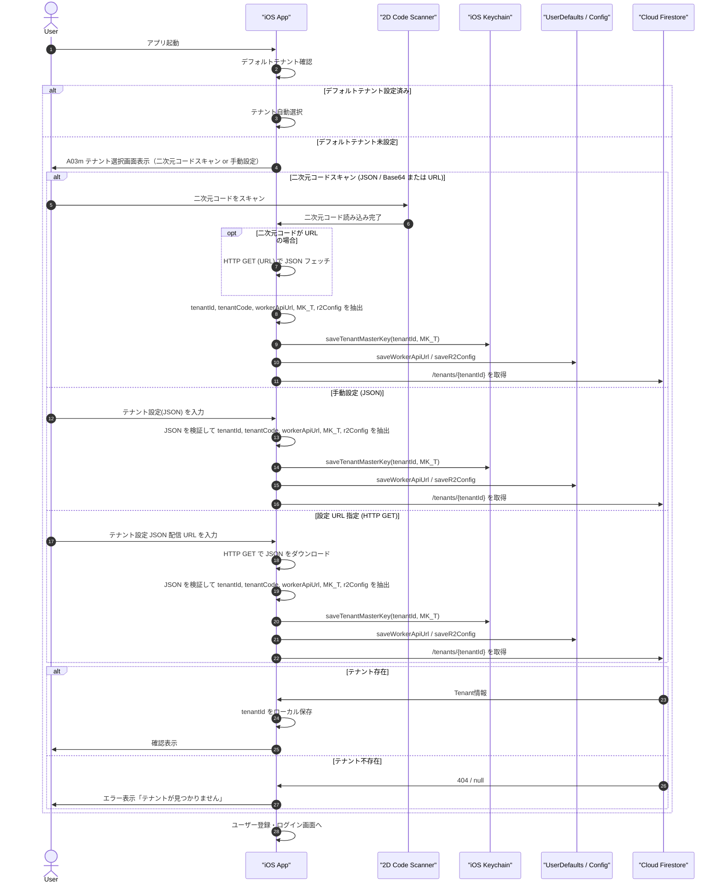

# 07-01: テナント選択フロー（二次元コードスキャン・マスターキー取り込み）

ロバストネス分析 #2 および暗号化仕様 [10-detailed-design/10-01-tenant-data-encryption.md](../10-detailed-design/10-01-tenant-data-encryption.md) に対応する詳細ユースケースです。

注: テナント用の二次元コードは **テナント作成後にサーバー側で生成・出力** されます（管理者がダウンロードや印刷で配布可能）。アプリ側はその二次元コードをスキャンして `tenantId`, `tenantCode`, `workerApiUrl` およびテナントマスターキー（$MK_T$）を取得し、Keychain / UserDefaults に保存します。構成管理（Git リポジトリ）にプライベートな接続先 URL を一切保持しないアーキテクチャを採用しています。

## 1. シーケンス図

## 2. ローカル管理と Firestore 管理の区分

- ローカル管理 (Keychain / UserDefaults)
  - 選択済み `tenantId`, `tenantCode` とユーザーが最後に利用したテナント状態
  - **Cloudflare Workers 接続先 URL (`workerApiUrl`)**: 二次元コードまたは設定 JSON 経由でのみ動的注入
  - **Cloudflare R2 設定 (`r2Config`)**: 二次元コードまたは設定 JSON 経由でのみ動的注入
  - **テナントマスターキー ($MK_T$)** (Keychain: `friends_tenant_key_{tenantId}`)
  - オフライン復帰時のテナント選択リストキャッシュ
- Firestore 管理
  - テナントの正規構成データ（`/tenants/{tenantId}`）
  - テナントの有効/無効状態、公開設定

> 端末上のローカル保存は暗号化マスターキーの厳重管理とユーザー体験向上用であり、権威あるテナント構成は Firestore 側に置きます。また、`workerApiUrl` や `r2Config` はソースコードに埋め込まず、配布されたテナント設定（二次元コード/JSON/URL）からのみ注入されます。

## 3. エラーハンドリング

| エラー                | 対応                                           |
| :-------------------- | :--------------------------------------------- |
| 二次元コード無効      | スキャン再試行                                 |
| JSON フォーマット不正 | 入力バリデーションメッセージ、テンプレート表示 |
| URL ダウンロード失敗  | ネットワーク接続・URL の確認を促すメッセージ表示 |
| テナント不存在        | 管理者に確認依頼                               |
| ネットワークエラー    | リトライ or オフライン表示                     |

## 4. 関連ドメインモデル
- Tenant
- User (tenantId に紐付け)

## 5. 多言語化（ローカライズ）
- アプリの UI 文言は `L10n` を通じて多言語化（日本語・英語）管理。
