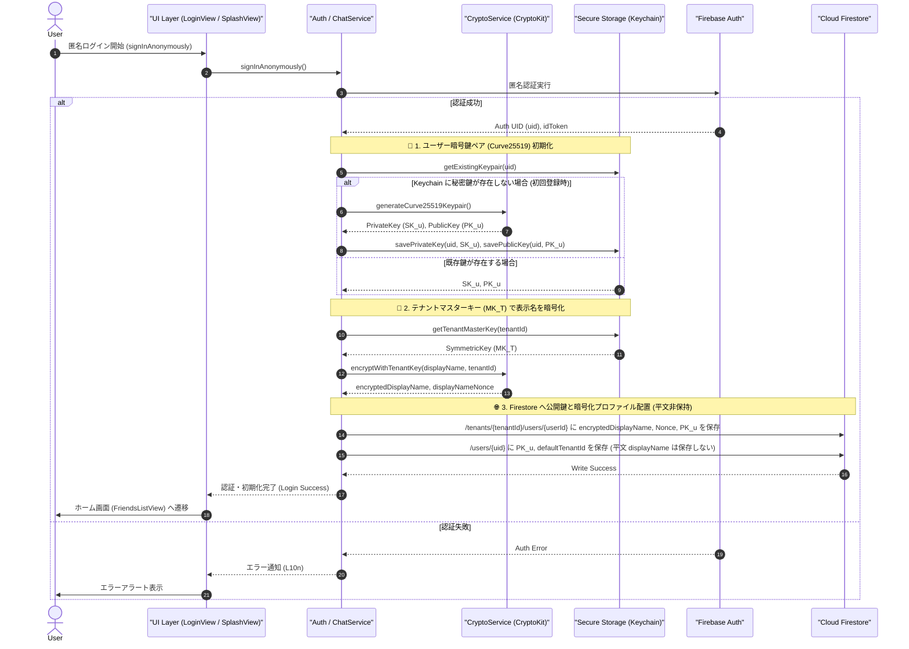

# 07-02: ユーザー登録・初回ログインと暗号鍵生成仕様

ロバストネス分析 #3 およびコア機能要件（E2EEおよびアカウント体系）に対応する詳細設計書です。
初回ログイン時（ユーザー作成時）における暗号鍵ペア（Curve25519）の自動生成、端末内 Keychain への秘密鍵安全保持、ならびに Cloud Firestore への公開鍵配置プロトコルを定義します。

---

## 1. 初回ログイン・ユーザー作成シーケンス



---

## 2. 暗号鍵およびプロファイルの保管境界

### 2.1 鍵仕様
- **鍵ペアアルゴリズム**: Curve25519 (X25519 鍵交換 / ECDH 方式)
- **生成ライブラリ**: Apple `CryptoKit` (`Curve25519.KeyAgreement.PrivateKey()`)
- **データ表現**: 32 バイト生データ (Raw Representation) を Base64 エンコードした文字列
- **表示名暗号化**: テナントマスターキー ($MK_T$) による **AES-256-GCM 暗号化** (12 バイト Nonce + 16 バイト認証タグ)

### 2.2 ローカル保持 (iOS Keychain & iCloud キーチェーン同期)
秘密鍵およびテナントマスターキーは端末のセキュアストレージ（iOS Keychain）に厳密に保管し、クラウドやサーバーへ平文で送信することは固く禁止します。
同一 Apple ID の端末間での安全な引き継ぎと自動復元を可能とするため、E2EE暗号化同期属性 `kSecAttrSynchronizable = true` を適用します。

| キー名 | 格納先 | アクセシビリティ属性 | 同期属性 (`kSecAttrSynchronizable`) | 説明 |
|:---|:---|:---|:---|:---|
| `friends_priv_key_{uid}` | iOS Keychain | `kSecAttrAccessibleAfterFirstUnlock` | `true` (iCloud E2EE 同期) | ユーザー端末秘密鍵 ($SK_u$) |
| `friends_pub_key_{uid}` | iOS Keychain | `kSecAttrAccessibleAfterFirstUnlock` | `true` (iCloud E2EE 同期) | ユーザー端末公開鍵 ($PK_u$) |
| `friends_tenant_key_{tenantId}` | iOS Keychain | `kSecAttrAccessibleAfterFirstUnlock` | `true` (iCloud E2EE 同期) | テナントマスターキー ($MK_T$) |

### 2.3 データベース配置 (Cloud Firestore)
公開鍵 ($PK_u$) および暗号化されたプロファイルのみを Firestore 上に配置します。**平文の `displayName` は DB 上に保存されません。**

#### `/users/{uid}` (グローバルユーザー情報)
```json
{
  "uid": "FIREBASE_AUTH_UID",
  "publicKey": "BASE64_CURVE25519_PUBLIC_KEY",
  "defaultTenantId": "t_01HKXYZ...",
  "updatedAt": "2026-03-30T10:00:00Z"
}
```

#### `/tenants/{tenantId}/users/{userId}` (テナント内プロファイル)
```json
{
  "userId": "u_01HKXYZ...",
  "uid": "FIREBASE_AUTH_UID",
  "tenantId": "t_01HKXYZ...",
  "publicKey": "BASE64_CURVE25519_PUBLIC_KEY",
  "encryptedDisplayName": "BASE64_AES_GCM_CIPHERTEXT",
  "displayNameNonce": "BASE64_12BYTE_NONCE",
  "accountType": 1,
  "role": "MEMBER",
  "status": "ACTIVE",
  "createdAt": "2026-03-30T10:00:00Z",
  "updatedAt": "2026-03-30T10:00:00Z"
}
```

---

## 3. セキュリティ原則 (ゼロ知識アーキテクチャ)

- **Keychain 管理**:
  - 秘密鍵 ($SK_u$)
  - テナントマスターキー ($MK_T$)
  - 復活の呪文、復旧用派生キー ($K_{priv\_enc}$)
  - DM・グループセッションキー ($SK_{direct}$, $SK_{group}$)
- **Firestore 管理**:
  - 公開鍵 ($PK_u$)
  - 暗号化プロファイル (`encryptedDisplayName`, `displayNameNonce`)
  - 認可・ルーティング用平文メタデータ (`role`, `accountType`, `tenantId`, `userId`, `uid`, `updatedAt`)
  - 友達リスト、会話メタデータ、暗号化メッセージ本文 (`encryptedPayload`)

> ユーザー個人の秘密鍵、テナントマスターキー、平文の氏名・表示名はサーバー・DB 上に一切保存されず、暗号化データと公開鍵・認可メタデータのみが保持されます。

---

## 4. 端末データ・Keychain 完全消去仕様 (Device Reset & Sign Out)

シミュレーター環境や端末引き継ぎ時、またはログアウト時において、Keychain に残留した古い秘密鍵 ($SK_u$) やテナントマスターキー ($MK_T$) による誤復号・不整合を完全に防止するため、以下の消去プロトコルを提供します：

1. **消去対象**:
   - `work.kanto.friends.keys` サービス名で Keychain に登録されたすべての項目 (`kSecClassGenericPassword`, `kSecClassKey` 等)
   - メモリ上のセッションキャッシュ (`directSessionKeys`, `messages`, `friends`, `chats`, `currentUser`)
   - Firebase Auth セッション (`Auth.auth().signOut()`)
2. **実行トリガー**:
   - **設定画面 (E01)**: 「ログアウト」実行時（ユーザー確認アラートを経て自動実行）
   - **ログイン画面 (A02)**: 「端末データ・鍵の完全リセット」ボタン押下時（未ログイン状態からでもクリーンリセット可能）

---

## 5. エラーハンドリング

| エラー | 原因 | 対応方針 |
|:---|:---|:---|
| `KEY_GENERATION_FAILED` | CryptoKit による鍵生成例外 | リトライおよびユーザーへ再試行通知 |
| `KEYCHAIN_STORE_FAILED` | Keychain 書き込み権限または容量エラー | エラーコードを記録しリカバリ |
| `FIRESTORE_WRITE_FAILED` | ネットワーク接続不良またはパーミッション | リトライキューへ投入し再接続時に同期 |

---

## 6. 多言語対応 (i18n)

- 認証フローおよび鍵初期化に関わるすべての文言・エラーメッセージは `L10n` を通じて `auth.*` / `error.auth.*` のドット記法キーで管理します。
