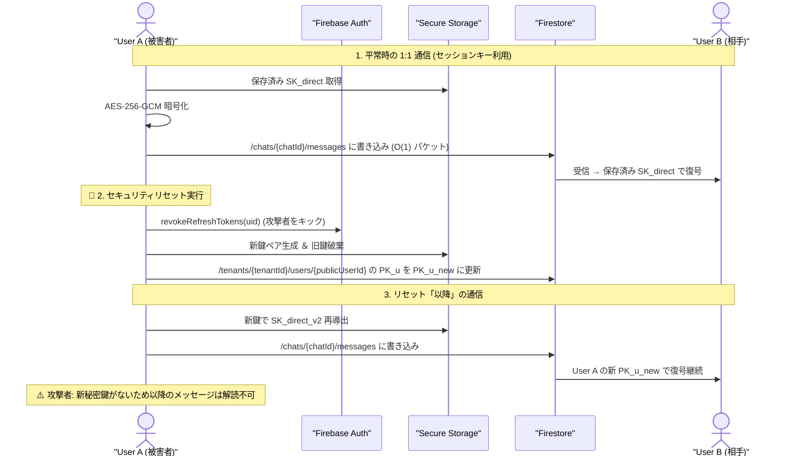

# 07-03: テキストメッセージ送信・暗号化詳細設計書 (E2EE)

本ドキュメントは、コミュニケーションアプリ **Friends** における E2EE（End-to-End Encryption）テキストメッセージ送信の仕様書です。サーバー管理者を含む第三者から本文内容を完全秘匿しつつ、最も実装が簡易でストレージ容量・端末負荷が最小な **共有セッションキー方式** を採用します。

---

## 1. アーキテクチャ概要 & 鍵体系

### 1.1 方式選定理由
本システムでは、メッセージごとに重い暗号化処理（ECDH/ラチェット）や追加ヘッダーの添付を行わない **共有セッションキー方式** を採用しています。

- **ストレージ最小化 ($O(1)$)**: メッセージドキュメントには暗号文と Nonce のみを格納（キー添付なし）。転送・DBコストを最小化。
- **端末負荷ゼロ (超高速)**: メッセージ送信時は高速な AES-256-GCM のみで処理（CPU/バッテリー消費を抑制）。
- **高い信頼性**: 事前鍵（PreKeys）の未同期問題が発生せず、不具合リスクを排除。

### 1.2 鍵体系一覧

- **User KeyPair `(SK_u, PK_u)`**
  - 非対称鍵 (Ed25519)
  - 秘密鍵: Secure Storage
  - 公開鍵: Firestore (`/tenants/{tenantId}/users/{publicUserId}`)
  - 役割: ユーザー識別、署名検証、対面 QR コード追加時の ECDH 鍵導出
- **Tenant Master Key `MK_T`**
  - 対称鍵 (256-bit AES)
  - 保存場所: 端末 Secure Storage
  - 役割: テナント（組織）マスターキー。セッションキー導出に利用
- **Direct Session Key `SK_direct`**
  - 対称鍵 (AES-256-GCM)
  - 保存場所: 端末 Secure Storage
  - 役割: **1:1 チャット用セッション鍵**。ペア会話の暗号化・復号に使用
- **Group Session Key `SK_group`**
  - 対称鍵 (AES-256-GCM)
  - 保存場所: 端末 Secure Storage & Firestore キーバケット
  - 役割: **グループ用セッション鍵**。グループ会話の暗号化・復号に使用

---

## 2. 1:1 メッセージ暗号化仕様

1:1 通信では、対面 QR コード登録時等の初回に 1 回だけペア共有鍵（`SK_direct`）を計算・保存し、以降のメッセージ送受信に使用します。

### 2.1 処理プロトコル
1. **初期鍵導出 (初回のみ)**:
   $$\text{SharedSecret} = \text{ECDH}(SK_A, PK_B)$$
   $$SK_{direct} = \text{HKDF}(\text{SharedSecret} \parallel MK_T, \text{info="friends-direct-v1"})$$
2. **暗号化・送信**:
   ローカルの $SK_{direct}$ を使用して AES-256-GCM 暗号化。
   $$\text{CiphertextPayload} = \text{AES-256-GCM-Encrypt}(SK_{direct}, \text{Plaintext}, \text{Nonce})$$
3. **受信・復号**:
   ローカルの $SK_{direct}$ を使用して即座に復号。

### 2.2 Firestore 格納構造
- **パス**: `/tenants/{tenantId}/chats/{chatId}/messages/{messageId}`
- **概要**: 1:1（DM）およびグループ共通の `/chats` サブコレクションに格納します。

```json
{
  "messageId": "m_123456789",
  "tenantId": "t_corp_abc",
  "chatId": "dm_userA_userB",
  "senderId": "userA_uid",
  "createdAt": "2026-08-20T21:30:00Z",
  "keyVersion": "v_1",
  "encryptedPayload": {
    "ciphertext": "base64EncodedCiphertext...",
    "nonce": "base64EncodedNonce..."
  }
}
```

---

## 3. グループメッセージ暗号化仕様

グループチャット（参加者 $N$ 名）では、1 本のグループ共通鍵 (`SK_group`) を使用し、参加人数に関わらず一定の通信量・計算量 ($O(1)$) で通信します。

### 3.1 平常時の送受信 & キーローテーション
- **送受信**: 現在有効な `SK_group` (バージョン `v_1`) を使用して AES-256-GCM 暗号化・復号。
- **キーローテーション (メンバー離脱・追放・加入時)**:
  1. メンバー離脱時、操作端末が新しいグループ鍵 `SK_group` (バージョン `v_2`) を生成。
  2. 残存メンバーの公開鍵で `v_2` の `SK_group` を暗号化し、Firestore のキーバケットに保存（離脱者は除外）。
  3. 離脱者は `v_2` を取得できないため、離脱後のメッセージを一切復号不可能。

### 3.2 Firestore 格納構造

#### A. メッセージドキュメント (`/tenants/{tenantId}/chats/{chatId}/messages/{messageId}`)
```json
{
  "messageId": "m_987654321",
  "tenantId": "t_corp_abc",
  "chatId": "gm_sales_team",
  "senderId": "userA_uid",
  "createdAt": "2026-08-20T21:35:00Z",
  "keyVersion": "v_2",
  "encryptedPayload": {
    "ciphertext": "base64EncodedGroupCiphertext...",
    "nonce": "base64EncodedNonce..."
  }
}
```

#### B. 鍵バケットドキュメント (`/tenants/{tenantId}/chats/{chatId}/keys/{keyVersion}`)
```json
{
  "keyVersion": "v_2",
  "chatId": "gm_sales_team",
  "tenantId": "t_corp_abc",
  "createdAt": "2026-08-20T21:34:00Z",
  "encryptedGroupKeys": {
    "userA_uid": "base64EncodedEncSK_group_for_A...",
    "userB_uid": "base64EncodedEncSK_group_for_B..."
  }
}
```

---

## 4. セキュリティリセット (Compromise Recovery)

アカウント情報や端末の流出・乗っ取りが発生した場合、ユーザーが「セキュリティリセット」を実行することで、**対策「以降」のメッセージを攻撃者が解読できない状態に保護**します。

### 4.1 リセット手順
1. **セッション強制切断**: Firebase Auth `revokeRefreshTokens(uid)` により攻撃者を強制ログアウト。
2. **鍵ペア再生成**: 被害端末で新鍵ペア `(SK_u_new, PK_u_new)` を生成し、Firestore `/tenants/{tenantId}/users/{publicUserId}` を更新。旧鍵 `SK_u_old` を消去。
3. **セッション再構築**: 対策「以降」の通信は新公開鍵 `PK_u_new` をベースにキー再導出。

### 4.2 保証効果 (Post-Compromise Security)
攻撃者は新秘密鍵 `SK_u_new` を持たないため、**リセット「以降」のメッセージを 1 通たりとも解読できません**。

---

## 5. シーケンス図 (通信 & セキュリティリセット)



---

## 6. データ管理区分 & 異常系処理

### 6.1 データ区分
- **ローカル管理 (Secure Storage)**: 秘密鍵 $SK_u$、マスターキー $MK_T$、セッションキー $SK_{direct}$ / $SK_{group}$、復活の呪文。
- **Firestore 管理**: 公開鍵 $PK_u$、暗号化ペイロード (`ciphertext`, `nonce`)、グループ鍵バケット、通信メタデータ。

### 6.2 異常系処理
- **相手の鍵更新**: 相手のリセットで `PK_u` が変更された場合、自動で新しい `PK_u` を取得して $SK_{direct}$ を更新。
- **鍵未同期**: グループメッセージ受信時に該当 `keyVersion` の鍵がない場合、キーバケットから最新キーを自動ダウンロード。
