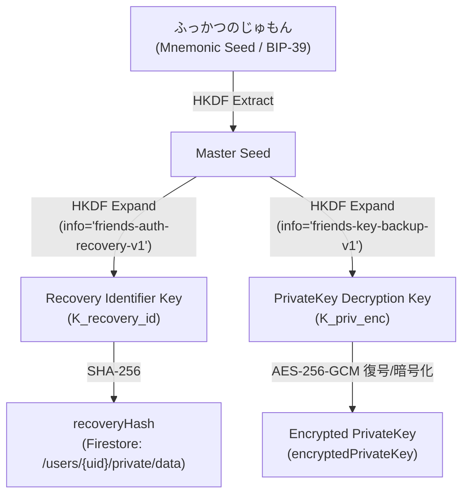
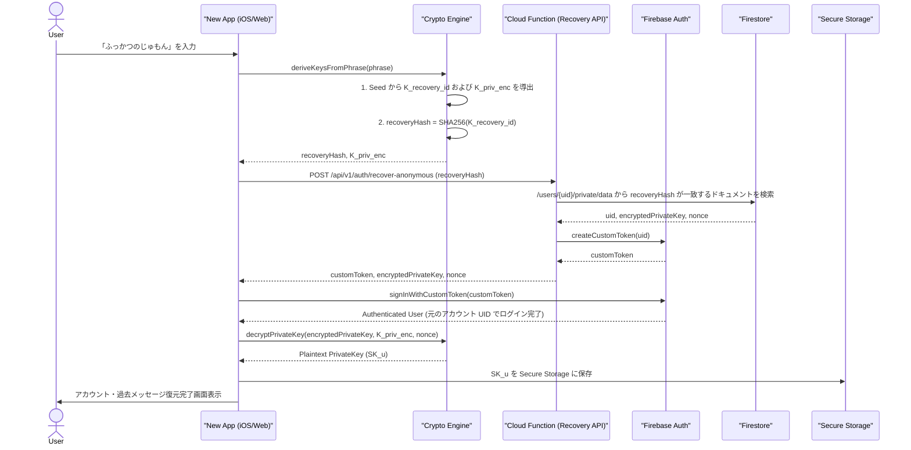

# 07-04: 端末移行および「ふっかつのじゅもん」によるアカウント・鍵復旧仕様

ロバストネス分析 #5 に対応する詳細設計です。本ドキュメントでは、「ふっかつのじゅもん（Mnemonic Phrase）」の役割、匿名ログインおよび永続ログイン時における保持データ構造、および新端末での復旧アルゴリズムを定義します。

---

## 1. 概念と課題整理（保持すべき情報の定義）

E2EEを採用する本システムにおいて、単にログイン情報（IdP token等）を保持するだけでは過去のメッセージを復号できず、逆に秘密鍵だけを復元できても対象アカウント（UID）にログインできなければ通信を行うことができません。

### 1.1 ログイン形態ごとの保持・復旧対象

- **匿名ログイン (ゲストアカウント)**
  - **アカウント識別・所有権認証**: メールアドレスやSNS情報が存在しないため、新端末では新規UIDになってしまう ⇒ アカウント所有権を示す照合キーが必要
  - **秘密鍵 (PrivateKey) の復元**: サーバー上の暗号化秘密鍵を復号するためのキーが必要
  - **「ふっかつのじゅもん」が保持・提供するもの**:
    - ① アカウント再照合キー ($K_{recovery\_id}$)
    - ② 秘密鍵復号キー ($K_{priv\_enc}$)
    - *(単一の Mnemonic Seed から両方を確定導出)*
- **永続ログイン (メール/パスワード, SNS)**
  - **アカウント識別・所有権認証**: Firebase Auth による通常のログイン（ID/PW、OAuth等）で旧UIDをそのまま認証可能
  - **秘密鍵 (PrivateKey) の復元**: サーバー上の暗号化秘密鍵を復号するためのキーが必要
  - **「ふっかつのじゅもん」が保持・提供するもの**:
    - ② 秘密鍵復号キー ($K_{priv\_enc}$)
    - *(認証完了後、呪文を入力して暗号化秘密鍵を解読)*

---

## 2. 「ふっかつのじゅもん」からの鍵導出アーキテクチャ

「ふっかつのじゅもん」は、BIP-39 スタイルの Mnemonic Phrase（12〜24単語）から構成されます。単一のマスターシードから HKDF により、独立した2つのキーを導出します。



---

## 3. Firestore 上でのバックアップデータ構造

`/users/{uid}/private/data`

```json
{
  "uid": "123456789",
  "recoveryHash": "e3b0c44298fc1c149afbf4c8996fb92427ae41e4649b934ca495991b7852b855",
  "encryptedPrivateKey": "base64EncodedEncryptedPrivateKeyPayload...",
  "nonce": "base64EncodedNonce...",
  "updatedAt": "2026-08-20T21:30:00Z"
}
```

- `recoveryHash`: $SHA256(K_{recovery\_id})$。匿名アカウントの復旧時にアカウントを検索・所有権検証するためのハッシュ値。
- `encryptedPrivateKey`: ユーザーの秘密鍵 $SK_u$ を $K_{priv\_enc}$ (AES-256-GCM) で暗号化したデータ。平文の秘密鍵はサーバー上に一切保存されません。

---

## 4. 復旧シーケンス（匿名ログインユーザーの移行）

匿名ログインユーザーが新端末で「ふっかつのじゅもん」を入力し、アカウントおよび秘密鍵を復元するフローです。



---

## 5. 復旧シーケンス（永続ログインユーザーの移行）

メール/パスワードやSNS連携で永続ログインしているユーザーの復旧フローです。

1. **ステップ 1 (アカウント認証)**: 新端末で通常の Firebase Auth ログイン（メール/PW等）を実行。元のアカウント UID でログインが成功。
2. **ステップ 2 (秘密鍵復元要求)**: ログイン直後は端末内に $SK_u$ が存在しないため、復号不能状態を検知し「ふっかつのじゅもん」の入力画面を表示。
3. **ステップ 3 (秘密鍵解読)**:
   - ユーザーが「ふっかつのじゅもん」を入力。
   - 呪文から $K_{priv\_enc}$ を導出。
   - Firestore の `/users/{uid}/private/data` から `encryptedPrivateKey` を取得。
   - $K_{priv\_enc}$ で `encryptedPrivateKey` を復号し、$SK_u$ を手に入れて端末の Secure Storage に保存。

---

## 6. セキュリティ上の注意事項 & リセット時のバックアップ更新

1. **ブルートフォース攻撃対策**:
   - `recoveryHash` に対する総当たり検索を防ぐため、Cloud Functions (Recovery API) 側で IP アドレスおよび端末あたりのレートリミット (Rate Limiting) を厳格に適用します。
2. **生データ非保持の徹底**:
   - サーバー（Firestore/Cloud Functions）は、平文の「ふっかつのじゅもん」や「$SK_u$」を絶対に受け取りません。
3. **セキュリティリセット（鍵再生成）時のバックアップ自動更新**:
   - ユーザーがアカウント露呈等により「セキュリティリセット（Key Rotation）」を実行した場合は、新しく生成された秘密鍵 $SK_{u\_new}$ を既存の $K_{priv\_enc}$ で即座に再暗号化し、Firestore `/users/{uid}/private/data` 上の `encryptedPrivateKey` を自動更新します。
