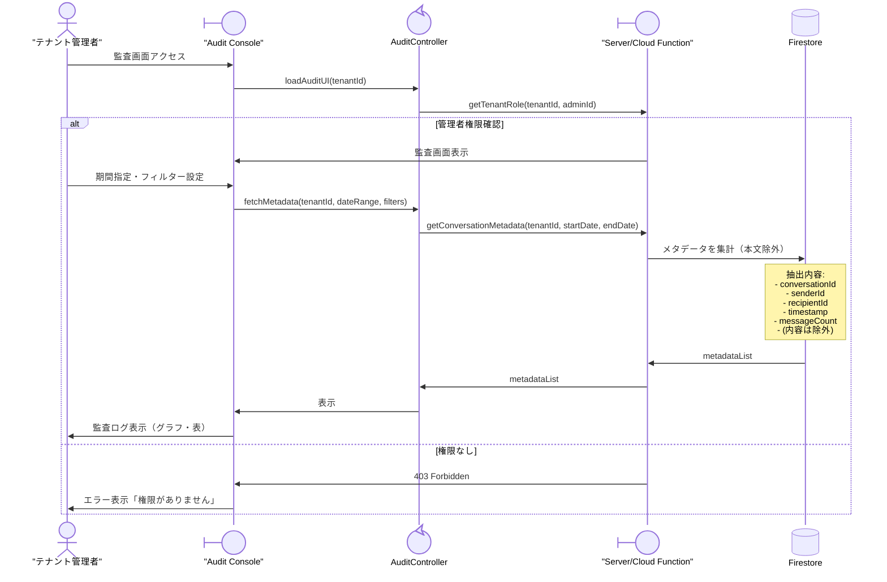

# 07-05: メタデータ監査（テナント管理者）

ロバストネス分析 #4 に対応する詳細設計です。

## シーケンス図



## 取得可能なメタデータ

```
✓ 許可:
  - Sender ID, Recipient ID
  - Timestamp, MessageID
  - Conversation Type (direct/group)
  - Message Count, Attachment Type

✗ 禁止:
  - Message Content (encrypted)
  - Media Payload
  - Metadata Decryption Keys
```

## エラーハンドリング

| エラー | 対応 |
|--------|------|
| 監査権限不足 | エラー表示「権限がありません」 |
| メタデータ収集エラー | リトライ or タイムアウト |
| 監査範囲超過 | 期間を絞る or ページング |

## 関連 API

> [!NOTE]
> **現行ステータス: 未実装（Phase 2 構想）**
> 現在の Phase 1 では「クライアント直接 Firestore アクセス」を基本方針としており、専用バックエンド API サーバーは構築されていません。
> 以下の `GET /api/v1/audit/metadata` および監査コンソール機能は、Phase 2 の管理者向け Web コンソール展開時に Cloud Functions / サーバーレス API として実装が予定されている構想仕様です。

- `GET /api/v1/audit/metadata` - メタデータ取得（将来の管理者コンソール用サーバーAPI構想）

## 関連ドメインモデル

- Tenant
- User (role: admin/manager/user)
- Message (metadata only)
- Conversation
