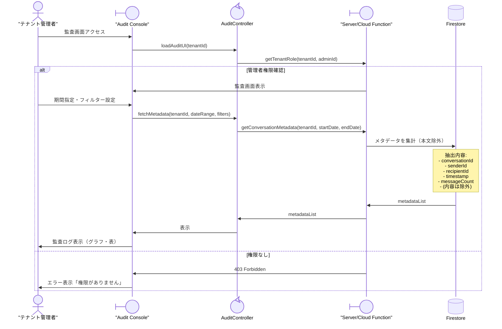

# 07-05: メタデータ監査（テナント管理者）

ロバストネス分析 #4 に対応する詳細設計です。

## シーケンス図



## 取得可能なメタデータ

```
✓ 許可:
  - Sender ID, Recipient ID
  - Timestamp, MessageID
  - Conversation Type (direct/group)
  - Message Count, Attachment Type

✗ 禁止:
  - Message Content (encrypted)
  - Media Payload
  - Metadata Decryption Keys
```

## エラーハンドリング

| エラー | 対応 |
|--------|------|
| 監査権限不足 | エラー表示「権限がありません」 |
| メタデータ収集エラー | リトライ or タイムアウト |
| 監査範囲超過 | 期間を絞る or ページング |

## 関連 API

- `GET /api/v1/audit/metadata` - メタデータ取得（Firestore 直接アクセスではなく、権限・集計ロジックのため専用サーバーAPIを残します）

## 関連ドメインモデル

- Tenant
- User (role: admin/manager/user)
- Message (metadata only)
- Conversation
