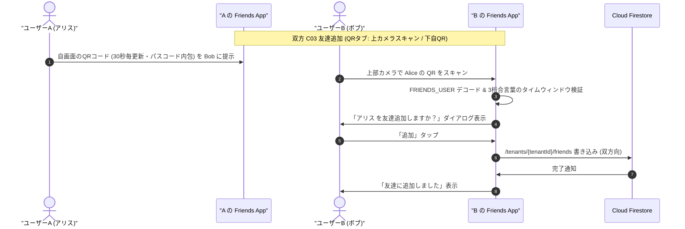
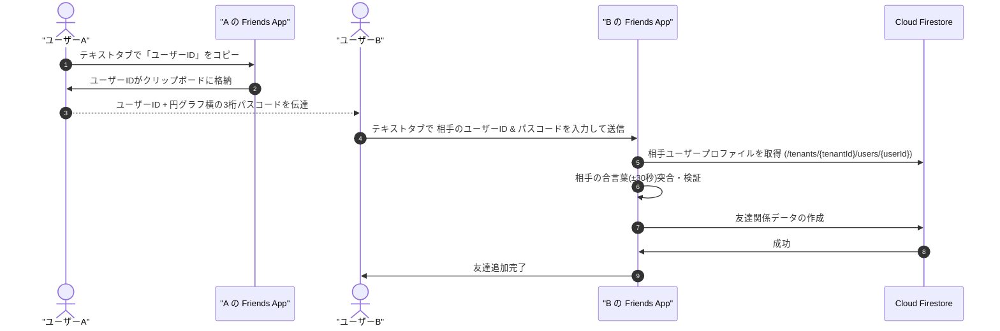

# 07-06: 友達追加（QR コード & テキスト連携 & 3桁合言葉）

ロバストネス分析 #7 およびコア機能要件に対応する詳細設計仕様書です。
対面での確実かつ安全な友達追加を実現するため、QRコード（カメラ）およびテキストでの連携、ならびに30秒ごとに更新される「3桁の合言葉（ワンタイムパスコード）」によるリアルタイム認証メカニズムを規定します。

---

## 1. 友達追加コードのフォーマット仕様

### 1.1 ペイロード構造 (JSON)

QRコード用データは、改ざん防止・バージョン互換・E2EE初期化に必要な情報を網羅した JSON 構造として定義し、3桁合言葉（パスコード）も含めてQRコードに内包します。**QRコードの画像生成・再描画は毎秒ではなく、30秒のタイムステップ切り替え時のみ実行** します。

```json
{
  "type": "friend_invite",
  "version": 1,
  "tenantId": "t_kanto_corp",
  "userId": "u_987654321",
  "uid": "firebase_auth_uid_abc123",
  "displayName": "アリス",
  "publicKey": "base64EncodedX25519PublicKey==",
  "passcode": "782",
  "timestamp": 1771999999
}
```

#### フィールド定義

| フィールド | 型 | 必須 | 説明 | 例 |
|:---|:---|:---|:---|:---|
| `type` | string | ◯ | 識別子 (`friend_invite` 固定) | `"friend_invite"` |
| `version` | integer | ◯ | ペイロードフォーマットのバージョン | `1` |
| `tenantId` | string | ◯ | 送信者の所属テナントID (`t_` プレフィックス) | `"t_kanto_corp"` |
| `userId` | string | ◯ | テナント内公開ユーザーID (`u_` プレフィックス) | `"u_987654321"` |
| `uid` | string | ◯ | Firebase Auth 全域一意識別子 | `"abc123xyz"` |
| `displayName` | string | ◯ | 表示名（確認ダイアログ用） | `"アリス"` |
| `publicKey` | string | ◯ | 送信者の端末公開鍵 (Base64) | `"x25519_pk_base64=="` |
| `passcode` | string | ◯ | 生成時の3桁合言葉 (`000`〜`999`) | `"782"` |
| `timestamp` | integer | ◯ | ペイロード生成エポック秒 (UTC) | `1771999999` |

### 1.2 表現フォーマット

1. **プレフィックス付き Base64 形式 (標準 QRコード)**:
   - フォーマット: `FRIENDS_USER:<Base64EncodedJSON>`
   - パスコードを含む完全なペイロードを保持し、カメラでスキャンするだけで即時認証・追加可能。
   - **更新頻度**: 30秒ごと（ステップ毎）に再生成。
2. **テキスト連携形式**:
   - ユーザーID（`u_...`）＋ 3桁パスコード（`000`〜`999`）の組み合わせ。
   - クリップボードにコピーするのは「ユーザーID」のみとし、パスコードは30秒更新で画面上に表示・口頭や別経路で共有。

---

## 2. 3桁の合言葉（30秒ローテーション TOTP & 円グラフメーター）仕様

対面外での不正な盗聴・QR盗撮・古いコードの再利用（リプレイアタック）を防止するため、**30秒ごとに自動更新される3桁の数字（000〜999）** を生成・検証します。

### 2.1 生成アルゴリズム (Time-based One-Time Passcode)

- **ステップ間隔 ($T$)**: 30 秒
- **タイムステップ算出**:
  $$\text{step} = \left\lfloor \frac{\text{unixTime}}{30} \right\rfloor$$
- **シード素材**: `\(uid):\(tenantId):\(step)`
- **ハッシュ計算**:
  $$\text{hash} = \text{SHA256}(\text{seed})$$
- **3桁抽出**:
  $$\text{code} = (\text{hash}[0..3] \pmod{1000}) \quad \text{（3桁ゼロ埋め文字列）}$$

### 2.2 検証ルール (許容ウィンドウ)

- 端末間の軽微な時刻ズレや通信遅延を吸収するため、検証時は **現行タイムステップ $\pm 1$（前後30秒、計90秒枠）** のいずれかと一致すれば合言葉を有効とみなします。

### 2.3 UI表現（カウントダウン & 小さな円グラフ）

- 3桁数字の横に、**残り秒数（カウントダウン: 30s → 1s）を示す小さな円グラフ（Circular Progress Indicator）** を配置します。
- 残り時間が直感的に把握でき、30秒経過時に滑らかに0秒→30秒へリセットされて次のパスコード・QRコードへ更新されます。

---

## 3. 画面構成仕様 (C03: 友達追加)

### 3.1 QRコードタブ（カメラとQRコードのみのシンプル表示）

QRコードタブでは、余分なユーザー名・UserID・コピー・共有ボタンを一切表示せず、**上部にカメラ（スキャナー）、下部に自分のQRコードのみ** を大きく表示します。QRコード内に最新のパスコードが含まれており、**30秒周期で更新** されます。

```
+------------------------------------------+
|  < 戻る           友達追加       [QR | テキスト]
+------------------------------------------+
|                                          |
|  [ 上部: カメラビューファインダー ]       |
|    - 相手のQRコードをリアルタイム検知    |
|    - スキャン枠アニメーション             |
|                                          |
+------------------------------------------+
|                                          |
|  [ 下部: マイQRコード（パスコード内包） ] |
|                                          |
|            +---------------+             |
|            |    [ QR ]     |             |
|            |  (30秒更新)   |             |
|            +---------------+             |
|                                          |
+------------------------------------------+
```

### 3.2 テキストコードタブ（ユーザー名・パスコード表示 & 入力）

カメラが使用できない環境のために「テキスト」タブを提供します：

1. **自分の情報表示エリア**:
   - **ユーザー名 / ユーザーID**: `u_` または `t_` から始まるユーザーIDを表示。タップで「ユーザーIDのみ」をクリップボードにコピー。
   - **合言葉（3桁パスコード）**: 3桁数字の横にカウントダウン残り秒数と**小さな円グラフ（Circular Progress）** を表示。
2. **相手の追加入力エリア**:
   - 相手から受け取った「ユーザーID」と「3桁パスコード」を入力して追加実行。
   - サーバー上のユーザープロファイルを検索し、合言葉の有効性を検証して友達関係を作成。

```
+------------------------------------------+
|  < 戻る           友達追加               |
+------------------------------------------+
| [     QR          |    テキスト        ] |
| 自分の情報                               |
|    ユーザーID: u_abc12345    [コピー]    |
|    パスコード:  [ 7 8 2 ]  (○ 18s)      |
|                                          |
| 相手を追加                               |
|    相手のユーザーID: [ u_...           ] |
|    相手のパスコード: [ 3桁数字         ] |
|    [ 友達に追加する ]                    |
+------------------------------------------+
```

---

## 4. シーケンス図

### 4.1 対面 QR スキャン連携フロー



### 4.2 テキスト連携 & 合言葉検証フロー



---

## 5. エラーハンドリング

| エラー種別 | 原因 | 画面表示・対応方針 |
|:---|:---|:---|
| `ERR_INVALID_QR_FORMAT` | QRが `FRIENDS_USER:` または規定形式でない | 「友達追加コードの形式が正しくありません。」 |
| `ERR_USER_NOT_FOUND` | 指定されたユーザーIDが存在しない | 「ユーザーが見つかりませんでした。ユーザーIDを確認してください。」 |
| `ERR_PASSCODE_EXPIRED` | 3桁の合言葉が不一致 / 30秒ウィンドウ期限切れ | 「合言葉が一致しないか、有効期限が切れています。最新のコードを再入力してください。」 |
| `ERR_TENANT_MISMATCH` | 相手の所属テナントIDが自分と異なる | 「異なる組織のユーザーです。同一組織内でのみ友達追加が可能です。」 |
| `ERR_ALREADY_FRIENDS` | 既に友達登録済み | 「このユーザーは既に友達に登録されています。」 |
| `ERR_SELF_ADD` | 自分自身を追加しようとした | 「自分自身を友達に追加することはできません。」 |

---

## 6. 多言語対応 (i18n)

本機能に関連するすべての文言は、英語ドット記法キー（`friend.add.*`, `friend.qr.*`, `friend.text.*`, `error.friend.*`）として定義し、日本語および英語のリソースに完全対応します。
