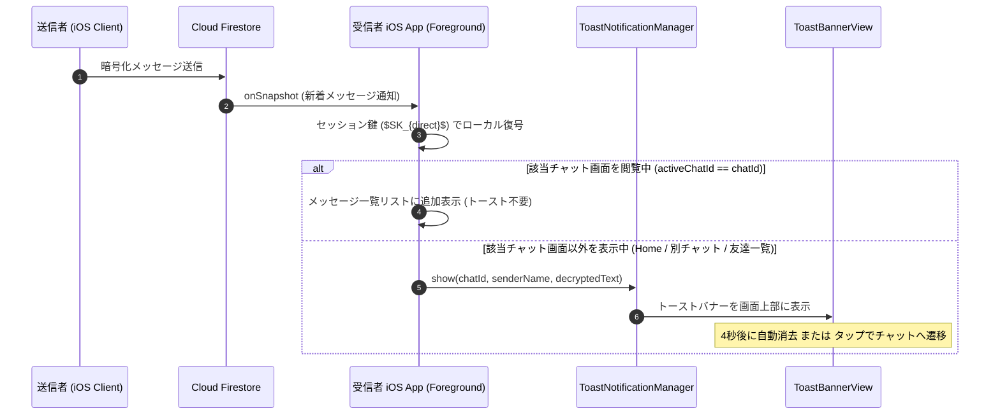

# 07-07: メッセージ通知仕様（アプリ内トースト & プッシュ通知）

本ドキュメントは、**Friends** アプリケーションにおけるメッセージ通知の全体仕様（フォアグラウンドでのアプリ内トースト通知およびバックグラウンドプッシュ通知）を定めたものです。

---

## 1. 通知の分類と動作概要

| 区分 | 状態 | 実装方式 | 表示UI | 備考 |
|:---|:---|:---|:---|:---|
| **フォアグラウンド通知** | アプリ起動中（別画面表示中） | Firestore `onSnapshot` ＋ In-App Banner Manager | `ToastBannerView`（画面上部トースト） | 会話中のチャット画面では非表示 |
| **バックグラウンド通知** | バックグラウンド / 画面ロック | APNs / FCM ＋ Notification Service Extension (NSE) | iOS システムバナー通知 | NSE で端末内 E2EE 復号 |

---

## 2. アプリ内トースト通知（フォアグラウンド）の設計

### 2.1 アーキテクチャ構成
フォアグラウンド時の通知は、Firebase SDK のリアルタイムリスナーを活用し、**追加のプッシュ通信コスト 0** で高速かつ確実に画面上部へ通知を表示します。

1. **`ToastNotificationManager` (`@ObservableObject`)**:
   - シングルトン / `@EnvironmentObject` としてアプリ全体で共有。
   - `show(chatId:senderName:message:)` により通知キューを管理。
   - 4秒間のタイマーによる自動消去、および通知タップ時のチャット画面（`ChatDetailView`）へのディープリンク遷移を提供。
2. **`ToastBannerView`**:
   - 最上位の `RootView` / `MainTabView` のオーバーレイ（Overlay）として配置。
   - スライドイン / フェードアウトのマイクロアニメーションを適用。
   - アイコン表示:
     - **1:1 トーク**: 送信元ユーザーの `UserAvatarView`（暗号化アバター画像または頭文字グラデーション）を表示。
     - **グループトーク**: グループカラーグラデーション ＋ グループシンボル（`person.3.fill`）を表示。
   - 送信者名（グループの場合はグループ名または送信者名）および復号済み本文スニペット（最大2行）を表示。

### 2.2 重複・不要通知の抑制ルール
- **閲覧中チャットの抑制**: ユーザーが現在開いているチャット（`activeChatId == message.chatId`）の新着メッセージは、トーストを表示せずメッセージタイムラインに直接追加。
- **自身送信メッセージの除外**: `message.senderId == currentUserId` のメッセージは通知対象外。

---

## 3. バックグラウンドプッシュ通知仕様

バックグラウンド通知の導入準備、Apple Developer Portal 設定、Firebase Console 設定、Xcode Capability、Notification Service Extension (NSE) 設計、および Cloud Functions 実装手順の詳細は、専門ドキュメント [10-detailed-design/10-04-background-notification-setup.md](../10-detailed-design/10-04-background-notification-setup.md) を参照してください。

---

## 4. シーケンス図

---

## 5. 関連ドキュメント

- [10-detailed-design/10-04-background-notification-setup.md](../10-detailed-design/10-04-background-notification-setup.md) - バックグラウンドプッシュ通知 導入準備・設計仕様書
- [07-03-message-encryption.md](./07-03-message-encryption.md) - メッセージ暗号化仕様
- [10-detailed-design/10-03-data-access-patterns.md](../10-detailed-design/10-03-data-access-patterns.md) - データアクセスパターン仕様
