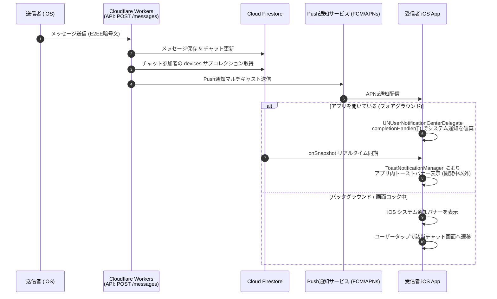

# 07-07: メッセージ通知仕様（アプリ内トースト & プッシュ通知・デバイス管理）

本ドキュメントは、**Friends** アプリケーションにおけるメッセージ通知の全体仕様（フォアグラウンドでのアプリ内トースト通知、バックグラウンドプッシュ通知、初回登録フロー、および設定画面でのデバイス管理）を定めたものです。

---

## 1. 通知の分類と動作概要

| 区分 | アプリ状態 | 実装方式 | 表示UI | 動作・抑制ルール |
|:---|:---|:---|:---|:---|
| **フォアグラウンド通知** | アプリ起動中（画面を開いている状態） | Firestore `onSnapshot` ＋ In-App Banner Manager | `ToastBannerView`（画面上部トースト） | 会話中のチャット画面では非表示。APNs着信時は `completionHandler([])` で**システム通知を破棄** |
| **バックグラウンド通知** | バックグラウンド / 画面ロック / 未起動 | Cloudflare Workers ＋ FCM / APNs | iOS システムバナー通知 | ゼロ知識 E2EE 原則に基づき平文は含めず、送信者名および汎用文言を表示 |

---

## 2. フォアグラウンド時の通知制御とシステム通知抑制

### 2.1 システム通知の破棄（フォアグラウンド抑制）
アプリがフォアグラウンド（アクティブ状態）にある場合、サーバーから配信された APNs プッシュ通知を受信しても、システム通知バナーやサウンドは表示しません。
- **実装方式**: `UNUserNotificationCenterDelegate` の `userNotificationCenter(_:willPresent:withCompletionHandler:)` において、`completionHandler([])` を返却してシステム通知を完全に破棄。
- **効果**: アプリを開いている最中にシステム通知バナーとアプリ内トーストが二重表示されることや、チャット画面閲覧中に不要な通知バナーが表示されることを防止。

### 2.2 アプリ内トースト通知（Firestore リアルタイム同期連動）
フォアグラウンド時の通知は、Firebase SDK の `onSnapshot` リスナーを活用し、追加のプッシュ通信コスト 0 で画面上部に表示します。
1. **`ToastNotificationManager` (`@ObservableObject`)**:
   - シングルトンとしてアプリ全体で共有。
   - 4秒間の自動消去タイマー、およびタップ時の該当チャットへのディープリンク遷移を提供。
2. **重複・不要通知の抑制ルール**:
   - **閲覧中チャットの抑制**: ユーザーが現在開いているチャット（`activeChatId == message.chatId`）の新着メッセージはトーストを表示せず、タイムラインに直接反映。
   - **自身送信メッセージの除外**: `message.senderId == currentUserId` のメッセージは通知対象外。

---

## 3. 初回ログイン時の通知登録フロー（ソフトプロンプト方式）

iOS では、一度通知許可ダイアログで「許可しない」を選択されると、以降は設定アプリを開かないと再許可できません。そのため、高い許諾率と納得感を担保する**事前説明シート（ソフトプロンプト方式）**を採用します。

### 3.1 登録ステップ
1. **初回ログイン完了**: 匿名ログイン（または復元ログイン）が成功し、メイン画面（`MainTabView`）に到達。
2. **事前説明シート表示 (`NotificationPermissionSheet`)**:
   - ハーフモーダルで「メッセージが届いた時にお知らせします」という案内とイラストを表示。
   - **「通知をオンにする」**: iOS 公式の通知許諾ダイアログ（`requestAuthorization`）を表示。許可された場合はデバイストークンを取得し、Firestore（`/devices/{deviceId}`）に登録。
   - **「あとで」**: システムダイアログを表示せずにシートを閉じ、後から設定画面で登録できるようにする。

---

## 4. 設定画面（アプリ設定）での通知トグル制御

設定画面（`SettingsView`）内に「アプリ設定」セクションを新設し、通知のON/OFFおよびメッセージ文字サイズをシンプルに一元管理します。

### 4.1 UI構成と配置
- **セクション名**: `アプリ設定` (`L10n.Settings.sectionAppSettings`)
- **項目**:
  1. **通知** (`L10n.Settings.notificationsToggle`):
     - トグルスイッチ（ON / OFF）形式で配置。
     - **ON操作時**: OS通知許諾が未要求の場合は許諾ダイアログを起動。既に拒否されている場合は端末の設定アプリへの誘導アラートを表示。許諾済みの場合はアプリ内通知有効化フラグを ON に設定し、端末トークンを同期。
     - **OFF操作時**: アプリ内通知有効化フラグを OFF に設定。
  2. **メッセージの文字サイズ** (`L10n.Settings.chatFontSizeLabel`):
     - セグメントピッカー（より小 〜〜 より大）


---

## 5. サーバー（Cloudflare Workers）Push通知ディスパッチ仕様

### 5.1 送信契機
- メッセージ送信 API: `POST /api/v1/tenants/:tenantId/chats/:chatId/messages`
- データベース保存（アトミックコミット）完了後、非同期で通知ディスパッチを実行。

### 5.2 受信対象の決定
- **1:1 DM**: チャットの相手ユーザー（送信者以外のメンバー）。
- **かいぎ（グループ）**: グループ参加メンバーのうち、送信者本人を除く全メンバー。
- 各対象ユーザーの `/tenants/{tenantId}/users/{uid}/devices` コレクションから有効なトークンを取得してマルチキャスト送信。

### 5.3 ペイロード設計（ゼロ知識 E2EE 準拠）
```json
{
  "notification": {
    "title": "Friends",
    "body": "新着メッセージが届きました"
  },
  "data": {
    "tenantId": "t_kanto",
    "chatId": "dm_u_alice_u_bob",
    "messageId": "m_01HX...",
    "senderId": "u_alice"
  },
  "apns": {
    "payload": {
      "aps": {
        "badge": 1,
        "sound": "default"
      }
    }
  }
}
```

---

## 6. シーケンス図



---

## 7. 関連ドキュメント

- [10-detailed-design/10-04-background-notification-setup.md](../10-detailed-design/10-04-background-notification-setup.md) - バックグラウンドプッシュ通知 導入準備・設計仕様書
- [07-03-message-encryption.md](./07-03-message-encryption.md) - メッセージ暗号化仕様
- [10-detailed-design/10-02-firestore-direct-access-rules.md](../10-detailed-design/10-02-firestore-direct-access-rules.md) - Firestoreセキュリティルール仕様
- [10-detailed-design/10-03-data-access-patterns.md](../10-detailed-design/10-03-data-access-patterns.md) - データアクセスパターン仕様
