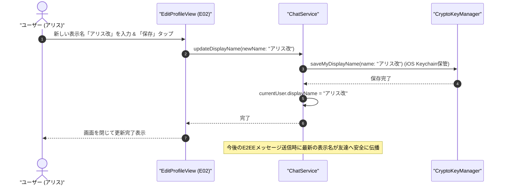
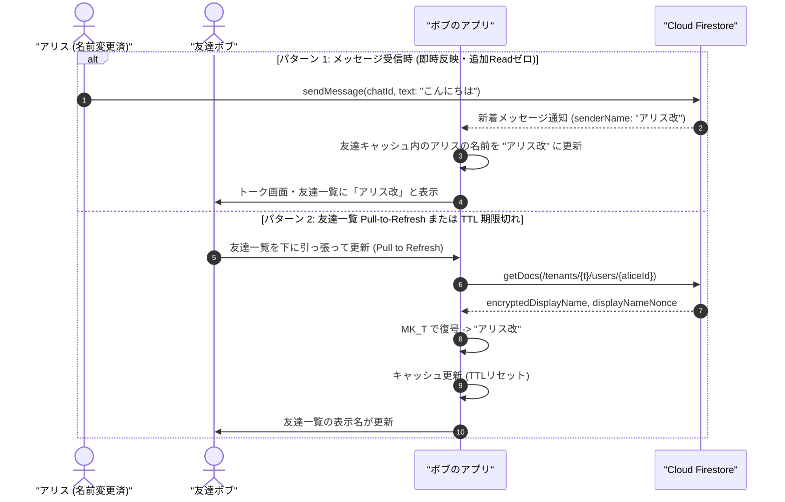
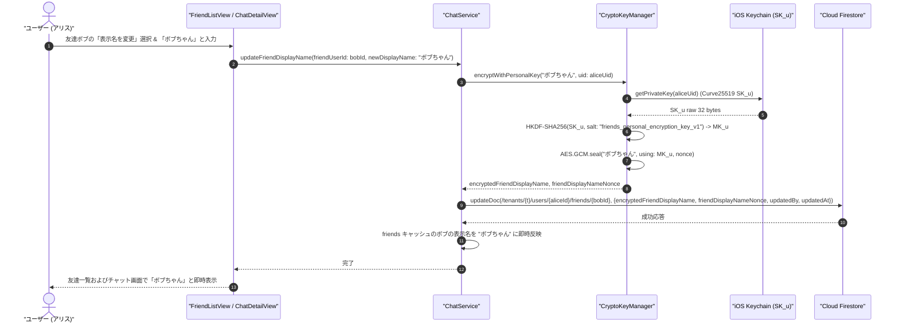

# 07-09: プロフィール編集（表示名・ユーザー識別子 username・アバター変更）と低コスト友達同期仕様書

本ドキュメントは、**Friends** におけるユーザーの表示名（`displayName`）、ユーザー識別子（`username`）およびアバター画像（`avatar`）変更のプロトコル、一意性制約管理、ローカルキャッシュ設計、および Firestore Read コストを最小化する**ハイブリッド同期方式（TTLキャッシュ + メッセージ受信時更新 + Pull-to-Refresh）**の設計仕様を定めたものです。

---

## 1. 背景と課題

1. **暗号化保存と公開識別子の分離**:
   - 表示名（`displayName`）は重要な個人特定情報（PII）であるため、同一テナント内であっても無差別に閲覧可能な公開プロファイルへの暗号化・平文保存は行いません。
   - 本人の表示名は自身の端末 Keychain（`kSecAttrAccessibleAfterFirstUnlockThisDeviceOnly`）に安全に保管され、友達成立後は各自の個人秘密鍵（$MK_u$）で暗号化して `friends` サブコレクションに保管されます。最新の表示名変更は E2EE チャットメッセージ経由（送信者メタデータ）でセッション鍵暗号化されて友達にのみ伝播します。
   - ユーザー識別子（`username`）は検索・メンション用の公開ハンドル名（英数字・アンダースコア）とし、`/tenants/{tenantId}/usernames/{username}` に一意制約インデックスを配置して重複を防止します（初期値は `userId` と同一）。
   - システム内部の参照キーはすべて不変の `userId` (`u_xxx`) を使用し、`username` 変更時にも過去メッセージ・暗号鍵・DMチャット参照が壊れないようにします。
   - **ユーザー名変更時の確認・警告ダイアログ**: ユーザー名を変更すると他者が自身を検索・友達追加する際の識別子が変更されるため、保存実行時に明示的な警告・確認アラートを表示し、合意を得てから更新トランザクションを実行します。
2. **画像最適化 & メモリ保護 & R2 高速配信**:
   - アバター画像は 256x256 に圧縮（JPEG quality: 0.75）し、$MK_T$ で AES-GCM 暗号化したバイナリを **Cloudflare R2（CDN キャッシュ + Egress 転送量ゼロ）** へ保存。
   - クライアント側では `NSCache` による 2 層キャッシュで不要なダウンロードおよび復号処理を最小化します。

3. **リアルタイム伝播のコスト課題**:
   - 友達全員（数十〜数百人）のプロファイルドキュメントに対してリアルタイムリスナー（`onSnapshot`）を常時張ると、Read 課金および端末通信負荷が膨大になります。
   - そのため、**「On-Demand TTL キャッシュ」** と **「会話時のイベント駆動更新」** を組み合わせた**ハイブリッド同期**を採用し、不要な通信を 90% 以上削減します。

---

## 2. ハイブリッド同期アーキテクチャ

### 2.1 3 層の同期メカニズム

```text
┌───────────────────────────────────────────────────────────────────────────┐
│                      表示名変更ハイブリッド同期モデル                     │
├───────────────────────────────────────────────────────────────────────────┤
│ 1. [ローカル TTL キャッシュ (24h)]                                        │
│    - 友達一覧表示時はローカルキャッシュから即時描画（通信 0 回 / 爆速）   │
│    - 個人秘密鍵 (MK_u) で暗号化されたローカル友達データを復号表示         │
├───────────────────────────────────────────────────────────────────────────┤
│ 2. [会話時（メッセージ受信時）の同期]                                    │
│    - メッセージ送信時に送信者の最新表示名を E2EE 暗号化ペイロードから抽出し、│
│      受信側のローカル友達キャッシュを即時更新                             │
├───────────────────────────────────────────────────────────────────────────┤
│ 3. [手動 Pull-to-Refresh / 二次元コード再スキャン]                        │
│    - 友達一覧の再取得や対面での二次元コード再スキャンによる最新化         │
└───────────────────────────────────────────────────────────────────────────┘
```

---

## 3. シーケンス図

### 3.1 表示名変更シーケンス (本人)



### 3.2 友達への伝播シーケンス (ハイブリッド方式)



### 3.3 友達のカスタム表示名変更シーケンス (秘密鍵 $MK_u$ 暗号化)

利用者が友達一覧やチャット画面で相手の呼び名（カスタム表示名）を変更する際、**自分自身の端末秘密鍵（$SK_u$）から導出される個人専用対称鍵（$MK_u$）** を用いて AES-256-GCM 暗号化を行い、自分側の友達サブコレクションにのみ保存します。



> [!IMPORTANT]
> - 友達のカスタム表示名は **本人しかアクセスできない自分側のサブコレクション** にのみ保存されます。
> - 暗号化鍵はテナント鍵（$MK_T$）ではなく本人の秘密鍵から導出される $MK_u$ を使用するため、テナント管理者や相手ボブ本人に対しても、アリスが設定したカスタムニックネームは一切漏洩しません（Zero-Knowledge）。

---

## 4. データ構造とキャッシュ設計

### 4.1 ローカル友達・プロファイルキャッシュ構造 (`FriendCacheEntry`)
```swift
struct FriendCacheEntry: Codable {
    let userId: String
    let displayName: String
    let publicKey: String
    let avatarNonce: String
    let avatarUpdatedAt: Date?
    let lastFetchedAt: Date

    var isExpired: Bool {
        // 24 時間で TTL 期限切れ
        Date().timeIntervalSince(lastFetchedAt) > 86400
    }
}
```

---

## 5. 画面設計・UI

プロフィール編集画面 (`E02`) の詳細なレイアウト・左右配置・ラベル体系・画面遷移については、[doc/08-screen-design.md (E02 プロフィール編集画面)](../08-screen-design.md#e02-プロフィール編集画面-editprofileview) を参照してください。
