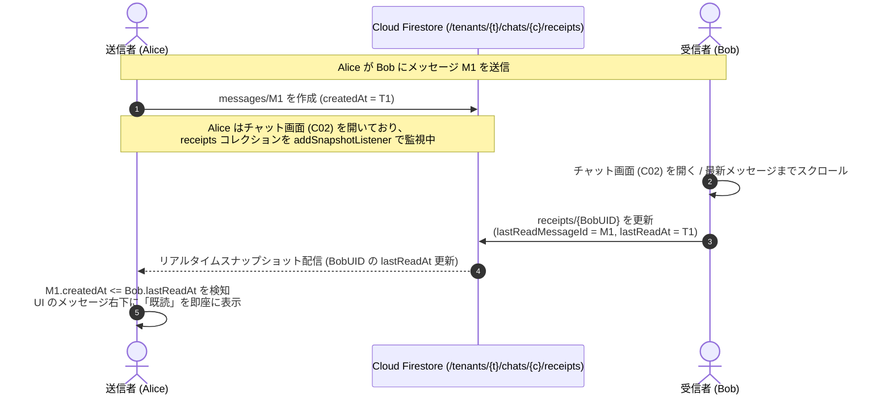
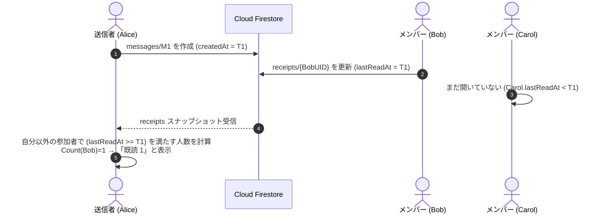

# 07-10: メッセージ既読管理（Read Receipt Management）仕様書

本ドキュメントは、**Friends** における E2EE チャット（1:1 DM および グループチャット GM）の既読管理アーキテクチャ、Firestore パス構造、リアルタイム検知シーケンス、セキュリティルールおよび UI 表示仕様を定義する詳細設計書です。

---

## 1. 既読管理の基本方針

### 1.1 水位線（Watermark Cursor）方式の採用
Firestore の課金・通信量削減、および E2EE メッセージ本文の不変性（書き換え禁止）を担保するため、メッセージ単位で書き込む方式ではなく、**ユーザーごとに「どこまで閲覧したか」を示す既読カーソル（Read Receipt Cursor）を保持・更新する水位線方式**を採用します。

### 1.2 既読判定の原則
- メッセージ $M$ の作成日時を $T_M = M.\text{createdAt}$、受信者 $U$ の既読カーソル時刻を $T_U = U.\text{lastReadAt}$ とします。
- $T_M \le T_U$ を満たす場合、ユーザー $U$ はメッセージ $M$ を **「既読」** と判定します。

---

## 2. データ構造・スキーマ設計 (Protobuf & Firestore)

### 2.1 Firestore パス構造

```text
/tenants/{tenantId}/chats/{chatId}/receipts/{userId}
```

### 2.2 Proto3 定義 (`shared/model/chat.proto`)

```protobuf
// チャット既読カーソル (/tenants/{tenantId}/chats/{chatId}/receipts/{userId})
message ReadReceipt {
  string user_id = 1;              // ユーザーID (u_xxx)
  string chat_id = 2;              // チャットID (dm_xxx または gm_xxx)
  string tenant_id = 3;            // テナントID (t_xxx)
  string last_read_message_id = 4; // 最後に閲覧したメッセージID (m_xxx)
  google.protobuf.Timestamp last_read_at = 5; // 最後に閲覧したメッセージの作成日時
  google.protobuf.Timestamp updated_at = 6;   // カーソル更新日時
}
```

---

## 3. シーケンス図 (Sequence Diagrams)

### 3.1 1:1 チャットにおける既読更新と即時検知



### 3.2 グループチャットにおける既読人数カウント



---

## 4. クライアント側の更新制御 & UI / UX 仕様

1. **画面表示・スクロール時のスロットリング**:
   - メッセージ一覧の最新アイテムが表示された際、および新規受信時に `markAsRead(chatId:lastMessage:)` を発行。
   - 連続してメッセージを受信する最中は、頻繁な書き込みを避けるため **300ms の Debounce** を適用。
2. **送信者自身の自動既読**:
   - 自分がメッセージを送信した際、自身の `lastReadAt` は自動的に最新時刻に更新。
3. **未読バッジの計算 & タブ通知**:
   - 友達一覧・チャット一覧画面（C01 / D01）での各行未読件数は、`messages.filter { $0.createdAt > myLastReadAt && $0.senderId != myUid }.count` により算出。
   - **メインタブ（MainTabView）の「Friends」タブ**: 全チャットの未読合計件数が 1 件以上ある場合、赤色の通知バッジ（`totalUnreadCount`）をリアルタイム表示。
4. **チャット詳細画面での既読表示レイアウト**:
   - 送信メッセージ吹き出しの左側メタデータにおいて、**時刻の上に「既読」（グループの場合は「既読 %d」）** を配置。
   - 相手がメッセージを開いた瞬間にリアルタイムで「既読」が表示される。

---

## 5. Security Rules (Firestore)

```javascript
match /tenants/{tenantId}/chats/{chatId} {
  // 既読管理サブコレクション
  match /receipts/{receiptUserId} {
    // 参加者およびテナント管理者は閲覧可能
    allow read: if isTenantMember(tenantId) && (
      request.auth.uid in get(/databases/$(database)/documents/tenants/$(tenantId)/chats/$(chatId)).data.members ||
      request.auth.token.role == 'tenant_admin'
    );

    // 自分の既読位置のみ作成・更新可能
    allow create, update: if isTenantMember(tenantId)
      && request.auth.uid == receiptUserId
      && request.resource.data.userId == request.auth.uid
      && request.resource.data.chatId == chatId
      && request.resource.data.tenantId == tenantId;

    allow delete: if false;
  }
}
```
