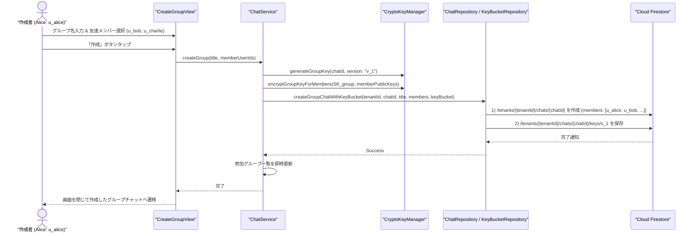

# 07-12: グループチャット詳細設計書（かいぎ）

本ドキュメントは、**Friends** アプリケーションにおけるグループチャット（タブ名：「かいぎ」 / Groups）の機能要件、画面遷移、E2EE 暗号化通信プロトコル、およびデータ構造を定義した詳細設計書です。

---

## 1. 概要 & 目的

グループチャット（「かいぎ」）機能は、同一組織（テナント）内の複数ユーザーがリアルタイムにメッセージ、リアクション、既読確認をセキュアに行うためのコラボレーション基盤です。

### 主要機能
1. **グループチャット一覧（D01 / タブ名: 「かいぎ」）**: 参加しているグループチャットの一覧表示、最新メッセージ・更新日時のプレビュー、未読バッジ表示。
2. **新規グループ作成（D03）**: グループ名の入力、友達一覧からの複数メンバー選択によるグループの新規開設。
3. **グループチャット詳細（D02 / 既存 C02 拡張）**: 複数人での E2EE 暗号化メッセージ送受信、送信者アイコン・名前表示、リアクション、既読カウント。
4. **グループ詳細 & メンバー管理（D04, D05m）**: グループ名・参加メンバー一覧の確認および追加メンバーの招待。

---

## 2. 鍵体系 & E2EE 暗号化プロトコル (前方秘匿性 / 後方秘匿性 対応)

グループチャットにおける E2EE 通信は、[07-03: テキストメッセージ送信・暗号化詳細設計書](07-03-message-encryption.md) および [10-01: テナント暗号設計](10-detailed-design/10-01-tenant-data-encryption.md) に規定された **グループ会話共有鍵バケット (`KeyBucket` / $SK_{group, v}$) 方式** に準拠します。

### 2.1 共有鍵バージョニング & ライフサイクルプロトコル

1. **初期開設時 (`v_1`)**:
   - グループ作成者端末が暗号論的擬似乱数により 256-bit の初期グループ会話鍵 $SK_{group, 1}$ を生成。
   - 作成時メンバー全員の公開鍵 $PK_{u}$ を取得し、各自の公開鍵で個別暗号化して `/tenants/{tenantId}/chats/{chatId}/keys/v_1` の `encryptedGroupKeys` マップに格納：
     $$\text{encryptedGroupKeys}[u_i] = \text{Encrypt}(PK_{u_i}, SK_{group, 1})$$
   - 親チャットドキュメントの `latestKeyVersion: "v_1"` に設定。

2. **新メンバー追加時の後方秘匿性 (Backward Secrecy)**:
   - **設計原則**: 新メンバーが追加された時点以降のメッセージのみを復号可能とし、加入以前の過去ログは復号させない（追加時点以降のセキュア境界）。
   - **実行主体**: メンバー招待操作を実行した既存メンバー端末。
   - **手順**:
     1. 招待者端末が新規バージョン用の 256-bit グループ鍵 $SK_{group, v_{new}}$（例: `v_2`）を生成。
     2. 追加された新メンバーを含む「追加後全メンバー」の公開鍵 $PK_{u}$ を用いて $SK_{group, v_{new}}$ を暗号化。
     3. 新規 `KeyBucket`（`/keys/v_2`）を作成し、親チャットの `members` 配列に新メンバーを追加するとともに `latestKeyVersion: "v_2"` にアトミック更新。
     4. 過去バージョンの `KeyBucket`（`v_1`）には新メンバー向けのエントリが含まれないため、新メンバーは加入前の過去メッセージ（`keyVersion: "v_1"`）を復号できません。

3. **メンバー除外時の前方秘匿性 (Forward Secrecy)**:
   - **設計原則**: グループから退出または除外されたユーザーが、除外以降の新着メッセージを一切復号できない。
   - **実行主体**: 除外操作を実行した管理者端末（自発的退出の場合は残存するグループオーナーまたは最古の管理者端末）。
   - **手順**:
     1. 操作者端末が新規バージョン用の 256-bit グループ鍵 $SK_{group, v_{new}}$（例: `v_3`）を生成。
     2. **除外されたユーザーを除外した「残存メンバーのみ」** の公開鍵 $PK_{u}$ を用いて $SK_{group, v_{new}}$ を暗号化。
     3. 新規 `KeyBucket`（`/keys/v_3`）を作成し、親チャットの `members` から対象ユーザーを除外するとともに `latestKeyVersion: "v_3"` に更新。
     4. 除外されたユーザーは `v_3` の `KeyBucket` に自身の暗号化鍵が存在しないため、以降送信されるメッセージを復号できません。

4. **暗号化送信**:
   - 送信端末は親チャットの `latestKeyVersion`（例: `v_2`）に対応するグループ会話鍵 $SK_{group, v}$ をローカルキャッシュ（メモリ）から取得。
   - メッセージ本文を AES-256-GCM 暗号化：
     $$\text{CiphertextPayload} = \text{AES-256-GCM-Encrypt}(SK_{group, v}, \text{Plaintext}, \text{Nonce})$$
   - メッセージに `keyVersion: "v_2"` を付与して Firestore に保存。

5. **受信・復号**:
   - 受信端末はメッセージに記録された `keyVersion` を確認。
   - 該当バージョンの $SK_{group, v}$ がローカル未保持の場合、`/tenants/{tenantId}/chats/{chatId}/keys/{keyVersion}` から自身の `encryptedGroupKeys[myUserId]` を読み取り、自身の秘密鍵 $SK_u$ で復号してローカルメモリに安全にキャッシュ。
   - 復号した $SK_{group, v}$ でメッセージ本文を平文へ復号。

---

## 3. データ構造 (Firestore)

### 3.1 チャットドキュメント (`/tenants/{tenantId}/chats/{chatId}`)
```json
{
  "chatId": "gm_01J6XYZ1234567890ABCDEF",
  "tenantId": "t_corp_abc",
  "chatType": "group",
  "title": "プロジェクト推進会",
  "members": [
    "u_01J6XYZ_ALICE",
    "u_01J6XYZ_BOB",
    "u_01J6XYZ_CHARLIE"
  ],
  "memberRoles": {
    "u_01J6XYZ_ALICE": "owner",
    "u_01J6XYZ_BOB": "admin",
    "u_01J6XYZ_CHARLIE": "member"
  },
  "latestKeyVersion": "v_1",
  "lastMessage": "次回の会議は明日10時からです",
  "lastMessageAt": "2026-08-30T22:50:00Z",
  "createdAt": "2026-08-30T20:00:00Z",
  "updatedAt": "2026-08-30T22:50:00Z"
}
```

### 3.2 グループ鍵バケット (`/tenants/{tenantId}/chats/{chatId}/keys/{keyVersion}`)
```json
{
  "keyVersion": "v_1",
  "chatId": "gm_01J6XYZ1234567890ABCDEF",
  "tenantId": "t_corp_abc",
  "encryptedGroupKeys": {
    "u_01J6XYZ_ALICE": "base64EncodedEncryptedSKGroupForAlice...",
    "u_01J6XYZ_BOB": "base64EncodedEncryptedSKGroupForBob...",
    "u_01J6XYZ_CHARLIE": "base64EncodedEncryptedSKGroupForCharlie..."
  },
  "createdAt": "2026-08-30T20:00:00Z"
}
```

### 3.3 メッセージドキュメント (`/tenants/{tenantId}/chats/{chatId}/messages/{messageId}`)
```json
{
  "messageId": "m_01J6XYZ9876543210FEDCBA",
  "tenantId": "t_corp_abc",
  "chatId": "gm_01J6XYZ1234567890ABCDEF",
  "senderId": "u_01J6XYZ_ALICE",
  "keyVersion": "v_1",
  "encryptedPayload": {
    "ciphertext": "base64EncodedGroupCiphertext...",
    "nonce": "base64EncodedNonce..."
  },
  "messageType": "text",
  "createdAt": "2026-08-30T22:50:00Z",
  "reactionCounts": {
    "thumbs_up": 2,
    "ok": 1
  }
}
```

---

## 4. シーケンス図

### 4.1 新規グループチャット作成 & KeyBucket 初期化 (D03)



---

## 5. UI/UX 仕様

1. **タブナビゲーション**:
   - タブアイコン: `person.3.fill` / タブ名: 「かいぎ」
   - グループチャット内の未読合計件数をバッジとして表示。
2. **グループ一覧（D01）**:
   - グループアイコン（グラデーション背景＋頭文字または複数人アバター）
   - グループ名、最新メッセージ本文（復号済み）、最新受信時刻
   - 未読件数バッジ（青丸に白文字）
   - ナビゲーションバー右上に新規作成ボタン（`+` アイコン）
3. **新規グループ作成（D03）**:
   - モーダル/シート表示
   - グループ名入力フィールド（クリアボタン付き）
   - メンバー選択（登録済み友達一覧の複数チェックボックス、`userId: u_...` 基準）
   - ナビゲーションバー右上に「作成」ボタン（グループ名未入力時は非活性）
4. **グループ詳細 & メンバー管理（D04）**:
   - チャット詳細のナビゲーションバー右上にあるインフォボタン（`info.circle`）から遷移
   - グループ名、作成日、参加メンバー一覧（表示名、アバター、自分バッジ、オーナー/管理者ロールバッジ）の表示
   - 管理者による立候補型オーナー昇格、管理者任命、メンバーキック、および2段階確認グループ削除機能を提供（詳細は [07-13: グループロール管理および二重確認グループ削除仕様書](07-13-group-role-and-deletion.md) 参照）
