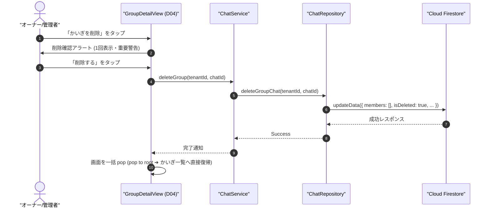

# 07-13: かいぎロール管理（メンバー属性 role・立候補昇格・退出管理）およびかいぎ削除仕様書

本ドキュメントは、**Friends** におけるグループチャット（かいぎ）内のメンバー属性（`role`）に基づく権限管理、立候補ダッシュ型オーナー昇格、メンバー退出・退出させる操作、および重要操作である**確認ダイアログ（1回表示）によるかいぎ削除仕様**を定めたものです。
※ 本アプリではグループチャットを「かいぎ」と呼びます（英語表記は `GroupChat`）。

---

## 1. 背景と目的

1. **かいぎ運営における柔軟性と安全性**:
   - かいぎ作成者を責任者（オーナー）とし、副責任者（管理者）を設けることで、組織やプロジェクトでの安全なかいぎ運用を可能にします。
2. **メンバー属性としてのロール管理**:
   - ロールをトップレベルの単独IDや個別リストで管理するのではなく、**各メンバーの属性（`memberRoles: map<userId, GroupMemberRole>`）** として保持します。
   - これにより、Firestore のインデックス制約を回避しつつ、$O(1)$ の高速な権限判定とピンポイント更新を両立します。
3. **退出管理（自発的退出と退出させる操作）**:
   - メンバーは自らかいぎから「退出する」ことができます（※ただしオーナーは退出不可）。
   - 他のメンバーを「かいぎから退出させる」操作は**グループオーナーまたはグループ管理者のみ**が実行可能です（一般メンバーは実行不可。※また対象がオーナーの場合は退出不可）。
   - 退出させる操作の UI は、メンバー一覧行の**左スワイプによる削除ボタン**から実行されます。
4. **重要操作の誤爆防止（確認ダイアログ1回表示）**:
   - かいぎ削除は参加者全員の会話履歴や共有情報に影響を与える破壊的変更です。
   - 誤タップ防止のため、**重要警告を明記した確認ダイアログ（1回表示）** を経て初めて実行される安全設計を採用します。
5. **論理削除とメンバークリア方式**:
   - かいぎ削除時は `members: []`（空配列）にクリアし、全ユーザーのチャット一覧クエリ（`whereField("members", arrayContains: userId)`）から即座に非表示化しつつ、監査ログ（`isDeleted: true`, `deletedAt`, `deletedBy`）を確実に残します。

---

## 2. ロール定義と権限マトリクス

### 2.1 ロール定義 (`GroupMemberRole`)

| ロール名 | 定義値 | 概要 | 人数制限 | 特記事項 |
|:---|:---|:---|:---:|:---|
| **グループオーナー** (Group Owner) | `GROUP_MEMBER_ROLE_OWNER` (`3`) | かいぎの最高責任者 | **1名** | かいぎ作成者が自動就任。 **自らかいぎを退出することは不可**。 |
| **グループ管理者** (Group Admin) | `GROUP_MEMBER_ROLE_ADMIN` (`2`) | かいぎの運営管理者 | 複数名可 | オーナーまたは管理者が任命。 **他メンバーを退出させる権限**、自らオーナーに昇格（立候補）可能。 |
| **一般メンバー** (Group Member) | `GROUP_MEMBER_ROLE_MEMBER` (`1`) | 一般参加者 | 複数名可 | メッセージ送受信、メンバー招待、自らかいぎを退出が可能（他者を退出させることは不可）。 |

### 2.2 権限マトリクス

| 操作機能 | オーナー | 管理者 | 一般メンバー | 備考・制御仕様 |
|:---|:---:|:---:|:---:|:---|
| **かいぎ削除** | **○** | **○** | × | **重要操作: 確認ダイアログ（1回表示）必須** |
| **管理者の任命 (昇格)** | **○** | **○** | × | 一般メンバーを管理者に指定 |
| **オーナーへの昇格 (立候補)** | — | **○** | × | **立候補ダッシュ型**: 前任オーナーは管理者にスライド |
| **メンバー招待 (追加)** | **○** | **○** | **○** | 一般メンバーも招待可能 |
| **メンバーを退出させる** | **○** | **○** | × | **管理者・オーナーのみ実行可能（左スワイプ操作）**。オーナーは対象外 |
| **自ら退出する** | **×** | **○** | **○** | オーナーは退出不可（他者がオーナー交代後に可能） |
| **かいぎ名の変更** | **○** | **○** | × | D04詳細画面から変更可能 |
| **メッセージ送受信・リアクション** | **○** | **○** | **○** | E2EE 暗号化通信 |

---

## 3. 詳細ユースケース

### 3.1 UC-GRP-01: かいぎ作成と初期オーナー設定
- **実行者**: 任意のユーザー
- **処理内容**:
  1. クライアントは新規 `chatId` (`gm_...`) を採番。
  2. `members` 配列に作成者および選択した友達を追加。
  3. `memberRoles` マップを作成し、作成者本人に `GROUP_MEMBER_ROLE_OWNER`、追加メンバーに `GROUP_MEMBER_ROLE_MEMBER` を設定。
  4. Firestore `/tenants/{tenantId}/chats/{chatId}` にドキュメントを作成。

### 3.2 UC-GRP-02: 管理者設定（管理者にする）
- **実行者**: グループオーナー
- **処理内容**:
  1. かいぎ詳細画面で一般メンバー行を**右スワイプ**、または行右端の**「…」メニュー**から「管理者にする」を選択。
  2. 確認ダイアログを経て承認時、対象ユーザーの `memberRoles.{userId}` を `GROUP_MEMBER_ROLE_ADMIN` に更新。
  3. `updatedBy: myUserId`, `updatedAt: serverTimestamp()` をアトミックに更新。

### 3.3 UC-GRP-03: 立候補ダッシュ型オーナー昇格（オーナーを引き継ぐ）
- **実行者**: グループ管理者
- **処理内容**:
  1. 管理者権限を持つユーザーに対して専用アクションカード「👑 オーナーを引き継ぐ」を表示。
  2. ボタンをタップし、確認ダイアログ（「かいぎのオーナーを引き継ぎますか？前任のオーナーは管理者になります」）で承認。
  3. トランザクションまたはアトミック更新により：
     - 現オーナーの `memberRoles.{currentOwnerId}` ➔ `GROUP_MEMBER_ROLE_ADMIN`（管理者にスライド降格）
     - 立候補した管理者の `memberRoles.{myUserId}` ➔ `GROUP_MEMBER_ROLE_OWNER`（オーナーに昇格）
     - `updatedBy: myUserId`, `updatedAt: serverTimestamp()` を反映。

### 3.4 UC-GRP-04: メンバー退出管理（退出する / 退出させる）
- **実行者**:
  - **自ら退出する（かいぎを退出）**: 全メンバー（一般メンバー含む。※オーナーは不可）
  - **他メンバーを退出させる**: **グループオーナー または グループ管理者**（一般メンバーは実行不可）
- **処理内容**:
  - **自ら退出する（かいぎを退出）**:
    - オーナーである場合は **実行不可（エラー表示「オーナーはかいぎを退出できません」）**。
    - かいぎ管理セクションの「かいぎを退出」ボタンをタップ。
    - 確認ダイアログ（1回表示）を経て承認時、`members` 配列から自身を除外し、`memberRoles` から自身のキーを削除。
    - 処理完了後はチャット詳細画面に戻るのではなく、画面を一括 pop してグループ一覧画面（かいぎタブ）へ直接戻る。
  - **他メンバーを退出させる**:
    - オーナーまたは管理者のみ実行可能。
    - メンバー一覧行右端の**「…」メニュー**から「退出させる」（赤文字）を選択。※誤スワイプ事故防止のためスワイプ操作からは除外。
    - 対象者がオーナーまたは自身の場合はメニュー非表示。
    - 確認ダイアログ（1回表示）を経て承認時、`members` 配列から対象 `userId` を除外し、`memberRoles` からキーを削除。
  - **前方秘匿性（Forward Secrecy）担保のための鍵ローテーション**:
    - メンバー除外または自発的退出が完了した際、操作者端末（自発的退出時は残存するオーナーまたは最古の管理者端末）が新規の 256-bit グループ鍵 $SK_{group, v_{next}}$ を生成。
    - 残存メンバー全員の公開鍵で個別暗号化した新規 `KeyBucket`（$v_{next}$）を Firestore に作成し、親チャットの `latestKeyVersion` を $v_{next}$ に更新。
    - これにより、除外されたユーザーは新規 `KeyBucket` にエントリが存在しないため、退出以降の新着メッセージを復号できません。

### 3.5 UC-GRP-05: かいぎ削除
- **実行者**: オーナー または 管理者
- **安全制御**:
  - **確認ダイアログ (1回表示)**:
    - タイトル: `かいぎ「{title}」を削除しますか？`
    - メッセージ: `この操作は取り消せません。かいぎを削除すると、メッセージの送受信ができなくなり、メンバー全員の一覧から完全に削除されます。`
    - ボタン: `キャンセル` (キャンセル) / `削除する` (破壊的ボタンスタイル)
- **データ処理**:
  - `members: []`（空配列）に更新。
  - `isDeleted: true`, `deletedAt: serverTimestamp()`, `deletedBy: myUserId` を付与。
  - メンバーのチャット一覧から即座に非表示となり、画面はチャット詳細画面をスキップして直接グループ一覧（かいぎタブ）へ一括 pop（ルート復帰）する。

### 3.6 UC-GRP-06: かいぎ名の変更
- **実行者**: オーナー または 管理者
- **処理内容**:
  1. かいぎ詳細画面でかいぎ名の横にある編集ボタンをタップ。
  2. 新しいかいぎ名を入力して保存を実行。
  3. クライアントは Firestore `/tenants/{tenantId}/chats/{chatId}` の `title`, `updatedBy`, `updatedAt` を更新。
  4. リアルタイムリスナーにより参加者全員の画面でかいぎ名が即座に反映される。

---

## 4. シーケンス図

### 4.1 かいぎ削除シーケンス

---

## 5. UI/UX 仕様

- **オーナー表示**: 名前の横に `👑`（または `crown.fill` アイコン）と「オーナー」バッジ。
- **管理者表示**: 名前の横に `🛡️`（または `shield.fill` アイコン）と「管理者」バッジ。
- **管理者任命**: 一般メンバー行の**右スワイプ**、または行右端「…」メニューから実行（オーナーのみ可能）。
- **退出操作**:
  - 「かいぎを退出」ボタン（全メンバー対象。タップで確認アラート1回表示）。
  - オーナー本人の画面では「オーナーはかいぎを退出できません。先に他の管理者にオーナーを交代してください」とアラート表示。
  - **他メンバー退出操作**: 行右端の「…」メニューから「かいぎから退出させる」を実行（オーナーまたは管理者のみ。赤文字・タップで確認アラート1回表示）。※誤操作防止のためスワイプからは除外。
- **オーナー引き継ぎ**: 管理者専用アクションカード「👑 オーナーを引き継ぐ」を表示。タップで確認アラート（1回表示）を表示。
- **かいぎ削除**: オーナーおよび管理者にのみ赤字で表示。タップで確認ダイアログ（1回表示）を表示。

