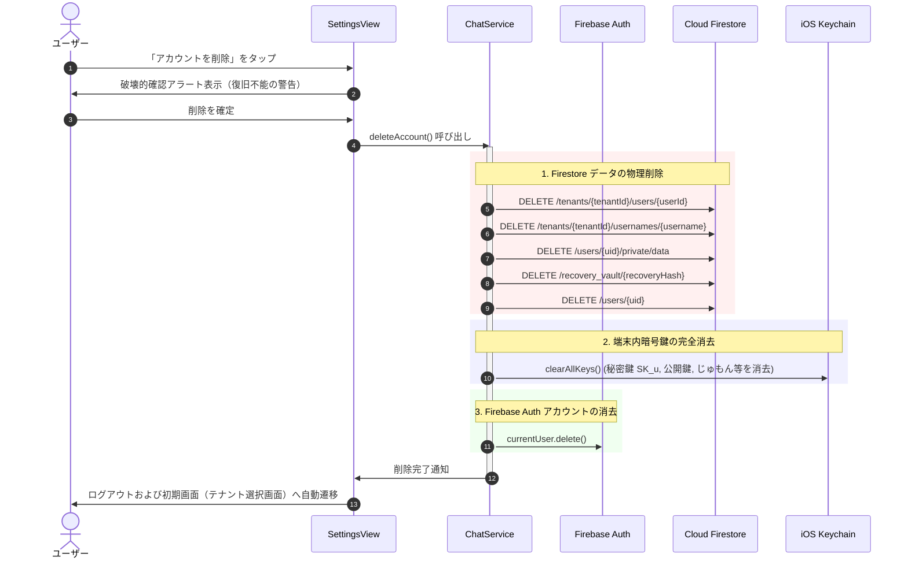

# 07-14: アカウント削除（退会）詳細設計書

本ドキュメントは、**Friends** アプリケーションにおけるアカウント削除（退会）機能の仕様、データ完全抹消プロトコル、画面フロー、および Apple App Store 審査ガイドライン 5.1.1(v) に適合するための要件を定めた詳細設計書です。

---

## 1. 概要 & 目的

Apple App Store Review Guidelines 5.1.1(v) では、「アカウントの作成に対応しているすべての App は、App 内からアカウントの削除を開始できるようにする必要があります。アカウントの削除には、アカウントに関連付けられた個人データの削除も含まれます」と義務付けられています。
本機能は、ユーザーが自発的にサービス利用を終了し、自身のアカウント、暗号鍵バックアップ、プロファイルデータを完全かつ安全に消去する手段を提供します。

---

## 2. アカウント削除シーケンス & データ抹消境界

アカウント削除は、取り消し不可能な破壊的操作であるため、ユーザーへの警告確認を経て以下のステップで実行されます。

### 2.1 データ抹消の境界と整合性維持
- **消去対象 (個人データ & 認証基盤)**:
  - `/tenants/{tenantId}/users/{userId}`: プロファイルドキュメント
  - `/tenants/{tenantId}/usernames/{username}`: ユーザーネーム一意性予約インデックス
  - `/users/{uid}/private/data`: 秘密鍵バックアップ
  - `/recovery_vault/{recoveryHash}`: 復旧ボルトレコード
  - `/users/{uid}`: 全域ユーザープロファイル
  - 端末内 Keychain: 全ての秘密鍵、公開鍵、テナントマスターキー、セッション鍵
  - Firebase Authentication アカウント
- **残存するデータ (通信整合性維持)**:
  - 過去に送信済みのE2EE暗号化メッセージ（`/tenants/{tenantId}/chats/{chatId}/messages/{messageId}`）:
    - 過去のメッセージ本文は暗号文のまま保持されますが、送信者プロファイルが削除されるため、他ユーザーの画面では「退会したユーザー」として扱われます（チャットログの欠損や整合性エラーを防止）。

---

## 3. セキュリティルール改修仕様

Firestore Security Rules (`infra/firestore.rules`) において、本人の認証 UID (`request.auth.uid`) に基づく削除を許可します：

1. **`/users/{uid}`**:
   - `allow delete: if isUser(uid);`
2. **`/users/{uid}/private/data`**:
   - `allow delete: if isUser(uid);`
3. **`/tenants/{tenantId}/users/{userId}`**:
   - `allow delete: if isTenantUser(tenantId, userId);`
4. **`/tenants/{tenantId}/usernames/{username}`**:
   - `allow delete: if isAuthenticated() && resource.data.uid == request.auth.uid;`（既存維持）
5. **`/recovery_vault/{recoveryHash}`**:
   - `allow delete: if isAuthenticated() && resource.data.uid == request.auth.uid;`（既存維持）

---

## 4. UI / UX 仕様

1. **配置**: `SettingsView` 最下部の危険操作セクション（サインアウトの下）。
2. **ボタン文言**: `settings.account_delete`（赤色 `role: .destructive`）。
3. **確認ダイアログ**:
   - タイトル: `settings.account_delete_confirm_title`（アカウントを削除しますか？）
   - メッセージ: `settings.account_delete_confirm_msg`（アカウントを削除すると、チャット履歴、友達関係、設定、暗号化鍵バックアップなどのすべてのデータが完全に削除され、元に戻すことはできません。）
   - 破壊ボタン: `settings.account_delete_execute`（削除する）
   - キャンセルボタン: `common.cancel`
4. **ローディング & エラーハンドリング**:
   - 削除処理中はインジケータを表示し、通信切断等のエラー時はエラーアラートを表示して安全に中断。
   - 再認証が必要（`FIRAuthErrorCodeRequiresRecentLogin`）な場合は、再ログインを促す案内を表示。
