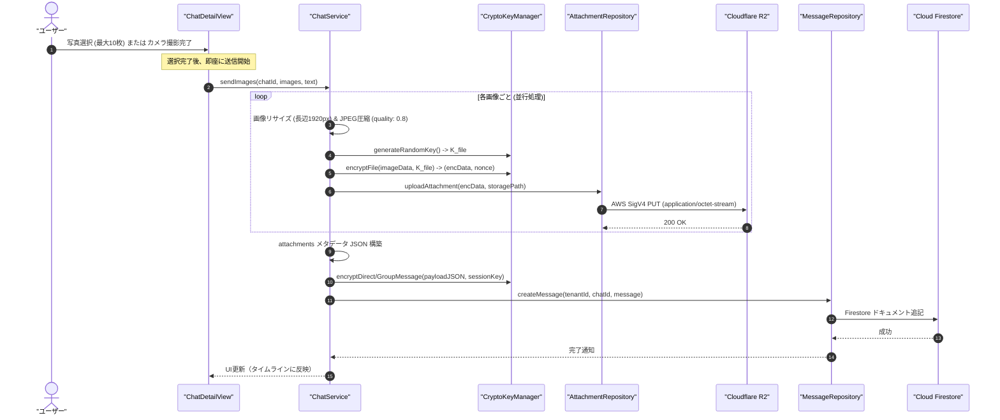
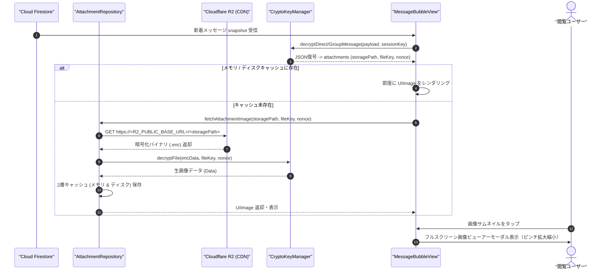

# 07-16: チャットファイル・写真添付・E2EE暗号化・R2連携詳細設計書 (Chat File Attachment & E2EE R2 Storage)

本ドキュメントは、**Friends** アプリケーションにおけるチャット（1:1 DM および グループチャット）での写真・ファイル添付機能、ゼロ知識 E2EE 封筒暗号化（Envelope Encryption）、Cloudflare R2 への安全なアップロードおよび高速配信・復号仕様を定義する詳細設計書です。

---

## 1. アーキテクチャ概要 & 封筒暗号化プロトコル (Envelope Encryption)

### 1.1 ゼロ知識・封筒暗号化の採用理由
写真や大容量メディアを扱うにあたり、チャットセッション鍵（$SK_{direct}$ / $SK_{group}$）で大容量ファイルを直接暗号化せず、添付ファイルごとに一意のランダム対称鍵 $K_{file}$ を生成する **封筒暗号化（Envelope Encryption）** を採用します。

- **最高度のセキュリティ（ゼロ知識 E2EE）**: Cloudflare R2 に保存されるバイナリはランダム鍵 $K_{file}$ で暗号化されており、Cloudflare 側には平文画像データは一切漏洩しません。また、ファイル名、復号鍵、Nonce などのメタデータはすべてメッセージ本文暗号化ペイロード内に隠蔽されるため、Firestore 上でも第三者・サーバー管理者に画像の存在や内容が漏洩しません。
- **効率的なパフォーマンス**: 大容量バイナリは端末内で AES-256-GCM 暗号化され、AWS SigV4 PUT により Cloudflare R2 に直接アップロードされます。Egress 転送量ゼロの Cloudflare CDN を経由して高速に配信されます。

### 1.2 鍵体系 & ペイロード構造

1. **ファイル暗号化鍵 $K_{file}$**:
   - 添付ファイルごとに生成される一意の 256-bit AES 対称鍵。
   - 暗号化アルゴリズム: AES-256-GCM (12-byte Nonce, 16-byte Auth Tag)。
2. **暗号化ファイル保存先**:
   - Cloudflare R2: `tenants/{tenantId}/chats/{chatId}/attachments/{attachmentId}.enc`
3. **メッセージペイロード暗号化**:
   - 暗号化対象となる平文 JSON ペイロード:
   ```json
   {
     "text": "写真送ります！",
     "attachments": [
       {
         "attachmentId": "att_01JMABC123XYZ",
         "storagePath": "tenants/t_corp/chats/dm_u1_u2/attachments/att_01JMABC123XYZ.enc",
         "fileKey": "base64Encoded256BitKey...",
         "nonce": "base64Encoded12ByteNonce...",
         "mimeType": "image/jpeg",
         "width": 1920,
         "height": 1080,
         "size": 245100
       }
     ]
   }
   ```
   - この JSON を UTF-8 エンコードし、既存のチャットセッション鍵（$SK_{direct}$ または $SK_{group}$）で AES-256-GCM 暗号化して Firestore の `encryptedPayload` に格納します。
   - ※添付がない通常のテキストメッセージは、従来通り平文テキストをそのまま暗号化するか、上記構造の `attachments: []` として相互運用可能とします。

---

## 2. 処理シーケンス

### 2.1 送信シーケンス（即時自動送信）
ユーザーが写真ライブラリから選択（最大10枚）またはカメラで撮影を完了した時点で、プレビュー待機を挟まず **速やかに自動送信処理** を開始します。



### 2.2 受信 & 閲覧シーケンス


---

## 3. UI / UX 仕様

1. **入力バー**:
   - `[ メディア添付アイコン ] [ テキスト入力欄 ] [ 送信アイコン ]`
   - メディア添付アイコンタップで、アイコンの直上近辺にコンテキストメニュー（`Menu`）を表示（「カメラを起動」「写真ライブラリから選択」）。各項目にアイコン（カメラ `camera`、写真ライブラリ `photo.on.rectangle`）を付与。
   - 写真ピッカーは iOS 16+ 標準の `PhotosPicker`（複数選択対応、最大10枚）。
2. **タイムライン吹き出し表示**:
   - パターンA（アルバムまとめ表示）: 複数枚の写真が添付されている場合、1つの吹き出し内にグリッド（1枚: 単一表示、2枚: 2分割、3枚以上: グリッド配置）でサムネイルを表示。
   - タップするとフルスクリーンビューアー（`ImageViewerView`）が開き、高解像度での閲覧・ピンチイン/アウト拡大縮小が可能。
3. **画像フルスクリーンビューアー (`ImageViewerView`) 仕様**:
   - **対象範囲（チャット内全写真ギャラリー）**:
     - チャットタイムライン上の写真添付メッセージ群からすべての写真を時系列順（古い順〜新しい順）に集約。
     - ユーザーがいずれかの写真サムネイルをタップした際、その写真の位置（`initialIndex`）からビューアーを開き、1枚送信・複数枚送信を問わず、チャット内の過去・次の写真へと左右スワイプで行き来可能とする。
   - **左右スワイプ & ページング**:
     - 等倍表示時（`scale == 1.0`）は、下層のズームスクロールを無効化（`isScrollEnabled = false`）してタッチドラッグを親ページャー（`TabView` / `UIPageViewController`）に 100% 透過し、左右のスワイプで前後の写真へ確実に遷移。
     - 等倍時の下方向スワイプ（Swipe to dismiss）による直感的な閉じる操作に対応。
   - **ズーム & パン排他制御**:
     - ピンチイン/アウトによる拡大縮小（最大4倍）、およびダブルタップによるズームイン（2.5倍）/等倍復帰をサポート。
     - 拡大表示時（`scale > 1.0`）は画像内パン移動を有効化し、不要なページ誤送りを防止。等倍復帰時に左右スワイプ遷移が再度有効化される。
   - **左上**: 閉じるボタン（✕ アイコン）。
   - **右上（ダウンロード/保存）**:
     - アイコンは1つ（ダウンロードアイコン `square.and.arrow.down`）。
     - 単一写真時: タップするとそのまま現在の写真を端末の写真ライブラリへ保存。
     - 複数写真時: タップするとメニュー（`Menu`）を表示し、「この写真を保存」または「写真(n)を保存」を選択可能。タップ時に端末の「写真（カメラロール）」へ保存し成否トーストをフィードバック表示。
   - **左右下部ナビゲーションボタン**:
     - 左下: 前の写真へ移動するボタン（◀）。先頭時は非活性。
     - 中央: チャット全体の写真ページ番号表示（例: `3 / 8`）。
     - 右下: 次の写真へ移動するボタン（▶）。末尾時は非活性。
4. **チャット一覧（友達一覧・グループ一覧）表示**:
   - 本文が空で写真のみ送信された場合、最新メッセージプレビューとして「写真を送信しました」（`L10n.Chat.imageMessageSent` / "Sent a photo"）を表示し、「メッセージのやり取りはありません」とならないようにする。

---

## 4. エラーハンドリング & 非機能要件

- **カメラ権限**: 未許可時は設定アプリへ誘導するアラートを表示。
- **シミュレーター環境**: シミュレーターでカメラが利用不可の場合は、自動的にアラートで案内し写真ライブラリへフォールバック。
- **オフライン/アップロード失敗**: アップロード失敗時はユーザーにエラーバナー（Toast）を通知し、中途半端なメッセージ書き込みを行わないアトミック性を担保。
