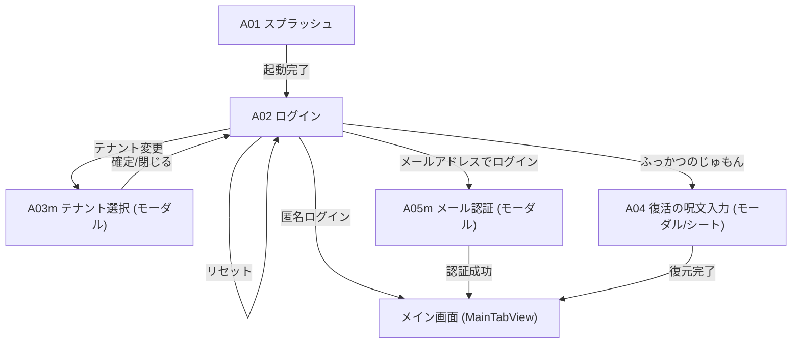
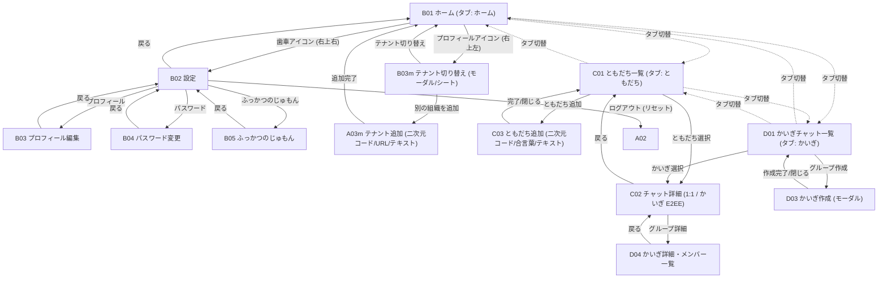

# 08: 画面設計 (Screen Design & Transition Flow)

## 画面設計の凡例・注記

- **モーダル画面**: 画面IDの末尾に `m` が付く画面（例: `A03m`, `E05m`）は、親画面の上に重ねて表示されるモーダルダイアログ/シート画面を示します。
- **現段階（Phase 1）未実装機能**: 音声・ビデオ通話機能および位置共有機能は、Phase 1 では未実装（Phase 2 以降で追加検討）のため、本画面設計には含めていません。
- **アクセシビリティ & Dynamic Type (OS文字サイズ連動) 原則**:
  - すべての画面において、OSの設定（「画面表示と明るさ > 文字サイズを変更」および「アクセシビリティ > さらに大きな文字」）に応じた文字サイズの拡大・縮小（Dynamic Type）に対応する。
  - 固定サイズ（`.system(size: XX)`）は原則禁止とし、SwiftUI セマンティックスタイル（`.largeTitle`, `.title`, `.title2`, `.title3`, `.headline`, `.subheadline`, `.body`, `.callout`, `.footnote`, `.caption`, `.caption2`）またはセマンティクス修飾子（`.font(.system(.body, design: .rounded))` 等）を使用する。
  - ボタンやカードの高さは固定 `height` ではなく `minHeight` を指定し、極大文字サイズ時でもテキストの見切れや不自然な改行・はみ出しを防ぐ。

## 画面一覧

| ID   | 画面                 | 主な役割                                      |
| :--- | :------------------- | :-------------------------------------------- |
| A01  | スプラッシュ         | 起動・初期化                                  |
| A02  | ログイン             | 認証方法の選択とテナント確認・変更            |
| A03m | テナント選択         | テナントの指定 (二次元スキャン/JSON入力/URL指定)  |
| A04  | ふっかつのじゅもん入力 | 既存端末でのじゅもんによるログイン            |
| A05m | メール認証           | メールアドレスとパスワードによるログイン/登録 |
| B01  | ホーム               | タブ名: "ホーム" (お知らせ・概要、右上から設定 B02 およびテナント切替 B03m へ遷移) |
| B02  | 設定                 | アプリ設定・セキュリティ・アカウント管理 (ホーム右上歯車よりPush遷移) |
| B03  | プロフィール編集     | ユーザー名・アイコン等のプロフィール変更      |
| B03m | テナント切り替え     | 複数テナントの保持・切り替え・追加 (ホーム右上のプロフィールアイコンからシート表示) |
| B04  | パスワード変更       | ログインパスワードの変更                      |
| B05  | ふっかつのじゅもん   | 匿名利用後の復旧手段作成・確認                |
| C01  | ともだち・チャット一覧 | タブ名: "ともだち" (Friends / チャット一覧、最新順、未読表示、右上からともだち追加) |
| C02  | チャット詳細         | 1:1およびかいぎのチャット詳細 (E2EE, 相手アイコン・吹き出し, メッセージ長押しリアクション, カウント表示) |
| C02m | リアクション詳細     | メッセージごとのリアクション一覧・ユーザー詳細 (モーダル/シート) |
| C03  | ともだち追加         | 統合1画面（上: カメラスキャン / 下: 自二次元コード+3桁合言葉）& テキスト連携 |
| C04  | ともだち詳細         | ともだちのプロフィール閲覧・チャット開始・設定    |
| D01  | かいぎチャット一覧   | タブ名: "かいぎ" (Groups)                     |
| D02  | かいぎチャット詳細   | かいぎ内のメッセージやりとり                |
| D03  | かいぎ作成           | 新規かいぎの作成                    |
| D04  | かいぎ詳細           | かいぎ情報・メンバー一覧の確認および管理    |
| D05m | かいぎメンバー追加   | かいぎへのメンバー追加（モーダル）          |

## 画面遷移図

### ログイン

### 利用者向け

---

## 主要画面 UI・レイアウト詳細設計

### A01 スプラッシュ画面 (`SplashView`)

- **コンテンツ構成**:
  1. **背景**: アプリアイコン連動グラデーション（#00C7B1 -> #00A2E8 -> #0066CC）
  2. **アプリアイコン**: 公式吹き出しシェイプ（`SpeechBubbleShape`）
  3. **タイトル**: `Friends` (`L10n.Auth.title`、`.font(.system(.largeTitle, design: .rounded).weight(.bold))`、OS文字サイズ連動)
  4. **プログレスインジケーター**: `ProgressView`（白ティント、ローディングアニメーション）

---

### A02 ログイン画面 (`LoginView`)

- **コンテンツ構成**:
  1. **アプリアイコン & ブランディング**:
     - 画面上部に心地よい余白（約60pt）を設け、中央に縦並び配置（公式アプリアイコン `FriendsIcon` 76x76 円形クリップ・ドロップシャドウ、その下にタイトル `Friends` (`L10n.Auth.title`、`.font(.system(.largeTitle, design: .rounded).weight(.heavy))`、OS文字サイズ連動)）。
  2. **テナント選択カード**:
     - 選択中のテナント名（`.subheadline.bold()`）・テナントコード（`.caption2`）、変更ボタン（`qrcode.viewfinder` アイコン + `.caption`、`A03m` モーダル表示、上下パディング 12pt の設計）。ヘッダー直下に配置。
  3. **表示名入力カード**:
     - 匿名ログイン時に使用する表示名の入力エリア。
     - ラベル (`L10n.Auth.displayNameLabel`)、プレースホルダー (`L10n.Auth.displayNamePlaceholder`)、フォーカス時のアクセント枠線表示。
     - テナント選択カードと認証操作エリアの間に配置。未入力時はデフォルト表示名 (`L10n.Common.guestUser`) に自動フォールバック。
  4. **認証操作エリア**:
     - **匿名ログインボタン**: 表示名入力の直下に配置 (`L10n.Auth.guestBtn`、`.font(.body.weight(.bold))`、`minHeight: 50pt`、タップで入力された表示名とともに匿名認証・鍵初期化開始)。文字サイズ拡大時もボタンが自然に縦伸長。
     - **復活の呪文ログインボタン**: 1行配置 (`L10n.Auth.recoveryBtn`、`.font(.caption.weight(.medium))`、タップで `A04` 復元シート表示)。
     - **端末データ・鍵の完全リセットボタン**: 1行配置 (`L10n.Auth.resetDeviceBtn`、`.font(.caption2.weight(.medium))`、タップで Keychain・ローカルデータ完全消去の確認アラート表示)。
  5. **利用規約・プライバシーポリシー表示 (最下部)**:
     - 同意案内文 (`L10n.Legal.termsAgreeNotice`、`.font(.system(size: 11))`、OSフォントサイズに左右されないやや小さい固定サイズで表示)
     - 利用規約リンク (`L10n.Legal.termsTitle`、`.font(.system(size: 11, weight: .medium))`、タップで `TermsOfServiceView` モーダル表示)
     - プライバシーポリシーリンク (`L10n.Legal.privacyTitle`、`.font(.system(size: 11, weight: .medium))`、タップで `PrivacyPolicyView` モーダル表示)
     - `dynamicTypeSize(...DynamicTypeSize.small)` または固定ポイント指定により、Dynamic Typeによる極端な肥大化を防ぎコンパクトなフッター表記を維持。
  6. **復活の呪文復元モーダル (`RecoveryLoginSheetView`)**:
     - 鍵アイコン、タイトル（`.title2`）、説明（`.caption`）、入力テキストエリア（等幅 `.body`）、復元ボタン（`minHeight: 50pt`）、ScrollView によるスクロール担保。

---

### A03m テナント選択画面 (`TenantSelectionView`)

- **画面種別**: ハーフモーダル / フルモーダルシート
- **コンテンツ構成**:
  1. **入力方式切替**: セグメンテッドピッカー（「二次元コード」「URL」「直接入力」）
  2. **タブコンテンツ**:
     - 二次元コード: 共通スキャナーコンポーネント（`TwoDimensionalCodeScannerView`：実機カメラプレビュー＋シンプルなガイド枠 / シミュレーター代替表示）
     - URL入力: URLテキストフィールド（等幅 `.subheadline`）、検証ボタン（`minHeight: 50pt`）
     - 直接入力: JSONテキストエディタ（等幅 `.caption`）、検証ボタン（`minHeight: 50pt`）
  3. **検証結果カード**:
     - テナント名（`.headline`）、コード（`.subheadline`）、デフォルトバッジ（`.caption2`）、確定ボタン（`minHeight: 50pt`）
  4. **スクロール対応**:
     - 文字サイズ拡大時にも画面下部のはみ出しを防ぐため `ScrollView` 構造を適用。

---

### B01 ホーム画面 (`HomeView`)

- **タブ名**: `ホーム` (アイコン: `house.fill`)
- **ナビゲーションバー**:
  - タイトル: `ホーム`
  - 右上ツールバー:
    - **歯車アイコン**: `gearshape.fill`（`.font(.body)`、タップで `B02` 設定画面へ Push 遷移）。
    - ※ テナント切り替えアイコン（プロフィール風アイコン＋他テナント未読バッジ）は機能として実装・保持し、将来の有効化導線として整理。
- **コンテンツ構成**:
  1. **クイックアクション (画面最上部)**:
     - `ともだちを追加` ボタン（タップで `C03` ともだち追加シート表示。セカンダリボタンスタイル採用、`minHeight: 44pt`、テキスト `.font(.subheadline.bold())`）。
  2. **お知らせセクション**:
     - お知らせ一覧 / 未読お知らせ（未読なし時はプレースホルダー表示、ベルアイコン `.font(.system(.largeTitle))`、テキスト `.font(.subheadline)`）。

---

### B03m テナント切り替え画面 (`TenantSwitcherView`)

- **画面種別**: ハーフモーダル / シート画面
- **ナビゲーションバー**:
  - タイトル: `テナントの切り替え` (`L10n.Tenant.switchTitle`)
  - 右: `閉じる` ボタン (`L10n.Common.close`)
- **コンテンツ構成**:
  1. **テナント一覧セクション**:
     - 登録済みテナントを 1 つの一覧として表示。
     - **現在利用中のテナント**: 一覧の一番上（最上段）に配置。行内に「利用中」識別バッジ（青色カプセル）およびチェックマークを表示し、現在のアクティブテナントであることを直感的に明示。
     - **その他のテナント**: テナント名、テナントコード（`@kanto.work` 等）、および**未読メッセージ数バッジ**を表示。タップで即時にそのテナントへ切り替えてシートを閉じる。スワイプによる離脱・削除操作が可能（デフォルトテナント以外）。
  2. **テナントの追加ボタン**:
     - `別のテナントを追加` (`L10n.Tenant.switchAddBtn`) ボタン。
     - タップで既存の `A03m` テナント選択画面（二次元コード / URL / テキスト入力）をモーダル表示。

---

### B02 設定画面 (`SettingsView`)

- **遷移方式**: ホーム画面（`B01`）右上歯車アイコンから NavigationStack 経由で Push 遷移（画面遷移、モーダルではない）
- **ナビゲーションバー**:
  - タイトル: `設定`（インライン中央表示: `.navigationBarTitleDisplayMode(.inline)`）
  - 左: 標準戻るボタン（`< ホーム`）
- **セクション構成**:
  1. **プロフィール概要カード (タップで `B03` へ遷移)**:
     - 左: ユーザーアバター画像（円形、未設定時はデフォルト人型アイコン）
     - 右上: 名前 (`displayName`、太字)
     - 右下: `@` + アカウント (`username`、グレー)
     - 右端: `>` (chevron)
  2. **セキュリティ**:
     - `ブロックしたともだち`: タップでブロック中ユーザー一覧画面 (`B07`) へ遷移。ブロック解除が可能。
     - `ふっかつのじゅもん`: タップで日本語（ひらがな12語）復旧フレーズ表示シート (`B05`) を開く。シート左上には「閉じる」ボタン、右上には「再作成」ボタン（`arrow.clockwise` アイコン、確認アラート後に新フレーズ生成・バックアップ上書き更新）を配置。
     - `セキュリティリセット`: 赤字ボタン、Curve25519 鍵ペア再生成とセッション切断確認ダイアログ
  3. **表示**:
     - `メッセージの文字サイズ`: セグメントピッカー（`ChatFontSize`: より小 14.0pt / 小 15.5pt / 中 17.0pt / 大 23.0pt / より大 28.0pt、デフォルト: 中）。チャット詳細画面（`C02`）の吹き出しテキスト・リアクションバッジ・アクションメニューに即時反映。
  4. **アプリ情報**:
     - `アプリ情報`: タップで `B06` アプリ情報画面へ Push 遷移（バージョン、暗号化方式の改行表示、利用規約、プライバシーポリシー、ライセンス表示）
  5. **アカウント & 危険操作**:
     - `ログアウト`: 端末暗号鍵・ローカルキャッシュ完全消去確認ダイアログ
     - `アカウントを削除`: 赤字ボタン (`role: .destructive`)、Firebase Auth アカウント・Firestore プロファイル・バックアップ・Keychain を完全消去する復旧不能警告ダイアログ (Apple Guideline 5.1.1(v) 適合)

---

### B03 プロフィール編集画面 (`EditProfileView`)

- **ナビゲーションバー**:
  - タイトル: `プロフィール編集`
  - 左: `閉じる` ボタン（`L10n.Common.close`）
  - 右: アイコンボタン（チェックマーク `checkmark`、`.buttonStyle(.borderedProminent)`、`.tint(.blue)`、未変更時または入力不正時は非活性）
- **セクション構成**:
  1. **プロフィールセクション** (`L10n.Settings.sectionProfile`):
     - **アバター & アカウント**:
       - 左: アバターサークル (64x64) & 右下カメラマークバッジ (タップでアクションシート表示)
       - 右: `@` + アカウント入力フィールド (`username`、`@` はユーザーネーム入力欄のすぐ左隣に密着配置され、文字数に応じて右端揃えのまま追従、半角英数字・アンダースコア、英語キーボード `.keyboardType(.asciiCapable)`、タップで即時フォーカス)
       - アクションシート: 「写真を選択」「プリセットから選ぶ」「アバターを削除」「キャンセル」
     - **名前**: 左ラベル `名前` / 右 入力フィールド (`displayName`、右寄せ、暗号化保存)
     - **ID**: 左ラベル `ID` / 右 等幅テキスト (`userId`: `u_<Base58>` 通常フォントサイズ `.body`、読み取り専用グレー)
  2. **テナントセクション (左右配置・読み取り専用)**:
     - セクション名: `テナント` (`L10n.Settings.sectionTenant`)
     - すべて編集不可であることが明確に分かるよう、統一されたフォントサイズ (`.body`)・通常の太さ・グレー色 (`.secondary`) で表示
     - **コード**: 左ラベル `コード` / 右 等幅グレーテキスト (`tenantCode`)
     - **テナント名**: 左ラベル `テナント名` / 右 通常グレーテキスト (`tenantName`)
     - **ID**: 左ラベル `ID` / 右 等幅グレーテキスト (`tenantId`: `t_...`)
- **確認ダイアログ & アラート**:
  - **ユーザー名（アカウント）変更警告ダイアログ**: ユーザー名が変更された状態で保存を実行しようとした場合、Apple HIG（Human Interface Guidelines）に準拠した2択の確認ダイアログを表示する。
    - キャンセルアクション: `role: .cancel`（文言: `キャンセル`）
    - 破壊的アクション: `role: .destructive`（文言: `変更` - HIGの動詞原則準拠）
    - メッセージ: `アカウント名を変更すると、相手があなたを検索・追加する際のアカウント名が変わります。変更して保存しますか？`
    - ユーザーが「変更」を選択した場合のみ、リモートDB更新とローカル状態の更新を実行する。

---

### B06 アプリ情報画面 (`AppInfoView`)

- **遷移方式**: `B02` 設定画面から NavigationStack 経由で Push 遷移（画面遷移、モーダルではない）
- **ナビゲーションバー**:
  - タイトル: `アプリ情報` (`L10n.AppInfo.title`)
  - 左: 標準戻るボタン（`< 設定`）
- **セクション構成**:
  1. **バージョン情報**:
     - 左ラベル: `バージョン` (`L10n.AppInfo.version`)
     - 右テキスト: `1.0.0 (Build 1)` (Info.plist から動的取得)
  2. **暗号化方式**:
     - 左ラベル: `暗号化方式` (`L10n.AppInfo.encryption`)
     - 右テキスト (改行して2行表示):
       - `AES-256-GCM`
       - `X25519 (ECDH)`
     - フッター説明: メッセージ通信は端末間の Curve25519 鍵交換と HKDF-SHA256 で導出されたセッション鍵による AES-256-GCM E2EE、組織内データはテナントマスターキーによる AES-256-GCM で保護されています。
  3. **規約・ポリシー・ライセンス** (`L10n.Settings.sectionLegal`):
     - `利用規約`: タップで `B08` 利用規約画面へ Navigation 遷移
     - `プライバシーポリシー`: タップで `B09` プライバシーポリシー画面へ Navigation 遷移
     - `ライセンス表示` (`L10n.AppInfo.licenses`): タップで `B06-a` オープンソースライセンス画面へ Navigation 遷移

---

### B06-a オープンソースライセンス画面 (`LicenseListView`)

- **遷移方式**: アプリ情報画面（`B06`）「ライセンス表示」から Navigation 遷移
- **ナビゲーションバー**:
  - タイトル: `オープンソースライセンス` (`L10n.AppInfo.licenses`)
- **コンテンツ構成**:
  - `ios/Sources/Resources/legal/licenses.md` を `LegalMarkdownView(fileName: "licenses")` でレンダリング。
  - SPM 依存関係から自動生成された OSS パッケージの一覧、バージョン、リポジトリ URL、およびライセンス条文（コードブロック表示）を美しく表示。

### C01 ともだち・チャット一覧画面 (`FriendListView`)

- **タブ名**: `ともだち` (アイコン: チャット吹き出し `bubble.left.and.bubble.right.fill`)
- **ナビゲーションバー**:
  - タイトル: `ともだち`
  - 右上: `ともだちを追加` アイコンボタン（`person.badge.plus`、`.font(.body.weight(.medium))`、タップで `C03` ともだち追加画面へ遷移）
- **リスト構成・操作**:
  - チャット・ともだち一覧（最新メッセージ順）
  - **空状態**: プレースホルダーアイコン（`person.2.slash`、`.font(.system(.largeTitle))`）、案内テキスト（`.font(.subheadline)`）
  - **チャットセル (`ChatRowView`)**:
    - 表示名（`.font(.headline)`）、最新メッセージ（`.font(.subheadline)`）、やり取りなし案内（`L10n.Chat.noMessages`、`.font(.caption)`）
    - タイムスタンプ・未読バッジ（`.font(.caption2)`、バッジパディング自動スケーリング）
    - Dynamic Type 拡大時もタイトル・本文に `.minimumScaleFactor(0.85)` を適用して文字の可読性を確保
  - **ともだちのカスタム表示名変更**: セルを長押し（コンテキストメニュー）またはスワイプした際に「表示名の変更」（`pencil`）を表示。タップでダイアログが表示され、自身の秘密鍵（$MK_u$）で暗号化される自分だけのカスタム呼び名を設定可能（ダイアログ案内:「相手には見えません。あなた専用に表示名を設定します。」）。

---

### C02 チャット詳細画面 (`ChatDetailView`)

- **ナビゲーションバー**:
  - タイトル: チャット相手の名前またはかいぎ名（`.navigationBarTitleDisplayMode(.inline)`）
  - 右上:
    - かいぎチャット時: `pencil` アイコン（タップで `D04` かいぎ詳細画面へ遷移）
    - 1:1 DM チャット時: `pencil` アイコンまたはタイトルタップで「表示名の変更」シート/ダイアログを表示
- **コンテンツ構成**:
  1. **動的ロードメッセージタイムライン (`ScrollViewReader` + `LazyVStack`)**:
     - 最上部: 過去メッセージ読み込みスピナー（上スクロール時に `loadMoreMessages` を自動発火し、30件ずつ過去メッセージを動的遡りロード）
     - 吹き出しバブル (`MessageBubbleView`): 相手メッセージ（左側 + アバター + 送信者名）、自分メッセージ（右側 + 既読/送信時刻/送信状態）
     - **メッセージ送信ステータス & 再送処理**:
       - **送信中 (`.sending`)**: 吹き出し横の時刻表示部に、再送信中が分かるアニメーションアイコン（回転スピナー）を表示。
       - **送信完了 (`.sent`)**: 通常の既読表示（1:1 は「既読」、グループは「既読 N」）および送信時刻を表示。
       - **送信失敗 (`.failed`)**: 既読位置に **「失敗アイコン (赤丸警告)」＋「再送」** を小さめに表示。
       - **タップによる再送**: 送信失敗状態のメッセージは、**「メッセージ内容（吹き出し本文）」または「再送表示」をタップすることで即座に再送を実行**（再送中は回転アニメーションアイコンへ動的変化）。このタップ時はリアクションのモーダルは出さない。
     - **かいぎメンバー送信者名・アバター解決**: ともだち未登録の参加者からのメッセージでも、かいぎ参加者プロファイルを動的解決して常に正しい表示名とアバターを表示
     - 長押しクイックアクションメニュー（直下にリアクション7種 👍❤️🆗😊🤣😢😱 ＆ コピーを表示） & リアクション集計バッジ表示
     - スワイプによる送信時刻・暗号鍵バージョンの詳細表示
  2. **新着メッセージフローティングバナー (オンデマンド移動)**:
     - ユーザーがタイムラインを過去にスクロール中に新着メッセージを受信した際、画面を勝手に最下部へ自動スクロールさせず、入力バー直上に「新着メッセージがあります ↓」フローティングバナーを表示。
     - バナーをタップすると、最新メッセージ（または未読位置）までスムーズに自動スクロール移動し、バナーを非表示にする。
   3. **入力バー (`[写真] [入力欄] [送信]`) & 送信プロトコル**:
      - **楽観的UI更新（即時反映 & 入力クリア）**:
        - 送信ボタン押下時、メッセージを送信中状態（`.sending`）として即座にタイムライン一覧へ追加表示し、テキスト入力欄は即座にクリア（空文字化）する。
        - 送信処理はサーバー API（`POST /api/v1/tenants/:tenantId/chats/:chatId/messages`）経由で実行（Firestore 直接書き込みフォールバックなしの一本化）。
      - **未送信メッセージの連動送信**:
        - 新しいメッセージを送信した際、メモリ上の未送信キュー（失敗または送信待ちのメッセージ）があれば、それらも自動的に順次再送する。
      - 左側: 写真添付ボタン（写真アイコン `photo.on.rectangle.angled`）
        - タップでアクションメニューを表示（「写真を撮る」「写真を選択」「キャンセル」）
        - 「写真を撮る」: カメラ起動（撮影完了後に暗号化写真アップロード + API経由メタデータ送信）
        - 「写真を選択」: OS標準の写真ピッカー（`PhotosPicker`、複数選択対応・上限10枚。選択完了後に暗号化写真アップロード + API経由メタデータ送信）
      - 中央: 複数行対応テキストフィールド (`TextField(..., axis: .vertical)`)
      - 右側: 送信ボタン (紙飛行機アイコン `paperplane.fill`、テキスト未入力かつ添付なし時は非活性)
   4. **写真・画像アルバム表示 & フルスクリーン画像ビューアー**:
      - 添付画像がある場合、メッセージ吹き出し内に角丸サムネイル（1枚は単一表示、複数枚はアルバムグリッド配置）を表示。
      - タップでフルスクリーン画像拡大ビューアーモーダル（ピンチイン/アウト拡大縮小）を表示。

---

### C03 ともだち追加画面 (`AddFriendView`)

- **タブ切替**: `二次元コード` / `テキスト`
- **二次元コードタブ**:
  - 上部: カメラプレビュー（共通スキャナー `TwoDimensionalCodeScannerView` によるシンプルなガイド枠と相手の二次元コード自動検知・ともだち追加実行）
  - 下部: 自分の招待二次元コード（余計な文字・ボタンなしのミニマル30秒更新表示）
- **テキストタブ**:
  - **自分の情報エリア**:
    - 行1: `ユーザー名` ラベル（改行なし固定） / ユーザー名 (`myDisplayUserId`) / アイコンのみのコピーボタン (`doc.on.doc`)
    - 行2: `合言葉` ラベル / 3桁数字ボックス `[0] [0] [0]` / 残り秒数付き円グラフメーター
  - **相手を追加エリア**:
    - 行1: 相手のユーザー名入力欄（先頭に `@` を表示、未入力時は灰色、入力時は黒字へ動的変化）
    - 行2: 合言葉入力欄（3桁数字）
    - 追加実行ボタン: `ともだちを追加`

---

### D01 かいぎ一覧画面 (`GroupListView`)

- **タブ名**: `かいぎ` (アイコン: 3人グループ `person.3.fill`)
- **ナビゲーションバー**:
  - タイトル: `かいぎ` (`L10n.Group.listTitle`)
  - 右上: `+` アイコンボタン（`plus`、`.font(.body.weight(.bold))`、タップで `D03` かいぎ作成画面をシート表示）
- **コンテンツ構成**:
  1. **参加中かいぎ一覧 (`List` / `InsetGrouped`)**:
     - 各行 (`GroupChatRowView`): かいぎアバター（カスタム画像またはグラデーション背景 + `person.3.fill`）、かいぎ名 (`displayTitle`、`.font(.headline)`、`.minimumScaleFactor(0.85)`)、参加人数バッジ (`(N)`、`.font(.caption)`)、最新メッセージ本文プレビュー（`.font(.subheadline)`、`.minimumScaleFactor(0.85)`）、最終メッセージ時刻（`.font(.caption2)`）、未読バッジ（`.font(.caption2)`）
     - 行タップで該当の `C02` チャット詳細画面へ遷移
  2. **引っ張って更新 (`.refreshable` / Pull-to-Refresh)**:
     - 「ともだち」一覧（C01）と同様に、リストを下に引っ張ることで最新のかいぎ一覧、最新メッセージ、未読件数、および参加メンバー全プロファイルをバックグラウンドで強制同期。
  3. **空状態表示**: 参加中のかいぎが存在しない場合、ガイダンスアイコン（`person.3.sequence.fill`、`.font(.system(.largeTitle))`）および案内文（`.font(.subheadline)`）を表示。

---

### D03 かいぎ作成画面 (`CreateGroupView`)

- **ナビゲーションバー**:
  - タイトル: `かいぎを作成` (`L10n.Group.createTitle`, `.navigationBarTitleDisplayMode(.inline)`)
  - 左上 (キャンセル): `xmark` アイコンボタン (`Image(systemName: "xmark")`)
  - 右上 (作成): プライマリカラー塗りつぶしボタン (`作成` `L10n.Group.submitBtn`, `.buttonStyle(.borderedProminent)`, `.tint(.blue)`)。未入力または作成処理中は非活性。
- **コンテンツ構成**:
  1. **かいぎ名入力セクション**:
     - ヘッダー: `かいぎ名`
     - プレースホルダー: `かいぎ名を入力`
  2. **メンバー選択セクション**:
     - ヘッダー: `メンバーを選択 (N人選択中)`
     - ともだち一覧リスト（アバター画像、名前、右端チェックボックス `checkmark.circle.fill` / `circle`）
  3. **エラー表示**: 作成失敗時のエラーメッセージ

### D04 かいぎ詳細画面 (`GroupDetailView`)

- **ナビゲーションバー**:
  - タイトル: かいぎ名（インライン表示）
  - 右上ツールバー:
    - メンバー追加ボタン (`person.badge.plus` アイコン。タップで未参加のともだち選択モーダルシート表示)
    - かいぎ名変更ボタン (`pencil` アイコン。タップでかいぎ名変更ダイアログ表示)
- **コンテンツ構成**:
  1. **かいぎ概要セクション**:
     - **かいぎアバター**: タップで写真選択・プリセット選択・アバター削除のアクションシートを表示し、かいぎ専用アバター画像を変更可能。
     - かいぎ名、作成日 (`chat.chat.createdDate`)
  2. **参加メンバー一覧セクション**:
     - ヘッダー: `メンバー (N人)`
     - メンバー行:
       - アバター画像、表示名、自分バッジ (`(あなた)`)
       - **ロールバッジ（名前の下に表示）**:
         - オーナー: 👑 `L10n.Group.roleOwner` (オレンジ色背景バッジ)
         - 管理者: 🛡️ `L10n.Group.roleAdmin` (青色背景バッジ)
         - 一般メンバー: バッジなし
       - **アクション（スワイプ操作 / 「…」メニュー）**:
         - **右スワイプ操作 (`.swipeActions(edge: .leading)`)**:
           - **管理者にする**: オーナーのみ実行可能（一般メンバー対象）。一般メンバー行を右にスワイプすると青色の「🛡️ 管理者にする」ボタンが表示され、タップで確認ダイアログを経て実行。
         - **行右端「…」メニュー (`Menu`)**:
           - **管理者にする**: オーナーにのみ表示（一般メンバー対象）。
           - **退室させる**: オーナーまたは管理者にのみ表示（対象が自分・オーナー以外。赤文字・破壊的スタイル）。タップで確認ダイアログ（1回表示）を表示。
           - ※ 誤操作防止のため、退室操作はスワイプから除外し「…」メニューからのみ実行可能。
   3. **管理者専用アクションセクション** (管理者のみ表示):
     - **「👑 オーナーを引き継ぐ」ボタン** (`L10n.Group.claimOwner`):
       - 自身が管理者（Admin）の場合にのみ表示される専用カード。
       - タップで「かいぎのオーナーを引き継ぎますか？前任のオーナーは管理者になります」と確認ダイアログ（1回表示）を表示し、承認時にオーナー昇格を実行。
    4. **参加状態セクション**:
      - **「退室する」ボタン**: 一般メンバー・管理者がかいぎを自ら離脱（タップで確認ダイアログ1回表示。※オーナーは「オーナーはかいぎを退室できません」と表示され離脱不可）。承認時にかいぎを離脱し、チャット詳細画面に戻るのではなく、グループ一覧画面（かいぎタブ）へ直接戻る。
    5. **かいぎ削除セクション（独立セクション）**:
      - **「かいぎを完全に削除」ボタン** (`L10n.Group.deleteButton`):
        - 表示条件: **自身がグループオーナーまたはグループ管理者の場合のみ表示**（赤色ラベル、破壊的スタイル）。
        - **削除確認ダイアログ (1回表示・重要警告)**:
          - タイトル: `かいぎ「{title}」を削除しますか？` (`L10n.Group.deleteConfirmTitle`)
          - メッセージ: `この操作は取り消せません。かいぎを削除すると、メッセージの送受信ができなくなり、メンバー全員の一覧から完全に削除されます。` (`L10n.Group.deleteConfirmMessage`)
          - アクション: `キャンセル` (キャンセル) / `削除` (破壊的)
          - Firestore 上で `members: []` に更新し、全参加者のチャット一覧から即時除外。
          - 処理完了後にチャット詳細画面に戻るのではなく、画面を一括 pop してグループ一覧画面（かいぎタブ）へ直接戻る。

---

### B07 ブロックしたユーザー一覧画面 (`BlockedUsersView`)

- **遷移方式**: 設定画面（`B02`）「ブロックしたユーザー」から NavigationStack 経由で Push 遷移
- **ナビゲーションバー**:
  - タイトル: `ブロックしたユーザー` (`L10n.Block.listTitle`)
- **コンテンツ構成**:
  - **一覧リスト**:
    - ブロック中のユーザー一覧（アバター、表示名、`userId`）
    - 右端に「ブロック解除」ボタン（`.buttonStyle(.bordered)`）
  - **空状態表示**:
    - ブロック中のユーザーが存在しない場合、シールドチェックアイコン (`shield.checkmark`) と「ブロックしているユーザーはいません」メッセージを表示。

---

### B08 利用規約画面 (`TermsOfServiceView`)

- **遷移方式**: 設定画面（`B02`）「利用規約」から Push またはシート表示（ログイン画面 `A02` 最下部からはモーダル表示）
- **ナビゲーションバー**:
  - タイトル: `利用規約` (`L10n.Legal.termsTitle`)
  - 左: `閉じる` ボタン (`L10n.Common.close`、モーダル表示時 `.topBarLeading` 配置)
- **コンテンツ構成**: `terms_of_service.md` の内容を Markdown 表示する。

---

## テナント管理者向け
