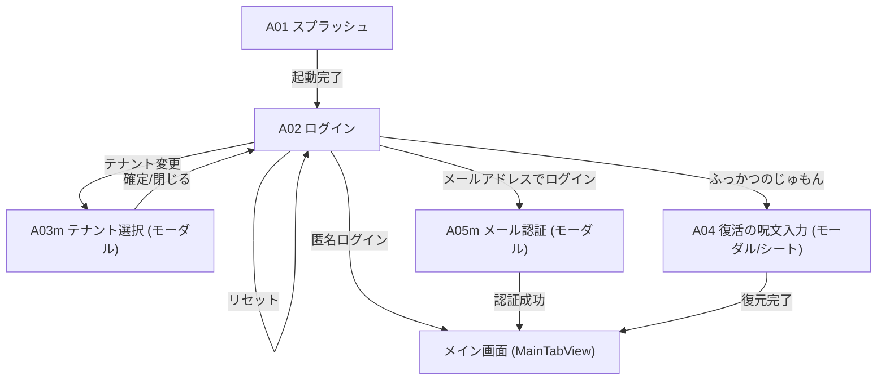
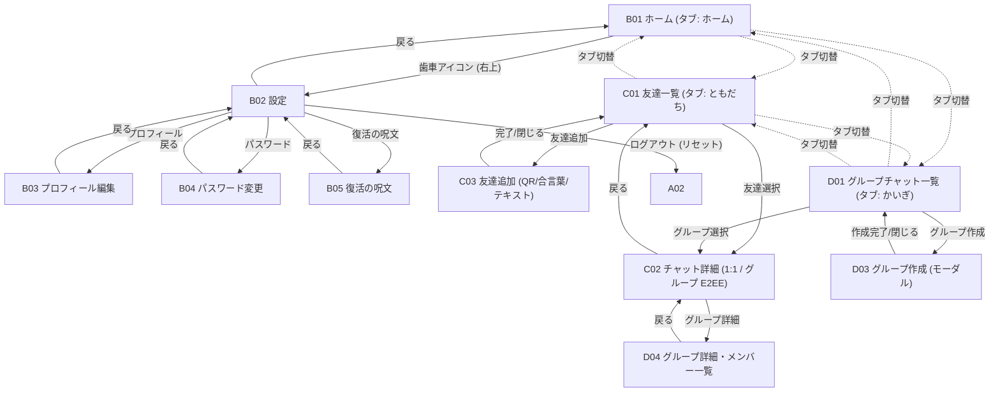

# 08: 画面設計 (Screen Design & Transition Flow)

## 画面設計の凡例・注記

- **モーダル画面**: 画面IDの末尾に `m` が付く画面（例: `A03m`, `E05m`）は、親画面の上に重ねて表示されるモーダルダイアログ/シート画面を示します。
- **現段階（Phase 1）未実装機能**: 音声・ビデオ通話機能および位置共有機能は、Phase 1 では未実装（Phase 2 以降で追加検討）のため、本画面設計には含めていません。

## 画面一覧

| ID   | 画面                 | 主な役割                                      |
| :--- | :------------------- | :-------------------------------------------- |
| A01  | スプラッシュ         | 起動・初期化                                  |
| A02  | ログイン             | 認証方法の選択とテナント確認・変更            |
| A03m | テナント選択         | テナントの指定 (QRスキャン/JSON入力/URL指定)  |
| A04  | 復活の呪文入力       | 既存端末での復活呪文によるログイン            |
| A05m | メール認証           | メールアドレスとパスワードによるログイン/登録 |
| B01  | ホーム               | タブ名: "ホーム" (お知らせ・概要、右上から設定 B02 へ遷移) |
| B02  | 設定                 | アプリ設定・セキュリティ・アカウント管理 (ホーム右上歯車よりPush遷移) |
| B03  | プロフィール編集     | ユーザー名・アイコン等のプロフィール変更      |
| B04  | パスワード変更       | ログインパスワードの変更                      |
| B05  | 復活の呪文           | 匿名利用後の復旧手段作成・確認                |
| C01  | 友達・チャット一覧   | タブ名: "ともだち" (Friends / チャット一覧、最新順、未読表示、右上から友達追加) |
| C02  | チャット詳細         | 1:1およびグループのチャット詳細 (E2EE, 相手アイコン・吹き出し, メッセージ長押しリアクション, カウント表示) |
| C02m | リアクション詳細     | メッセージごとのリアクション一覧・ユーザー詳細 (モーダル/シート) |
| C03  | 友達追加             | 統合1画面（上: カメラスキャン / 下: 自QR+3桁合言葉）& テキスト連携 |
| C04  | 友達詳細             | 友達のプロフィール閲覧・チャット開始・設定    |
| D01  | グループチャット一覧 | タブ名: "かいぎ" (Groups)                     |
| D02  | グループチャット詳細 | グループ内のメッセージやりとり                |
| D03  | グループ追加         | 新規グループチャットの作成                    |
| D04  | グループ詳細         | グループ情報・メンバー一覧の確認および管理    |
| D05m | グループメンバ追加   | グループへのメンバー追加（モーダル）          |

## 画面遷移図

### ログイン

### 利用者向け

---

## 主要画面 UI・レイアウト詳細設計

### B01 ホーム画面 (`HomeView`)

- **タブ名**: `ホーム` (アイコン: `house.fill`)
- **ナビゲーションバー**:
  - タイトル: `ホーム`
  - 右上: 歯車アイコンボタン（タップで `B02` 設定画面へ Push 遷移）
- **コンテンツ構成**:
  1. **テナントステータスカード**:
     - テナント名、テナントコード（`@code`）、接続中ステータスバッジ
     - ログインアカウント名、ユーザーID
  2. **クイックアクション**:
     - `友達を追加` ボタン（タップで `C03` 友達追加シート表示）
  3. **お知らせセクション**:
     - お知らせ一覧 / 未読お知らせ

---

### B02 設定画面 (`SettingsView`)

- **遷移方式**: ホーム画面（`B01`）右上歯車アイコンから NavigationStack 経由で Push 遷移（画面遷移、モーダルではない）
- **ナビゲーションバー**:
  - タイトル: `設定`（インライン中央表示: `.navigationBarTitleDisplayMode(.inline)`）
  - 左: 標準戻るボタン（`< ホーム`）
- **セクション構成**:
  1. **プロフィール概要カード (タップで `B03` へ遷移)**:
     - 左: ユーザーアバター画像（円形、未設定時はデフォルト人型アイコン）
     - 右上: 名前 (`displayName`、太字)
     - 右下: `@` + アカウント (`username`、グレー)
     - 右端: `>` (chevron)
  2. **セキュリティ & バックアップ**:
     - `ふっかつのじゅもん`: タップで 12 語の復旧フレーズ表示シート (`B05`) を開く
     - `セキュリティリセット`: 赤字ボタン、Curve25519 鍵ペア再生成とセッション切断確認ダイアログ
  3. **アカウント**:
     - `ログアウト`: 赤字ボタン、端末暗号鍵・ローカルキャッシュ完全消去確認ダイアログ
  4. **アプリ情報**:
     - バージョン、暗号化方式（AES-256-GCM / ECDH）

---

### B03 プロフィール編集画面 (`EditProfileView`)

- **ナビゲーションバー**:
  - タイトル: `プロフィール編集`
  - 左: `閉じる` ボタン（`L10n.Common.close`）
  - 右: アイコンボタン（チェックマーク `checkmark`、`.buttonStyle(.borderedProminent)`、`.tint(.blue)`、未変更時または入力不正時は非活性）
- **セクション構成**:
  1. **プロフィールセクション** (`L10n.Settings.sectionProfile`):
     - **アバター & アカウント**:
       - 左: アバターサークル (64x64) & 右下カメラマークバッジ (タップでアクションシート表示)
       - 右: `@` + アカウント入力フィールド (`username`、右寄せ密着配置、半角英数字・アンダースコア、英語キーボード `.keyboardType(.asciiCapable)`)
       - アクションシート: 「写真を選択」「プリセットから選ぶ」「アバターを削除」「キャンセル」
     - **名前**: 左ラベル `名前` / 右 入力フィールド (`displayName`、右寄せ、暗号化保存)
     - **ID**: 左ラベル `ID` / 右 等幅テキスト (`userId`: `u_<Base58>` 通常フォントサイズ `.body`、読み取り専用グレー)
  2. **テナントセクション (画面最下部・左右配置・読み取り専用)**:
     - セクション名: `テナント` (`L10n.Settings.sectionTenant`)
     - すべて編集不可であることが明確に分かるよう、統一されたフォントサイズ (`.body`)・通常の太さ・グレー色 (`.secondary`) で表示
     - **コード**: 左ラベル `コード` / 右 等幅グレーテキスト (`tenantCode`)
     - **テナント名**: 左ラベル `テナント名` / 右 通常グレーテキスト (`tenantName`)
     - **ID**: 左ラベル `ID` / 右 等幅グレーテキスト (`tenantId`: `t_...`)
- **確認ダイアログ & アラート**:
  - **ユーザー名（アカウント）変更警告ダイアログ**: ユーザー名が変更された状態で保存を実行しようとした場合、Apple HIG（Human Interface Guidelines）に準拠した2択の確認ダイアログを表示する。
    - キャンセルアクション: `role: .cancel`（文言: `キャンセル`）
    - 破壊的アクション: `role: .destructive`（文言: `変更` - HIGの動詞原則準拠）
    - メッセージ: `アカウント名を変更すると、相手があなたを検索・追加する際のアカウント名が変わります。変更して保存しますか？`
    - ユーザーが「変更」を選択した場合のみ、リモートDB更新とローカル状態の更新を実行する。

---

### C01 友達・チャット一覧画面 (`FriendListView`)

- **タブ名**: `ともだち` (アイコン: チャット吹き出し `bubble.left.and.bubble.right.fill`)
- **ナビゲーションバー**:
  - タイトル: `ともだち`
  - 右上: `友達を追加` ボタン（タップで `C03` 友達追加画面へ遷移）
- **リスト構成**:
  - セクションヘッダー: `友達一覧 (N人)`
  - リスト行（1行ごとに相手アバター、名前、最新メッセージ、未読バッジ、日時を表示）
  - タップで `C02` チャット詳細画面へ遷移

---

### C03 友達追加画面 (`AddFriendView`)

- **タブ切替**: `QRコード` / `テキスト`
- **QRコードタブ**:
  - 上部: カメラプレビュー（相手のQRコードスキャン、シミュレーター環境ではシミュレートボタン）
  - 下部: 自分の招待QRコード & 30秒更新3桁合言葉（残り秒数付き円形カウントダウンメーター）
- **テキストタブ**:
  - **自分の情報エリア**: アカウント (`@username`) 表示 & コピーボタン、30秒更新3桁合言葉
  - **相手を追加エリア**: 相手のアカウント入力フィールド、3桁合言葉入力フィールド、`友達に追加する` ボタン

---

## テナント管理者向け

