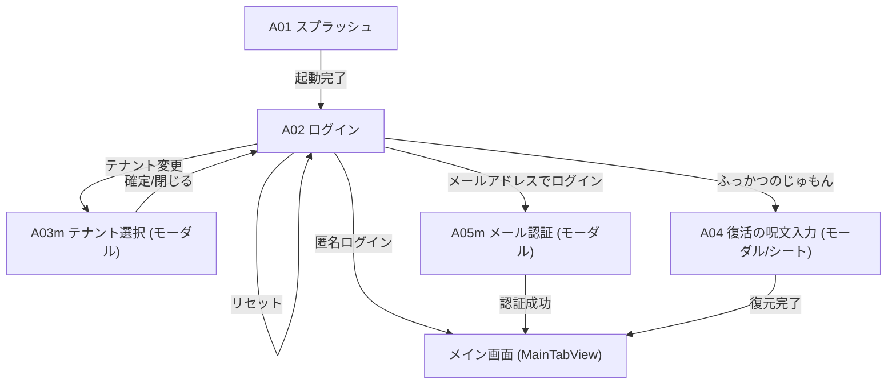

# 08: 画面設計 (Screen Design & Transition Flow)

## 画面設計の凡例・注記

- **モーダル画面**: 画面IDの末尾に `m` が付く画面（例: `A03m`, `E05m`）は、親画面の上に重ねて表示されるモーダルダイアログ/シート画面を示します。
- **現段階（Phase 1）未実装機能**: 音声・ビデオ通話機能および位置共有機能は、Phase 1 では未実装（Phase 2 以降で追加検討）のため、本画面設計には含めていません。

## 画面一覧

| ID   | 画面                 | 主な役割                                      |
| :--- | :------------------- | :-------------------------------------------- |
| A01  | スプラッシュ         | 起動・初期化                                  |
| A02  | ログイン             | 認証方法の選択とテナント確認・変更            |
| A03m | テナント選択         | テナントの指定 (二次元コードスキャン/JSON入力/URL指定)  |
| A04  | 復活の呪文入力       | 既存端末での復活呪文によるログイン            |
| A05m | メール認証           | メールアドレスとパスワードによるログイン/登録 |
| B01  | ホーム               | タブ名: "ホーム" (お知らせ・概要、右上から設定 B02 へ遷移) |
| B02  | 設定                 | アプリ設定・セキュリティ・アカウント管理 (ホーム右上歯車よりPush遷移) |
| B03  | プロフィール編集     | ユーザー名・アイコン等のプロフィール変更      |
| B04  | パスワード変更       | ログインパスワードの変更                      |
| B05  | 復活の呪文           | 匿名利用後の復旧手段作成・確認                |
| C01  | 友達・チャット一覧   | タブ名: "ともだち" (Friends / チャット一覧、最新順、未読表示、右上から友達追加) |
| C02  | チャット詳細         | 1:1およびグループのチャット詳細 (E2EE, 相手アイコン・吹き出し, メッセージ長押しリアクション, カウント表示) |
| C02m | リアクション詳細     | メッセージごとのリアクション一覧・ユーザー詳細 (モーダル/シート) |
| C03  | 友達追加             | 統合1画面（上: カメラスキャン / 下: 自二次元コード+3桁合言葉）& テキスト連携 |
| C04  | 友達詳細             | 友達のプロフィール閲覧・チャット開始・設定    |
| D01  | グループチャット一覧 | タブ名: "かいぎ" (Groups)                     |
| D02  | グループチャット詳細 | グループ内のメッセージやりとり                |
| D03  | グループ追加         | 新規グループチャットの作成                    |
| D04  | グループ詳細         | グループ情報・メンバー一覧の確認および管理    |
| D05m | グループメンバ追加   | グループへのメンバー追加（モーダル）          |

## 画面遷移図

### ログイン

### 利用者向け

---

## 主要画面 UI・レイアウト詳細設計

### B01 ホーム画面 (`HomeView`)

- **タブ名**: `ホーム` (アイコン: `house.fill`)
- **ナビゲーションバー**:
  - タイトル: `ホーム`
  - 右上: 歯車アイコンボタン（タップで `B02` 設定画面へ Push 遷移）
- **コンテンツ構成**:
  1. **クイックアクション (画面最上部)**:
     - `友達を追加` ボタン（タップで `C03` 友達追加シート表示。セカンダリボタンスタイル採用）
  2. **お知らせセクション**:
     - お知らせ一覧 / 未読お知らせ（未読なし時はプレースホルダー表示）

---

### B02 設定画面 (`SettingsView`)

- **遷移方式**: ホーム画面（`B01`）右上歯車アイコンから NavigationStack 経由で Push 遷移（画面遷移、モーダルではない）
- **ナビゲーションバー**:
  - タイトル: `設定`（インライン中央表示: `.navigationBarTitleDisplayMode(.inline)`）
  - 左: 標準戻るボタン（`< ホーム`）
- **セクション構成**:
  1. **プロフィール概要カード (タップで `B03` へ遷移)**:
     - 左: ユーザーアバター画像（円形、未設定時はデフォルト人型アイコン）
     - 右上: 名前 (`displayName`、太字)
     - 右下: `@` + アカウント (`username`、グレー)
     - 右端: `>` (chevron)
  2. **セキュリティ & バックアップ**:
     - `ふっかつのじゅもん`: タップで日本語（ひらがな12語）復旧フレーズ表示シート (`B05`) を開く。シート左上には「閉じる」ボタン、右上には「再作成」ボタン（`arrow.clockwise` アイコン、確認アラート後に新フレーズ生成・バックアップ上書き更新）を配置。
     - `セキュリティリセット`: 赤字ボタン、Curve25519 鍵ペア再生成とセッション切断確認ダイアログ
  3. **アカウント**:
     - `ログアウト`: 赤字ボタン、端末暗号鍵・ローカルキャッシュ完全消去確認ダイアログ
  4. **アプリ情報**:
     - バージョン、暗号化方式（AES-256-GCM / ECDH）

---

### B03 プロフィール編集画面 (`EditProfileView`)

- **ナビゲーションバー**:
  - タイトル: `プロフィール編集`
  - 左: `閉じる` ボタン（`L10n.Common.close`）
  - 右: アイコンボタン（チェックマーク `checkmark`、`.buttonStyle(.borderedProminent)`、`.tint(.blue)`、未変更時または入力不正時は非活性）
- **セクション構成**:
  1. **プロフィールセクション** (`L10n.Settings.sectionProfile`):
     - **アバター & アカウント**:
       - 左: アバターサークル (64x64) & 右下カメラマークバッジ (タップでアクションシート表示)
       - 右: `@` + アカウント入力フィールド (`username`、短い文字数でも右端に詰めて右寄せ密着配置、半角英数字・アンダースコア、英語キーボード `.keyboardType(.asciiCapable)`)
       - アクションシート: 「写真を選択」「プリセットから選ぶ」「アバターを削除」「キャンセル」
     - **名前**: 左ラベル `名前` / 右 入力フィールド (`displayName`、右寄せ、暗号化保存)
     - **ID**: 左ラベル `ID` / 右 等幅テキスト (`userId`: `u_<Base58>` 通常フォントサイズ `.body`、読み取り専用グレー)
  2. **テナントセクション (画面最下部・左右配置・読み取り専用)**:
     - セクション名: `テナント` (`L10n.Settings.sectionTenant`)
     - すべて編集不可であることが明確に分かるよう、統一されたフォントサイズ (`.body`)・通常の太さ・グレー色 (`.secondary`) で表示
     - **コード**: 左ラベル `コード` / 右 等幅グレーテキスト (`tenantCode`)
     - **テナント名**: 左ラベル `テナント名` / 右 通常グレーテキスト (`tenantName`)
     - **ID**: 左ラベル `ID` / 右 等幅グレーテキスト (`tenantId`: `t_...`)
- **確認ダイアログ & アラート**:
  - **ユーザー名（アカウント）変更警告ダイアログ**: ユーザー名が変更された状態で保存を実行しようとした場合、Apple HIG（Human Interface Guidelines）に準拠した2択の確認ダイアログを表示する。
    - キャンセルアクション: `role: .cancel`（文言: `キャンセル`）
    - 破壊的アクション: `role: .destructive`（文言: `変更` - HIGの動詞原則準拠）
    - メッセージ: `アカウント名を変更すると、相手があなたを検索・追加する際のアカウント名が変わります。変更して保存しますか？`
    - ユーザーが「変更」を選択した場合のみ、リモートDB更新とローカル状態の更新を実行する。

---

### C01 友達・チャット一覧画面 (`FriendListView`)

- **タブ名**: `ともだち` (アイコン: チャット吹き出し `bubble.left.and.bubble.right.fill`)
- **ナビゲーションバー**:
  - タイトル: `ともだち`
  - 右上: `友達を追加` ボタン（タップで `C03` 友達追加画面へ遷移）
- **リスト構成・操作**:
  - チャット・友達一覧（最新メッセージ順）
  - **友達のカスタム表示名変更**: セルを長押し（コンテキストメニュー）またはスワイプした際に「表示名の変更」（`pencil`）を表示。タップでダイアログが表示され、自身の秘密鍵（$MK_u$）で暗号化される自分だけのカスタム呼び名を設定可能（ダイアログ案内:「相手には見えません。あなた専用に表示名を設定します。」）。
---

### C02 チャット詳細画面 (`ChatDetailView`)

- **ナビゲーションバー**:
  - タイトル: チャット相手の名前またはグループ名（`.navigationBarTitleDisplayMode(.inline)`）
  - 右上:
    - グループチャット時: `pencil` アイコン（タップで `D04` かいぎ詳細画面へ遷移）
    - 1:1 DM チャット時: `pencil` アイコンまたはタイトルタップで「表示名の変更」シート/ダイアログを表示
- **コンテンツ構成**:
  1. **動的ロードメッセージタイムライン (`ScrollViewReader` + `LazyVStack`)**:
     - 最上部: 過去メッセージ読み込みスピナー（上スクロール時に `loadMoreMessages` を自動発火し、30件ずつ過去メッセージを動的遡りロード）
     - 吹き出しバブル (`MessageBubbleView`): 相手メッセージ（左側 + アバター + 送信者名）、自分メッセージ（右側 + 既読/送信時刻）
     - **グループメンバー送信者名・アバター解決**: 友達未登録の参加者からのメッセージでも、グループ参加者プロファイルを動的解決して常に正しい表示名とアバターを表示
     - 長押しクイックアクションメニュー（直下にリアクション6種 👍❤️🆗😊😢😱 ＆ コピーを表示） & リアクション集計バッジ表示
     - スワイプによる送信時刻・暗号鍵バージョンの詳細表示
  2. **新着メッセージフローティングバナー (オンデマンド移動)**:
     - ユーザーがタイムラインを過去にスクロール中に新着メッセージを受信した際、画面を勝手に最下部へ自動スクロールさせず、入力バー直上に「新着メッセージがあります ↓」フローティングバナーを表示。
     - バナーをタップすると、最新メッセージ（または未読位置）までスムーズに自動スクロール移動し、バナーを非表示にする。
  3. **入力バー**:
     - 複数行対応テキストフィールド (`TextField(..., axis: .vertical)`)
     - 送信ボタン (紙飛行機アイコン `paperplane.fill`、未入力時は非活性)

---

### C03 友達追加画面 (`AddFriendView`)

- **タブ切替**: `二次元コード` / `テキスト`
- **二次元コードタブ**:
  - 上部: カメラプレビュー（相手の二次元コードスキャン。正しいフォーマットの二次元コードをスキャンすると自動で友達追加を実行。シミュレータ環境では機能ラベルのないアイコンボタン `qrcode` のみ配置）
  - 下部: 自分の招待二次元コード（余計な文字・ボタンなしのミニマル30秒更新表示）
- **テキストタブ**:
  - **自分の情報エリア**:
    - 行1: `ユーザー名` ラベル（改行なし固定） / ユーザー名 (`myDisplayUserId`) / アイコンのみのコピーボタン (`doc.on.doc`)
    - 行2: `合言葉` ラベル / 3桁数字ボックス `[0] [0] [0]` / 残り秒数付き円グラフメーター
  - **相手を追加エリア**:
    - 行1: 相手のユーザー名入力欄（先頭に `@` を表示、未入力時は灰色、入力時は黒字へ動的変化）
    - 行2: 合言葉入力欄（3桁数字）
    - 追加実行ボタン: `友達に追加する`

---

### D01 かいぎ一覧画面 (`GroupListView`)

- **タブ名**: `かいぎ` (アイコン: 3人グループ `person.3.fill`)
- **ナビゲーションバー**:
  - タイトル: `かいぎ` (`L10n.Group.listTitle`)
  - 右上: `+` アイコンボタン（タップで `D03` かいぎ作成画面をシート表示）
- **コンテンツ構成**:
  1. **参加中グループ一覧 (`List` / `InsetGrouped`)**:
     - 各行: グループアバター（カスタム画像またはグラデーション背景 + `person.3.fill`）、グループ名 (`displayTitle`)、参加人数バッジ (`(N)`）、最新メッセージ本文プレビュー、最終メッセージ時刻、未読バッジ
     - 行タップで該当の `C02` チャット詳細画面へ遷移
  2. **引っ張って更新 (`.refreshable` / Pull-to-Refresh)**:
     - 「ともだち」一覧（C01）と同様に、リストを下に引っ張ることで最新のグループ一覧、最新メッセージ、未読件数、および参加メンバー全プロファイルをバックグラウンドで強制同期。
  3. **空状態表示**: 参加中のかいぎが存在しない場合、ガイダンスアイコンおよび案内文を表示。

---

### D03 かいぎ作成画面 (`CreateGroupView`)

- **ナビゲーションバー**:
  - タイトル: `かいぎを作成` (`L10n.Group.createTitle`, `.navigationBarTitleDisplayMode(.inline)`)
  - 左上 (キャンセル): `xmark` アイコンボタン (`Image(systemName: "xmark")`)
  - 右上 (作成): プライマリカラー塗りつぶしボタン (`作成` `L10n.Group.submitBtn`, `.buttonStyle(.borderedProminent)`, `.tint(.blue)`)。未入力または作成処理中は非活性。
- **コンテンツ構成**:
  1. **かいぎ名入力セクション**:
     - ヘッダー: `かいぎ名`
     - プレースホルダー: `かいぎ名を入力`
  2. **メンバー選択セクション**:
     - ヘッダー: `メンバーを選択 (N人選択中)`
     - 友達一覧リスト（アバター画像、名前、右端チェックボックス `checkmark.circle.fill` / `circle`）
  3. **エラー表示**: 作成失敗時のエラーメッセージ

### D04 かいぎ詳細画面 (`GroupDetailView`)

- **ナビゲーションバー**:
  - タイトル: グループ名（かいぎ名、インライン表示）
  - 右上ツールバー:
    - メンバー追加ボタン (`person.badge.plus` アイコン。タップで未参加の友達選択モーダルシート表示)
    - かいぎ名変更ボタン (`pencil` アイコン。タップでかいぎ名変更ダイアログ表示)
- **コンテンツ構成**:
  1. **かいぎ概要セクション**:
     - **グループアバター**: タップで写真選択・プリセット選択・アバター削除のアクションシートを表示し、グループ専用アバター画像を変更可能。
     - かいぎ名、作成日 (`chat.chat.createdDate`)
  2. **参加メンバー一覧セクション**:
     - ヘッダー: `メンバー (N人)`
     - メンバー行:
       - アバター画像、表示名、自分バッジ (`(あなた)`)
       - **ロールバッジ（名前の下に表示）**:
         - オーナー: 👑 `L10n.Group.roleOwner` (オレンジ色背景バッジ)
         - 管理者: 🛡️ `L10n.Group.roleAdmin` (青色背景バッジ)
         - 一般メンバー: バッジなし
       - **アクション（スワイプ操作 / 「…」メニュー）**:
         - **右スワイプ操作 (`.swipeActions(edge: .leading)`)**:
           - **管理者にする**: オーナーのみ実行可能（一般メンバー対象）。一般メンバー行を右にスワイプすると青色の「🛡️ 管理者にする」ボタンが表示され、タップで確認ダイアログを経て実行。
         - **行右端「…」メニュー (`Menu`)**:
           - **管理者にする**: オーナーにのみ表示（一般メンバー対象）。
           - **退出させる**: オーナーまたは管理者にのみ表示（対象が自分・オーナー以外。赤文字・破壊的スタイル）。タップで確認ダイアログ（1回表示）を表示。
           - ※ 誤操作防止のため、退出操作はスワイプから除外し「…」メニューからのみ実行可能。
   3. **管理者専用アクションセクション** (管理者のみ表示):
     - **「👑 オーナーを引き継ぐ」ボタン** (`L10n.Group.claimOwner`):
       - 自身が管理者（Admin）の場合にのみ表示される専用カード。
       - タップで「かいぎのオーナーを引き継ぎますか？前任のオーナーは管理者になります」と確認ダイアログ（1回表示）を表示し、承認時にオーナー昇格を実行。
    4. **参加状態セクション**:
      - **「退室する」ボタン**: 一般メンバー・管理者がかいぎを自ら離脱（タップで確認ダイアログ1回表示。※オーナーは「オーナーはかいぎを退室できません」と表示され離脱不可）。
    5. **かいぎ削除セクション（独立セクション）**:
      - **「かいぎを完全に削除」ボタン** (`L10n.Group.deleteButton`):
        - 表示条件: **自身がグループオーナーまたはグループ管理者の場合のみ表示**（赤色ラベル、破壊的スタイル）。
        - **削除確認ダイアログ (1回表示・重要警告)**:
          - タイトル: `かいぎ「{title}」を削除しますか？` (`L10n.Group.deleteConfirmTitle`)
          - メッセージ: `この操作は取り消せません。かいぎを削除すると、メッセージの送受信ができなくなり、メンバー全員の一覧から完全に削除されます。` (`L10n.Group.deleteConfirmMessage`)
          - アクション: `キャンセル` (キャンセル) / `削除する` (破壊的)
          - Firestore 上で `members: []` に更新し、全参加者のチャット一覧から即時除外。
          - 処理完了後に画面を `dismiss()` してチャット一覧（かいぎタブ）へ戻る。

---

## テナント管理者向け
