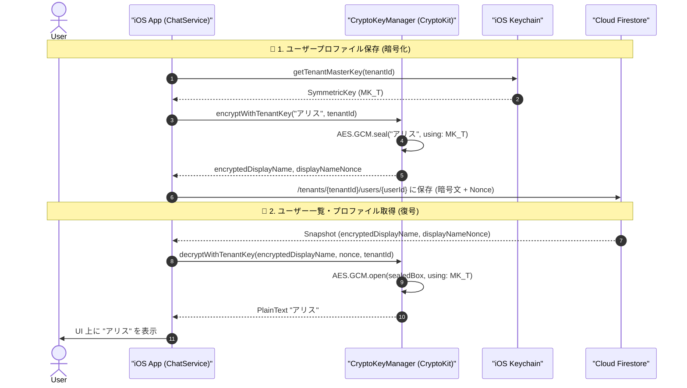

# 10-01: テナント共通鍵（$MK_T$）によるテナント内データ暗号化仕様書

本ドキュメントは、**Friends** におけるテナント（組織）共通鍵（テナントマスターキー: $MK_T$）を用いた、`/tenants/{tenantId}` 配下データの暗号化方針および暗号化・復号プロトコルを定義する詳細設計書です。

---

## 1. 暗号化すべきデータの方針 (Data Encryption Policy)

### 1.1 背景と目的
Cloud Firestore 上に保存されるデータのうち、テナント組織内のプライバシー（氏名、グループ名等）に関わる機密情報は、**データベース管理者や外部攻撃者に対しても平文を秘匿**しなければなりません。
正当な手段（テナント参加二次元コードや招待JSON）でテナントに参加し、テナントマスターキー（$MK_T$）を取得した端末のみが内容を復号・閲覧できるように設計します。

### 1.2 フィールド別 暗号化 / 平文保持 区分基準

| カテゴリ | フィールド名 | 保管形式 | 理由 / 役割 |
|:---|:---|:---|:---|
| **暗号化対象** ($MK_T$) | `tenantName` (テナント表示名) | **AES-256-GCM 暗号化** (`encryptedTenantName`, `nonce`) | 組織・企業名をクラウド上で秘匿 |
| **暗号化対象** ($MK_u$) | `friendDisplayName` (友達表示名) | **AES-256-GCM 暗号化** (`encryptedFriendDisplayName`, `friendDisplayNameNonce`) | 友達サブコレクション内の表示名を本人の秘密鍵（$SK_u$）導出鍵（$MK_u$）で秘匿（他者・管理者への平文秘匿） |
| **E2EE伝播** ($SK_{direct}$) | `displayName` (本人表示名) | **X25519 E2EE 暗号化** (チャット/友達サブコレクション経由) | 公開プロファイルへの暗号化保存は全廃。友達追加成立後に 1:1 E2EE セッション鍵で相手に安全に伝播 |
| **暗号化対象** ($MK_T$) | `groupName` (グループ名) | **AES-256-GCM 暗号化** (`encryptedGroupName`, `nonce`) | 組織内の機密プロジェクト名・部署名を秘匿 |
| **暗号化対象** ($MK_T$) | `description` (グループ説明) | **AES-256-GCM 暗号化** (`encryptedDescription`, `nonce`) | 組織内の業務詳細・説明を秘匿 |
| **暗号化対象** ($MK_T$) | カスタムステータス・アバターURL | **AES-256-GCM 暗号化** | プライベートなプロファイルメタデータを秘匿 |
| **平文保持** | `tenantId`, `tenantCode` | **平文** | ルーティング、ドキュメントパス、Firestore クエリに必須 |
| **平文保持** | `userId`, `uid`, `username`, `groupId`, `chatId` | **平文** | ルーティング、ドキュメントパス、Firestore クエリに必須 |
| **平文保持** | `publicKey` (X25519 Base64) | **平文** | ユーザー公開鍵（$PK_u$）。E2EE メッセージ通信および友達追加時の ECDH 鍵導出に必須（※テナント鍵は保持しない） |
| **平文保持** | `role`, `accountType`, `isDefaultTenant` | **平文** | Firestore セキュリティルール（認可・アクセス制御）での判定に必須 |
| **平文保持** | `createdAt`, `updatedAt` | **平文** | Firestore 上でのタイムスタンプソートおよび同期クエリに必須 |

---

## 2. テナントマスターキー ($MK_T$) 仕様 & 配布・保管

### 2.1 鍵仕様
- **暗号アルゴリズム**: AES-256-GCM (対称鍵 256-bit / 32バイト)
- **Nonce (IV)**: 暗号化ごとに暗号学的に安全な乱数で生成される 12 バイト (`AES.GCM.Nonce`)
- **暗号化出力**: 暗号文 + 16 バイト認証タグ (Combined Data) の Base64 文字列

### 2.2 配布プロトコル (テナント参加)
- テナント管理者が発行する **参加用二次元コード** または **招待 JSON** に $MK_T$ (Base64) を含めて利用者に配布します。
- 二次元コードペイロード例:
  ```json
  FRIENDS_TENANT:{
    "type": "tenant_invite",
    "version": 1,
    "tenantId": "t_kanto_corp",
    "tenantCode": "kanto-tech",
    "tenantName": "関東テクノロジー",
    "tenantMasterKey": "AAAAAAAAAAAAAAAAAAAAAAAAAAAAAAAAAAAAAAAAAAA=",
    "isDefaultTenant": true
  }
  ```

### 2.3 端末内保管 (iOS Keychain)
$MK_T$ は端末のセキュア領域（iOS Keychain）に保管され、サーバー上に平文で保存されることはありません。

| キー名 | 格納先 | アクセシビリティ属性 |
|:---|:---|:---|
| `friends_tenant_key_{tenantId}` | iOS Keychain | `kSecAttrAccessibleAfterFirstUnlockThisDeviceOnly` |

---

## 3. Firestore 格納スキーマ
 
### 3.0 テナント情報 (`/tenants/{tenantId}`)

```json
{
  "tenantId": "t_kanto_corp",
  "tenantCode": "kanto-tech",
  "encryptedTenantName": "AQIDBAUGBwgJCgsMDQ4PEBESExQVFhcYGRobHB0eHyA...",
  "tenantNameNonce": "MDEyMzQ1Njc4OWFi",
  "isDefaultTenant": true,
  "createdAt": "2026-08-27T00:00:00Z"
}
```

### 3.1 ユーザープロファイル (`/tenants/{tenantId}/users/{userId}`)

```json
{
  "userId": "u_12345678",
  "uid": "firebase_auth_uid_abc",
  "tenantId": "t_kanto_corp",
  "username": "alice",
  "publicKey": "dGVzdFB1YmxpY0tleU1vY2szMmJ5dGVzQmFzZTY0PT0=",
  "role": 1,
  "accountType": 1,
  "updatedAt": "2026-08-27T00:00:00Z"
}
```

### 3.1.1 友達サブコレクション (`/tenants/{tenantId}/users/{userId}/friends/{friendUserId}`)

```json
{
  "friendUserId": "u_87654321",
  "friendUsername": "alice",
  "encryptedFriendDisplayName": "AQIDBAUGBwgJCgsMDQ4PEBESExQVFhcYGRobHB0eHyA...",
  "friendDisplayNameNonce": "MDEyMzQ1Njc4OWFi",
  "friendPublicKey": "dGVzdFB1YmxpY0tleU1vY2szMmJ5dGVzQmFzZTY0PT0=",
  "tenantId": "t_kanto_corp",
  "createdBy": "u_12345678",
  "createdAt": "2026-08-27T00:00:00Z",
  "updatedBy": "u_12345678",
  "updatedAt": "2026-08-27T00:00:00Z"
}
```
> [!IMPORTANT]
> 友達の氏名・ニックネーム等の表示名はクラウドDB上に平文（`friendDisplayName`）として一切保管してはならず、必ず $MK_T$ による暗号化フィールド（`encryptedFriendDisplayName`, `friendDisplayNameNonce`）のみを書き込みます。

### 3.2 チャット/グループ情報 (`/tenants/{tenantId}/chats/{chatId}`)

```json
{
  "chatId": "gm_sales_dept",
  "tenantId": "t_kanto_corp",
  "chatType": "group",
  "encryptedTitle": "base64EncodedTitle...",
  "titleNonce": "base64EncodedNonce...",
  "members": ["u_alice", "u_bob"],
  "createdAt": "2026-08-27T00:00:00Z",
  "updatedAt": "2026-08-27T00:00:00Z"
}
```

---

## 4. 暗号化・復号シーケンス図



---

## 5. 平文非保持原則と鍵未所持時の挙動

1. **平文非保持の徹底（Clean Start 原則）**:
   - 既存データの移行期間や旧形式との混在は行わず、すべての機密フィールド（`tenantName`, `displayName`, `groupName`, `description`）は初回保存時から $MK_T$ による AES-256-GCM 暗号文および Nonce のみとして Firestore に格納します。平文カラムは DB 上に保持されません。
2. **$MK_T$ 未所持・未認証時の挙動**:
   - テナントキーが未取り込みの端末では復号に失敗するため、表示名にはフォールバック表記（テナント: `@tenantCode`、ユーザー: `[未復号ユーザー]`）を表示し、安全性を担保します。
