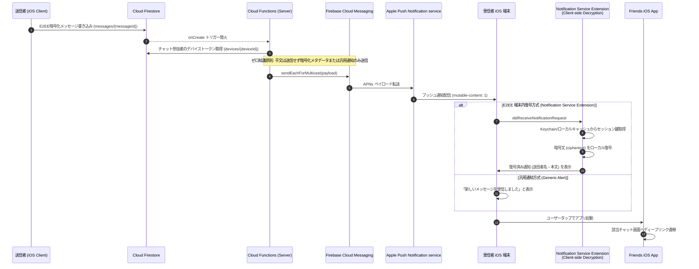

# 12-04: バックグラウンドプッシュ通知 導入準備・設計仕様書 (Background Push Notification Setup & Design)

## 1. 概要 (Overview)

本ドキュメントは、**Friends** アプリケーションにおけるバックグラウンドプッシュ通知（APNs: Apple Push Notification service ＋ FCM: Firebase Cloud Messaging）の導入準備手順、ゼロ知識 E2EE アーキテクチャとの統合仕様、クライアント/サーバー実装設計、および導入作業チェックリストを定めたものです。

---

## 2. アーキテクチャ全体像 (Architecture Overview)



    Sender->>Firestore: 暗号化メッセージ書き込み (E2EE)
    Firestore->>Function: onCreate トリガー発火
    Function->>Function: 受信者デバイスの FCM トークン取得
    Function->>FCM: 通知ペイロード送信 (暗号化データまたは汎用通知)
    FCM->>APNs: APNs ペイロード転送 (mutable-content: 1)
    APNs->>RecipientDevice: プッシュ通知着信
    RecipientDevice->>NSE: Notification Service Extension 起動
    NSE->>NSE: Keychain から $MK_T$ / $SK$ 取得しローカル復号
    NSE->>RecipientDevice: 復号済みテキストでローカル通知バナー表示
```

---

## 3. セキュリティ & ゼロ知識 E2EE 原則 (Zero-Plaintext Compliance)

### 3.1 平文メッセージの外部送信禁止
- Apple (APNs) および Google (FCM) のサーバーには、**メッセージ平文を一切送信してはならない**。
- ペイロードには以下を採用する：

| 方式 | 特徴 | セキュリティ評価 | 実装要件 |
|:---|:---|:---:|:---|
| **A. 端末内復号方式 (NSE)**<br>*(推奨)* | ペイロードに暗号文 (`ciphertext`, `nonce`, `keyVen`) を含め、iOS の `UNNotificationServiceExtension` 内で App Group 経由の Keychain 鍵を用いて復号・表示 | 最高 (E2EE 堅持 ＋ リッチな通知) | App Groups 設定、Notification Service Extension ターゲット追加 |

---

## 3.2 実装・設定手順

### 3.2.1 Apple Developer Portal 設定 (APNs AuthKey)
1. **Apple Developer Account** (`developer.apple.com`) にログイン。
2. **Certificates, Identifiers & Profiles** ➔ **Keys** へ移動。
3. 新しい Key を作成（名前: `Friends APNs Key`）。
4. **Apple Push Notifications service (APNs)** を有効化して Key を生成・ダウンロード（`.p8` ファイル）。
5. **Key ID** および **Team ID** を控える。

### 3.2.2 Firebase Console 設定
1. **Firebase Console** ➔ プロジェクト設定 ➔ **Cloud Messaging** タブを開く。
2. **Apple アプリ構成** ➔ **APNs 認証キー** に `.p8` ファイルをアップロード。
3. Key ID と Team ID を入力して保存。

### 3.2.3 iOS アプリ設定 (Xcode / project.yml)
1. **Capability 追加**:
   - `Push Notifications`
   - `Background Modes` ➔ `Remote notifications` をチェック。
2. **APNs トークン登録処理 (AppDelegate / NotificationManager)**:
   - アプリ起動時に `UNUserNotificationCenter.current().requestAuthorization(...)` で通知許可を要求。
   - `UIApplication.shared.registerForRemoteNotifications()` を実行。
   - `didRegisterForRemoteNotificationsWithDeviceToken` で取得したデバイストークンを FCM SDK に渡し、FCM トークンを取得。
   - 取得した FCM トークンを Firestore（`/tenants/{tenantId}/users/{userId}/devices/{deviceId}`）に保存。

### 3.2.4 Notification Service Extension (NSE) による端末内 E2EE 復号
1. Xcode プロジェクトに **Notification Service Extension** ターゲットを追加（App Group を設定）。
2. App Group を経由してメインアプリの Keychain（$MK_T$ およびセッションキー）を共有。
3. `didReceive(_:withContentHandler:)` 内で、ペイロードの暗号化本文をローカル復号し、バナー表示文言を上書き。

---

## 4. Cloud Functions 送信関数仕様 (TypeScript)

```typescript
import * as functions from 'firebase-functions/v1';
import * as admin from 'firebase-admin';

export const onNewMessageCreated = functions.firestore
  .document('tenants/{tenantId}/chats/{chatId}/messages/{messageId}')
  .onCreate(async (snap, context) => {
    const { tenantId, chatId, messageId } = context.params;
    const messageData = snap.data();
    const senderId = messageData.senderId;

    // 1. チャットメンバーの取得
    const chatDoc = await admin.firestore().doc(`tenants/${tenantId}/chats/${chatId}`).get();
    const members: string[] = chatDoc.data()?.members || [];
    const recipientUids = members.filter(uid => uid !== senderId);

    // 2. 受信者デバイスの FCM トークン一覧を取得
    const tokens: string[] = [];
    for (const uid of recipientUids) {
      const devicesSnap = await admin.firestore()
        .collection(`tenants/${tenantId}/users/${uid}/devices`)
        .get();
      devicesSnap.forEach(doc => {
        const token = doc.data().fcmToken;
        if (token) tokens.push(token);
      });
    }

    if (tokens.length === 0) return null;

    // 3. APNs / FCM ペイロード作成 (ゼロ知識 E2EE 準拠)
    const payload: admin.messaging.MulticastMessage = {
      tokens,
      notification: {
        body: "新着メッセージが届きました",
      },
      data: {
        tenantId,
        chatId,
        messageId,
        senderId,
      },
      apns: {
        payload: {
          aps: {
            badge: 1,
            sound: "default",
            mutableContent: true, // NSE での端末内復号を有効化
          },
        },
      },
    };

    await admin.messaging().sendEachForMulticast(payload);
  });
```

---

## 5. 導入作業チェックリスト (Implementation Checklist)

- [ ] **Apple Developer**: APNs Auth Key (`.p8`) 発行・ダウンロード
- [ ] **Firebase Console**: APNs 認証キーのアップロード設定
- [ ] **iOS project.yml**: `Push Notifications` / `Background Modes` capability 設定追加
- [ ] **iOS Package**: `FirebaseMessaging` の依存追加
- [ ] **iOS Code**: `AppDelegate` / `NotificationManager` によるトークン取得・Firestore 登録実装
- [ ] **Firestore Rule**: `/tenants/{tenantId}/users/{userId}/devices/{deviceId}` への書き込み許可ルール検証
- [ ] **Cloud Functions**: メッセージ作成トリガーによる FCM 配信関数のデプロイ
- [ ] **実機検証**: APNs 実機へのバックグラウンド通知受信・バナー表示・ディープリンク遷移検証

---

## 6. 関連ドキュメント

- [07-07-push-notification.md](../07-detailed-usecases/07-07-push-notification.md) - プッシュ通知基本設計
- [07-03-message-encryption.md](../07-detailed-usecases/07-03-message-encryption.md) - メッセージ暗号化仕様
- [10-03-data-access-patterns.md](./10-03-data-access-patterns.md) - データアクセスパターン仕様
