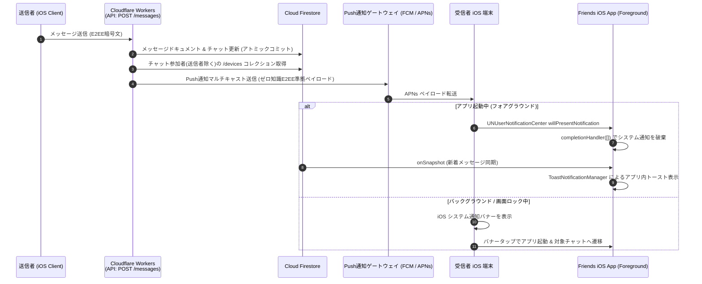

# 10-04: バックグラウンドプッシュ通知 導入準備・設計仕様書 (Background Push Notification Setup & Design)

## 1. 概要 (Overview)

本ドキュメントは、**Friends** アプリケーションにおけるバックグラウンドプッシュ通知（APNs: Apple Push Notification service ＋ FCM: Firebase Cloud Messaging）の導入準備手順、ゼロ知識 E2EE アーキテクチャとの統合仕様、Cloudflare Workers サーバー配信設計、フォアグラウンド抑制制御、および設定画面でのデバイス管理仕様を定めたものです。

---

## 2. アーキテクチャ全体像 (Architecture Overview)



---

## 3. セキュリティ & ゼロ知識 E2EE 原則 (Zero-Plaintext Compliance)

### 3.1 平文メッセージの外部送信禁止
- Apple (APNs) および Google (FCM) のサーバーには、**メッセージ平文を一切送信してはならない**。
- ペイロードには送信者名、チャットID、メッセージIDなどのメタデータのみを含め、本文は「新着メッセージが届きました」等の汎用文言を使用。
- 将来的な端末内復号（Notification Service Extension: NSE）拡張時は、暗号文・nonce をペイロードに含め、App Group 経由のローカル鍵で復号。

---

## 4. クライアント仕様 (iOS Client Implementation)

### 4.1 フォアグラウンド通知の破棄（システム通知抑制）
アプリを開いている状態では、`UNUserNotificationCenterDelegate` によりシステムバナーを抑止：
```swift
func userNotificationCenter(
    _ center: UNUserNotificationCenter,
    willPresent notification: UNNotification,
    withCompletionHandler completionHandler: @escaping (UNNotificationPresentationOptions) -> Void
) {
    // アプリ起動中はシステム通知を一切表示しない（Firestore onSnapshot + ToastNotificationManager に委ねる）
    completionHandler([])
}
```

### 4.2 初回ログイン時の通知登録（事前説明シート）
- 初回匿名ログイン完了時、未登録であれば `NotificationPermissionSheet`（ソフトプロンプト）を表示。
- ユーザーが「通知をオンにする」を押下した場合にのみ `UNUserNotificationCenter.current().requestAuthorization` を起動。
- 許可取得後、APNs / FCM トークンを Firestore に登録。

### 4.3 デバイストークンおよびデバイス情報モデル
Firestore パス: `/tenants/{tenantId}/users/{userId}/devices/{deviceId}`

| フィールド名 | 型 | 説明 |
|:---|:---|:---|
| `deviceId` | string | 端末一意識別子 (Keychain UUID) |
| `deviceName` | string | デバイス名（`UIDevice.current.name` を自動保持） |
| `fcmToken` | string? | FCM Push 通知トークン |
| `apnsToken` | string? | APNs デバイストークン (Hex) |
| `platform` | string | プラットフォーム (`ios`) |
| `enabled` | boolean | アプリ内通知有効化フラグ（初期値: true） |
| `createdBy` | string | 登録者 userId |
| `createdAt` | timestamp | 登録日時 |
| `updatedBy` | string | 更新者 userId |
| `updatedAt` | timestamp | 最終更新日時 |

### 4.4 設定画面（アプリ設定）での通知トグル制御
- 設定画面の「アプリ設定」セクションに「通知（トグルスイッチ）」を配置。
- トグルOFF時はアプリ内での通知受信を無効化し、Firestore の `enabled: false` に更新。
- トグルON時は通知許諾を確認/要求し、`enabled: true` に更新。


---

## 5. サーバー（Cloudflare Workers）送信仕様 (TypeScript)

### 5.1 Pushディスパッチフロー
```typescript
// server/workers/src/services/messageService.ts
// 1. チャットメンバーから送信者を除外
const recipientUids = members.filter((uid) => uid !== message.senderId);

// 2. PushNotificationService 経由で受信者のデバイストークンを一括取得 (Collection Group クエリ)
// lib/firestore.ts の汎用 runQuery を用い、PushNotificationService が責務を持つ
const pushService = new PushNotificationService(this.firestore);
const tokens = await pushService.getDeviceTokensForUsers(recipientUids);

// 3. Push通知マルチキャスト送信
if (tokens.length > 0) {
  await pushService.sendNotification({
    tokens,
    title: "Friends",
    body: "新着メッセージが届きました",
    data: {
      tenantId,
      chatId,
      messageId: message.messageId,
      senderId: message.senderId,
    },
  });
}
```

---

## 6. セキュリティルール仕様 (`infra/firestore.rules`)

```javascript
match /devices/{deviceId} {
  // 本人のみ自身のデバイス一覧の取得・登録・更新・削除が可能
  allow read, write: if isTenantUser(tenantId, userId);
}
```

---

## 7. 関連ドキュメント

- [07-07-push-notification.md](../07-detailed-usecases/07-07-push-notification.md) - プッシュ通知基本設計
- [07-03-message-encryption.md](../07-detailed-usecases/07-03-message-encryption.md) - メッセージ暗号化仕様
- [10-02-firestore-direct-access-rules.md](./10-02-firestore-direct-access-rules.md) - Firestoreセキュリティルール仕様
- [10-03-data-access-patterns.md](./10-03-data-access-patterns.md) - データアクセスパターン仕様
