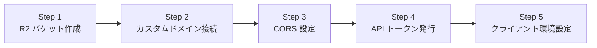

# 10-06: Cloudflare R2 ストレージ事前準備・運用手順書 (R2 Storage Setup & Operations)

本ドキュメントは、**Friends** アプリケーションにおける暗号化メディアファイル（ユーザーアバター、画像、添付ファイル）の配置ストレージとして **Cloudflare R2** をセットアップ・運用するための事前作業手順書です。

---

## 1. 概要と選定理由

Friends では、ゼロ知識暗号化（E2EE）されたメディアデータを安全・低コスト・高速に配信するため、Cloudflare R2 を採用しています。

- **エグレス（下り転送量）無料**: Firebase Storage / AWS S3 と比較して画像配信コストが大幅に削減。
- **Cloudflare グローバル CDN 連携**: カスタムドメインを割り当てることで、世界中へ低レイテンシ配信とキャッシュが可能。
- **S3 互換 API**: AWS S3 互換の REST API / プリサインド URL / ダイレクト PUT に完全対応。
- **完全ゼロ知識暗号化**: R2 にアップロードされるデータはすべて端末内で $MK_T$（AES-256-GCM）暗号化済みであり、Cloudflare 側にも生データは一切漏洩しません。

---

## 2. R2 セットアップ手順（事前作業チェックリスト）



### ✅ Step 1: Cloudflare R2 バケットの作成
1. [Cloudflare ダッシュボード](https://dash.cloudflare.com/) にログイン。
2. 左メニューの **「R2」** を選択し、**「Create bucket（バケットを作成）」** をクリック。
3. 設定項目：
   - **Bucket Name（バケット名）**: `friends-media`（または環境に応じた一意な名前）
   - **Location Hint（ロケーション）**: `Automatic` または `APAC (Asia-Pacific)` を選択
4. **「Create Bucket」** をクリックして作成を完了。

---

### ✅ Step 2: カスタムドメインの割り当て & 公開アクセス設定
Cloudflare CDN 経由で暗号化バイナリを高速 GET 取得するため、所有ドメインをバケットに割り当てます。

1. 作成したバケットの詳細画面を開き、**「Settings（設定）」** タブを選択。
2. **「Public Access（公開アクセス）」** セクションの **「Custom Domains（カスタムドメイン）」** に進む。
3. **「Connect Domain（ドメインを接続）」** をクリック。
4. 割り当てたいサブドメインを入力（例: `media.kanto.work` / `cdn.friends.example.com`）。
5. **「Continue」** をクリックし、DNS レコードの自動設定を確認して完了。
   > **💡 補足**: 独自ドメインがない場合は **「R2.dev subdomain」** を有効化してテスト用ドメインを利用することも可能です。

---

### ✅ Step 3: CORS（オリジン間リソース共有）の設定
iOS アプリおよび Web クライアントからのダイレクト PUT / GET 通信を許可するため、CORS を設定します。

1. バケット詳細画面の **「Settings（設定）」** タブ内の **「CORS Policy（CORS ポリシー）」** を開く。
2. **「Edit CORS Policy」** をクリックし、以下の JSON を貼り付けて保存：

```json
[
  {
    "AllowedOrigins": [
      "*"
    ],
    "AllowedMethods": [
      "GET",
      "PUT",
      "HEAD",
      "DELETE"
    ],
    "AllowedHeaders": [
      "*"
    ],
    "ExposeHeaders": [
      "ETag"
    ],
    "MaxAgeSeconds": 3600
  }
]
```

---

### ✅ Step 4: R2 API トークン（S3 互換認証情報）の発行
クライアントまたは管理スクリプトからアップロードを行うための認証キーを発行します。

1. Cloudflare 左メニューの **「R2」** > 画面右側の **「Manage R2 API Tokens（R2 API トークンの管理）」** をクリック。
2. **「Create API token（API トークンを作成）」** をクリック。
3. 設定項目：
   - **Token Name**: `friends-app-storage-token`
   - **Permissions**: `Object Read & Write`（読み取りおよび書き込み）
   - **Specify bucket(s)**: 作成したバケット（例: `friends-media`）を選択
   - **TTL**: 必要に応じて設定（運用初期は無期限推奨）
4. **「Create API Token」** をクリック。
5. 表示される以下のキー情報を安全に記録・保管してください：
   - **Access Key ID** (`ACCESS_KEY_ID`)
   - **Secret Access Key** (`SECRET_ACCESS_KEY`)
   - **Endpoint URL** (`https://<ACCOUNT_ID>.r2.cloudflarestorage.com`)

---

### ✅ Step 5: アプリケーション環境設定への反映
発行された情報およびカスタムドメインを、`ios/Sources/Resources/R2Config.plist` に登録します。

#### 1. 設定ファイル仕様と構成管理対策（Git除外）
- **設定ファイル本体**: `ios/Sources/Resources/R2Config.plist`
  - 🚨 **重要**: API キー等のシークレットを含むため、`.gitignore` で Git 追跡から**除外**されています。
- **テンプレートファイル**: `ios/Sources/Resources/R2Config.plist.example`
  - チーム開発・新規環境セットアップ用に Git 管理されます。

```xml
<?xml version="1.0" encoding="UTF-8"?>
<!DOCTYPE plist PUBLIC "-//Apple//DTD PLIST 1.0//EN" "http://www.apple.com/DTDs/PropertyList-1.0.dtd">
<plist version="1.0">
<dict>
	<!-- 1. ダウンロード用 公開カスタムドメイン (HTTPS) -->
	<key>R2_PUBLIC_BASE_URL</key>
	<string>https://media.yourdomain.com</string>

	<!-- 2. R2 バケット名 -->
	<key>R2_BUCKET_NAME</key>
	<string>friends-media</string>

	<!-- 3. S3 互換 エンドポイント URL -->
	<key>R2_ENDPOINT_URL</key>
	<string>https://<ACCOUNT_ID>.r2.cloudflarestorage.com</string>

	<!-- 4. S3 互換 API 認証情報 (※アップロード用トークン) -->
	<key>R2_ACCESS_KEY_ID</key>
	<string>your_access_key_id</string>
	<key>R2_SECRET_ACCESS_KEY</key>
	<string>your_secret_access_key</string>
</dict>
</plist>
```

#### 2. 設定キー項目一覧

| 設定キー名 | 設定例 | 用途 |
|:---|:---|:---|
| `R2_PUBLIC_BASE_URL` | `https://media.kanto.work` | 暗号化アバター・画像の CDN ダウンロード用 URL |
| `R2_BUCKET_NAME` | `friends-media` | 格納対象バケット名 |
| `R2_ENDPOINT_URL` | `https://<ACCOUNT_ID>.r2.cloudflarestorage.com` | S3 互換アップロード用エンドポイント |
| `R2_ACCESS_KEY_ID` | `...` | S3 互換認証アクセスキー |
| `R2_SECRET_ACCESS_KEY` | `...` | S3 互換認証シークレット |


---

## 3. ストレージパス階層規約

```text
https://<R2_PUBLIC_BASE_URL>/
  └── tenants/
        └── {tenantId}/
              ├── users/
              │     └── {userId}/
              │           └── avatar.enc    # MK_T 暗号化済みアバターバイナリ (256x256 JPEG)
              └── chats/
                    └── {chatId}/
                          └── {messageId}.enc # SK_direct / SK_group 暗号化添付画像・ファイル
```

---

## 4. 運用・セキュリティ留意事項

1. **ゼロ知識暗号化の徹底**:
   - R2 のバケットが公開設定（Public Domain）であっても、保存されるファイルはすべてクライアント端末内で暗号化されたバイナリ（`.enc`）です。
   - テナントマスターキー（$MK_T$）またはセッションキーを持たない第三者や Cloudflare は、保存されている画像やファイルを復号・閲覧できません。
2. **キャッシュコントロール**:
   - アバター画像は更新時に Firestore の `avatarUpdatedAt`（タイムスタンプ）が更新されるため、クライアント側は URL クエリパラメータ（例: `avatar.enc?t=1725000000`）を付与することで、CDN キャッシュの即時パージを不要としつつ最新画像を取得できます。
