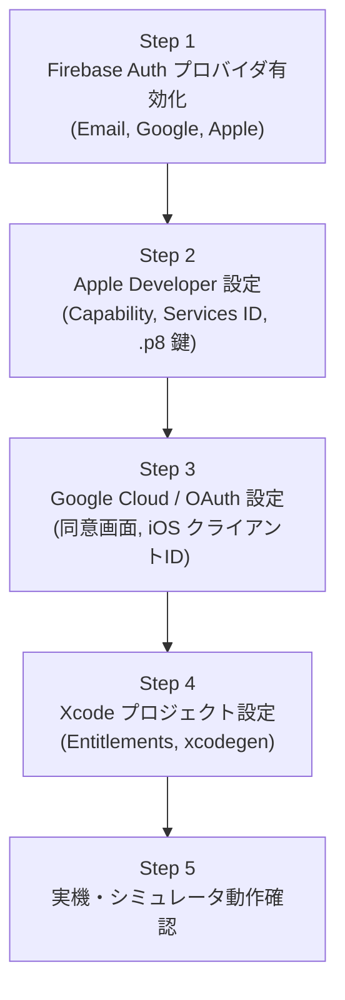

# 10-09: Apple / Google / Eメール認証事前準備・運用手順書 (Social & Email Auth Setup & Operations)

本ドキュメントは、**Friends** アプリケーションにおける各種認証プロバイダ（Apple サインイン、Google サインイン、Eメール／パスワード認証）を Firebase Authentication および各プラットフォーム（Apple Developer Program、Google Cloud Console）と統合し、運用するための事前準備および手動設定手順書です。

---

## 1. 概要とアーキテクチャ

Friends では、ゼロ知識暗号化（E2EE）とアカウント認証をシームレスに結合しています。
各認証プロバイダは **Firebase Auth UID (`uid`)** を安全に確立するためのアイデンティティレイヤーとしてのみ機能し、ユーザーの氏名・表示名・メッセージは端末内暗号鍵によって保護されます。

- **ゼロ知識暗号化との連動**:
  - 初回ログイン（アカウント作成）時に、iOS 端末の Keychain 内で **Curve25519 (X25519) 鍵ペア** を自動生成。
  - 秘密鍵 ($SK_u$) は平文でサーバー送信せず、iOS Keychain (`kSecAttrAccessibleAfterFirstUnlock`, `kSecAttrSynchronizable = true`) により Apple の E2EE iCloud キーチェーンを通じて同一 Apple ID 端末間で安全に自動同期。公開鍵 ($PK_u$) のみを Firestore に配置。
  - Apple / Google から取得されるユーザー名は、テナントマスターキー ($MK_T$) で **AES-256-GCM 暗号化** して Firestore に保存（平文非保持）。
- **認証プロバイダの構成**:
  - **Sign in with Apple**: iOS ネイティブの `AuthenticationServices` + CryptoKit SHA256 Nonce 連携。
  - **Sign in with Google**: Firebase Auth `OAuthProvider(providerID: "google.com")` による Web/Safari 安全認証。
  - **Eメール / パスワード認証**: Firebase Auth Email/Password プロバイダによる直接認証。

---

## 2. セットアップ手順（事前作業チェックリスト）



---

## ✅ Step 1: Firebase Authentication プロバイダの有効化

1. [Firebase Console](https://console.firebase.google.com/) にアクセスし、プロジェクトを選択。
2. 左メニューの **「構築 (Build)」** > **「Authentication」** を開く。
3. **「Sign-in method」** タブを選択。

### 1.1 Eメール / パスワード (Email/Password)
1. 「新しいプロバイダを追加」から **「メール / パスワード」** を選択。
2. **「有効にする」** スイッチを ON にする（「メールリンク（パスワードなしのログイン）」は OFF のままで可）。
3. **「保存」** をクリック。

### 1.2 Google サインイン
1. 「新しいプロバイダを追加」から **「Google」** を選択。
2. **「有効にする」** スイッチを ON にする。
3. **「プロジェクトのサポートメール」** に運用者の連絡先メールアドレスを選択。
4. **「保存」** をクリック。
   > **💡 補足**: これにより、Google Cloud Console 側にも自動的に OAuth 2.0 クライアント ID が生成されます。

### 1.3 Apple サインイン
1. 「新しいプロバイダを追加」から **「Apple」** を選択。
2. **「有効にする」** スイッチを ON にする。
3. 以下の項目を入力（Step 2 で取得する値）：
   - **Services ID**: Apple Developer で作成するサービス ID
   - **Apple チーム ID**: Apple Developer Account の Team ID（10桁の英数字）
   - **キー ID**: Apple Developer で発行した秘密鍵の Key ID（10桁の英数字）
   - **秘密鍵**: Apple Developer からダウンロードした `.p8` ファイルの全テキスト
4. Firebase に表示される **「コールバック URL」** をコピー（Step 2 で使用）。
5. **「保存」** をクリック。

---

## ✅ Step 2: Apple Developer Program での Sign in with Apple 設定

Sign in with Apple をアプリおよび Firebase 連携で利用するための Apple 側の設定です。

### 2.1 App ID に Sign in with Apple を追加
1. [Apple Developer Certificates, Identifiers & Profiles](https://developer.apple.com/account/resources/identifiers/list) にログイン。
2. **「Identifiers」** > **「App IDs」** から `work.kanto.friends` を選択。
3. **「Capabilities」** 一覧の中から **「Sign In with Apple」** にチェックを入れる。
4. **「Edit」** をクリックし、「Enable as a primary App ID」が選択されていることを確認。
5. **「Save」** をクリック。

### 2.2 Services ID の作成（Web / Firebase ハンドラ用）
1. 「Identifiers」右上の **「＋」** をクリック。
2. **「Services IDs」** を選択して **「Continue」**。
3. 設定項目：
   - **Description**: `Friends Apple Sign In Service`
   - **Identifier**: `work.kanto.friends.auth`（またはプロジェクトに適した識別子）
4. **「Continue」** > **「Register」**。
5. 登録された Services ID をクリックして開き、**「Sign In with Apple」** にチェックを入れ、**「Configure」** をクリック。
6. 設定内容：
   - **Primary App ID**: `work.kanto.friends` を選択
   - **Domains and Subdomains**: Firebase Auth ドメイン（例: `kantowork-friends.firebaseapp.com`）
   - **Return URLs**: Step 1.3 でコピーした Firebase コールバック URL（例: `https://kantowork-friends.firebaseapp.com/__/auth/handler`）
7. **「Next」** > **「Done」** > **「Save」** をクリック。

### 2.3 秘密鍵 (.p8) の発行
1. 左メニュー **「Keys」** を開き、**「＋」** をクリック。
2. **Key Name**: `Friends Apple Auth Key`
3. **「Sign In with Apple」** にチェックを入れ、**「Configure」** をクリック。
4. Primary App ID として `work.kanto.friends` を選択し、**「Save」**。
5. **「Continue」** > **「Register」**。
6. **Key ID** をメモし、**「Download」** をクリックして秘密鍵ファイル（`AuthKey_XXXXXXXXXX.p8`）を保存。
   > **⚠️ 重要**: この `.p8` ファイルは一度しかダウンロードできません。安全なストレージに保管してください。
7. ダウンロードした `.p8` の内容を Step 1.3 の Firebase Console に貼り付けます。

---

## ✅ Step 3: Google Cloud / Firebase OAuth 設定

1. [Google Cloud Console - API & Services](https://console.cloud.google.com/apis/credentials) でプロジェクト `kantowork-friends` を開く。
2. **「OAuth 同意画面 (OAuth consent screen)」**:
   - ユーザータイプ: **外部 (External)**
   - アプリ名: `Friends`
   - ユーザーサポートメール & デベロッパー連絡先情報 を入力して保存。
   - スコープ: `.../auth/userinfo.email`, `.../auth/userinfo.profile`, `openid` が含まれていることを確認。
3. **GoogleService-Info.plist の最新化**:
   - Firebase Console の「プロジェクト設定」>「マイアプリ (iOS)」から、最新の `GoogleService-Info.plist` をダウンロード。
   - `CLIENT_ID` および `REVERSED_CLIENT_ID` が含まれていることを確認。
   - プロジェクト内 `ios/Sources/GoogleService-Info.plist` を最新ファイルで置き換える。

---

## ✅ Step 4: Xcode プロジェクト設定 (Entitlements)

本リポジトリでは `xcodegen` を使用してプロジェクト定義を一元管理しています。

1. **Entitlements の定義**:
   - `ios/Sources/Friends.entitlements` に以下を定義：
     ```xml
     <?xml version="1.0" encoding="UTF-8"?>
     <!DOCTYPE plist PUBLIC "-//Apple//DTD PLIST 1.0//EN" "http://www.apple.com/DTDs/PropertyList-1.0.dtd">
     <plist version="1.0">
     <dict>
         <key>com.apple.developer.applesignin</key>
         <array>
             <string>Default</string>
         </array>
     </dict>
     </plist>
     ```
2. **`ios/project.yml` への反映**:
   ```yaml
   targets:
     Friends:
       entitlements:
         path: Sources/Friends.entitlements
   ```
3. プロジェクトファイルの再生成：
   ```bash
   cd ios && xcodegen generate
   ```

---

## 3. 認証後のプロファイル自動生成 & E2EE 鍵初期化仕様

認証プロバイダを問わず、認証成功後は以下の統一シーケンスが実行されます：

| 認証方式 | 初期表示名取得元 | アカウント種別 | E2EE暗号鍵生成 |
|:---|:---|:---|:---|
| **Apple サインイン** | `ASAuthorizationAppleIDCredential.fullName`（初回のみ取得可能。未設定時は "Apple User"） | `AccountType.persistent` | 初回ログイン時に端末 Keychain で自動生成・保存 |
| **Google サインイン** | `AuthDataResult.user.displayName`（Google プロフィール名） |ええ `AccountType.persistent` | 初回ログイン時に端末 Keychain で自動生成・保存 |
| **Eメールサインアップ** | 登録時入力フォームの `displayName` | `AccountType.persistent` | 新規登録時に端末 Keychain で自動生成・保存 |
| **匿名ログイン (ゲスト)** | "ゲストユーザー" | `AccountType.anonymous` | 初回ログイン時に端末 Keychain で自動生成・保存 |

---

## 4. トラブルシューティング

| 事象 | 原因 | 対処法 |
|:---|:---|:---|
| Apple サインイン時にエラー 1000 / `ASAuthorizationErrorFailed` | シミュレータの Apple ID 未サインイン、または Entitlements 不足 | シミュレータまたは実機の設定アプリから Apple ID にサインインする。`Friends.entitlements` がビルドに含まれているか確認する。 |
| Firebase: `auth/invalid-credential` (Apple) | Services ID、Team ID、Key ID、または .p8 秘密鍵の設定不整合 | Step 1.3 および Step 2.2/2.3 の各設定値（特に Services ID と Key ID）が完全一致しているか再確認する。 |
| Google ログイン時に Safari ダイアログが表示されない / キャンセルされる | スコープ設定不足またはユーザーによるキャンセル | ネットワーク接続および OAuth 同意画面のステータス（公開ステータス）を確認する。 |
| ログイン成功後にチャット画面が表示されない | Firestore 側のプロファイル作成ルールまたはネットワークエラー | `loadUserProfile` および `createAndSaveUserProfile` のログを確認し、セキュリティルール違反がないか検証する。 |

---
*This document is maintained under the Friends project specification index.*
